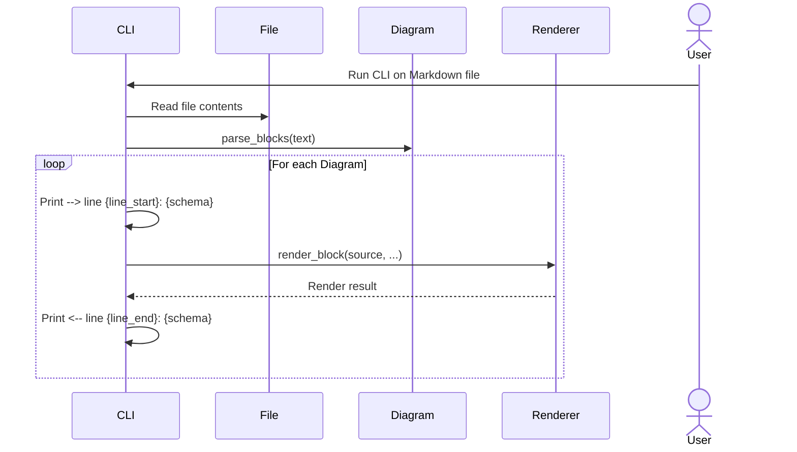

# Diagram Rendering Flow

The following sequence diagram illustrates how Nixie processes Mermaid diagrams
within a Markdown document. The Renderer participant is either `merman-cli` or
the Node-based `mermaid-cli`, selected once at startup by `--renderer` (see
[ADR 0001](adr/0001-prefer-merman-cli-over-mmdc.md)).

