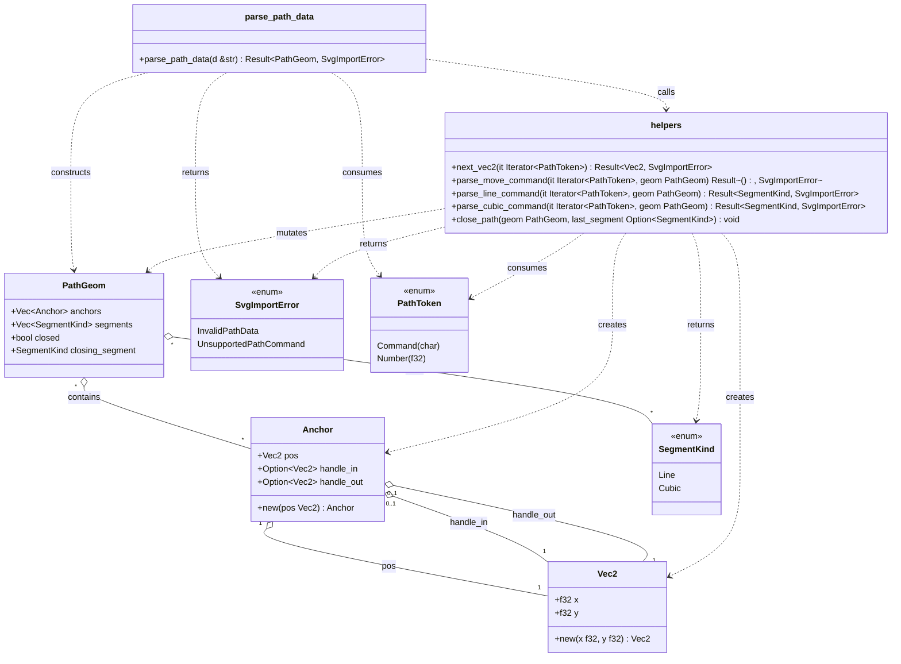

# Gauss: Foundational Architecture & Guiding Principles

(Draft v0.1 — December 2025)

This document defines an architectural “spine” for **Gauss**, a Rust/GPUI SVG
illustration tool, designed to scale from the current proof-of-concept to
long‑term **Illustrator 10–era feature breadth**, while prioritizing:

- **Accessibility-first** (mobility & vision impaired)
- **Localizability**
- **Performance**
- **Pervasive scriptability** (RustPython + LLM control)
- **SVG feature completeness** + **web‑ready export**
- Cross‑platform targets: **Linux (Fedora/Ubuntu), FreeBSD, Windows, macOS**

It also codifies patterns already validated in the Phase 0 PoC: the GPUI mental
model (entities/views/elements), canvas drawing with `Canvas` + `PathBuilder`,
the model/controller/view split, and test strategy.
【111†using-gpui-and-gpui-component.md】

______________________________________________________________________

## 1. Scope, Audience, and Non‑Goals

### Scope

This is a *foundational* architecture document. It defines:

- Core subsystems and boundaries
- Data flow and invariants
- Extension points (tools, commands, exporters, UI panels)
- Cross‑cutting requirements (a11y, i18n, scripting, performance)
- Repository structure suggestions

### Audience

Engineers working on Gauss (core engine, rendering, UI, scripting), plus
product/UX for shared vocabulary.

### Non‑Goals (for this document)

- Precise delivery timelines
- Final UI design system / visual language
- Comprehensive feature roadmap (this architecture enables the roadmap)

______________________________________________________________________

## 2. Guiding Principles (Non‑Negotiable Invariants)

These principles are “architecture laws”. If a feature violates them, we
redesign the feature.

### 2.1 Everything is an Action (and therefore scriptable)

All user‑visible behavior must be representable as an **Action → Command**
pipeline:

- **UI** invokes actions (buttons, menus, keyboard shortcuts, gestures)
- **Scripting** invokes the *same* actions (RustPython API)
- **LLM control** invokes the same actions (via the scripting surface)
- Actions produce **Commands** that mutate state and are undoable

> If there is no command, the feature doesn’t exist.

This is required for:

- automation/macros
- repeatability/testing
- accessibility parity (keyboard-only operation)
- long-term maintainability

### 2.2 Single Source of Truth: Document State in the Engine

The document (and editor state such as selection, tool mode, viewport) must
live in **engine state**, not in the view layer.

The view layer is a projection of state + a dispatcher of actions. This aligns
with the PoC’s model/controller/view split.
【111†using-gpui-and-gpui-component.md】

### 2.3 Deterministic Geometry and Rendering

Given the same document and viewport, Gauss must produce the same scene every
time, across platforms and runs.

- Stable ordering of nodes
- Stable IDs for document objects and a11y nodes
- Deterministic floating point strategy (see §8)

### 2.4 Accessibility is a first‑class API surface, not an afterthought

Accessibility is designed in from day one:

- Keyboard-only operation is always supported
- UI controls expose roles, labels, states, actions
- Canvas interactions have keyboard equivalents where feasible
- Accessibility tree uses **stable node IDs** (critical for immediate-mode
  toolkits) 【110†accesskit-based-accessibility-in-gpui.md】

### 2.5 “SVG First” with reversible transforms

Gauss’s native format is currently SVG, and **SVG export is the only v1
deliverable**.

Architecture must ensure:

- Round-tripping (load → edit → save) keeps SVG semantics intact
- Non-SVG editor metadata is stored in a safe, namespaced way (see §10)
- Export pipeline can optionally strip editor metadata to produce web‑ready SVG

### 2.6 Platform abstraction at the edges

All platform-specific behavior (dialogs, clipboard, filesystem integration,
accessibility adapters, printing later) must be isolated behind a small
“platform boundary”, so Gauss can expand to Windows and FreeBSD even if
GPUI/platform support evolves. 【111†using-gpui-and-gpui-component.md】

______________________________________________________________________

## 3. System Overview

At a high level, Gauss is a **document editor** with:

- A *core engine* that owns document state and editing semantics
- A *renderer* that turns document state into a GPU scene (GPUI Canvas)
- A *tool system* that maps input events to commands
- A *command system* for undo/redo + scripting + tests
- A *persistence layer* (SVG read/write + export options)
- A *scripting host* (RustPython) and a uniform automation API
- *Accessibility* (AccessKit) and *localization* as cross-cutting concerns

### 3.1 Component diagram (conceptual)

```text
+---------------------------+
|        Gauss UI           |
|  GPUI Views + Components  |
|  (toolbars/panels/canvas) |
+-------------+-------------+
              |
              | Actions (keyboard/mouse/menu)
              v
+-------------+-------------+
|     Action / Command Bus  |  <- single “control plane”
| (validation, routing, log)|
+------+------+------+------+
       |      |      |
       |      |      +---------------------+
       |      |                            |
       v      v                            v
+------+--+ +--+------+              +------+--------+
| Tools  | | History  |              | Scripting     |
| (FSMs) | | Undo/Redo|              | (RustPython)  |
+---+----+ +----+-----+              +------+--------+
    |           |                           |
    v           v                           |
+---+-----------+---------------------------+---+
|              Engine State (Core)              |
| Document + Selection + Viewport + Resources   |
+---+-------------------+-----------------------+
    |                   |
    v                   v
+---+---------+   +-----+-----------------+
| Renderer    |   | Persistence / Export  |
| (scene/cache|   | SVG load/save/export  |
|  GPUI draw) |   +-----------------------+
+---+---------+
    |
    v
+---+------------------+
| Accessibility (A11y) |
| AccessKit tree +     |
| action requests      |
+----------------------+
```

______________________________________________________________________

## 4. State, Data Flow, and the GPUI Model

The PoC identifies GPUI’s “three registers”: **Entities, Views, Elements**.
【111†using-gpui-and-gpui-component.md】

### 4.1 Recommended mapping

- **Entities**: editor state and shared services
  - `AppState` (open document(s), selection, viewport, active tool, preferences)
  - `CommandBus` / `History`
  - `KeymapService`, `LocalizationService`, `A11yService`, `ScriptingService`
- **Views**: declarative UI that renders toolbars/panels and wires actions
  - `ShellView` (successor to `Phase0Shell`)
  - panel views (Layers, Properties, Swatches, etc.)
- **Elements**: imperative/low-level rendering surfaces
  - `CanvasElement` for the artboard and overlays
  - specialized controls if GPUI Component widgets are insufficient

### 4.2 Context safety

GPUI uses `AsyncApp` / `AsyncWindowContext` for async work and becomes fallible
across `.await` points. This drives an architectural rule:

> Long-running tasks live outside the view and communicate results back via the
> command bus (or entity updates), never by holding window contexts.
> 【111†using-gpui-and-gpui-component.md】

______________________________________________________________________

## 5. Engine Core: Document Model & Editor State

### 5.1 Document identity and stable IDs

Everything interactive must have stable IDs:

- `DocumentId`
- `NodeId` (for objects in the document tree)
- `StyleId` / `PaintId` (gradients, patterns)
- `ResourceId` (symbols, images, defs)
- `A11yNodeId` (mapped deterministically from document + UI state)

Stable IDs are especially important for AccessKit updates in an immediate-mode
UI. 【110†accesskit-based-accessibility-in-gpui.md】

**Implementation suggestion:** use a generational ID map (`slotmap`,
`generational-arena`, or an internal generational index type). Store IDs as
opaque newtypes to prevent mixing.

### 5.2 Two kinds of state

#### Document state (saved)

This is what gets serialized (SVG + metadata). It includes:

- object tree (groups/layers/shapes/text)
- geometry (paths, rects, etc.)
- styles (fill/stroke/opacity)
- defs/resources (gradients, patterns, symbols, markers, filters)
- document metadata (viewBox, width/height units, etc.)

#### Editor state (not saved by default)

This drives interaction and UI:

- selection set(s), hover target
- active tool + tool-local state machine
- viewport transform (pan/zoom/rotate)
- snapping settings, guides visibility
- UI layout (dock state), if you choose to persist it (optional)

### 5.3 Structural model: “SVG semantics first, editor semantics layered on top”

Gauss should represent SVG-native concepts explicitly (so export is faithful),
but permit editor-only annotations.

Recommended internal structure:

- `Document`
  - `root: NodeId`
  - `nodes: NodeStore`
  - `resources: ResourceStore` (defs)
  - `styles: StyleStore`
  - `metadata: DocumentMetadata`

- `Node`
  - `kind: NodeKind` (Group, Path, Rect, Ellipse, Text, Image, SymbolInstance,
    etc.)
  - `transform: Affine2`
  - `style: StyleRef`
  - `children: Vec<NodeId>` for groups/layers
  - `name: Option<String>` (for layers/a11y/scripting)

This naturally maps to SVG: groups, shapes, and defs.

### 5.4 EngineState (implemented 2025-12)

The `EngineState` struct unifies all editor state into a single source of
truth, per guiding principle §2.2. It lives in `src/model/engine_state.rs` and
is GPUI-independent for testability and scripting.

**Design decision:** EngineState consolidates document, selection, viewport,
tool mode, and resources into a single struct, rather than scattering them
across the view layer. This enables:

- **Testability**: Tests can construct EngineState without GPUI.
- **Scripting**: Scripts operate on a single state object.
- **Consistency**: All state queries go through one structure.

The struct contains:

```rust
pub struct EngineState {
    pub document: Document,
    pub selection: Selection,
    pub viewport: Viewport,
    pub tool_mode: ToolMode,
    pub edge_mode: EdgeMode,
    pub active_path: Option<ShapeId>,
    pub current_style: PaintStyle,
    pub resize_anchor: ResizeAnchor,
    pub resources: ResourceStore,
    pub styles: StyleStore,
}
```

**Note on history stacks:** Undo/redo history is intentionally *not* part of
EngineState. The `gpui_component::History` type has GPUI dependencies, so
history stacks remain in the view layer (Phase0Shell). This preserves
EngineState's GPUI-independence while delegating GPUI-specific concerns to the
appropriate layer.

**Relationship to prepare_command():** The command system's `prepare_command()`
function takes `&EngineState` rather than individual state pieces, providing a
unified entry point for action dispatch.

______________________________________________________________________

## 6. Tool System (Controller Layer)

The PoC recommends **explicit enum-based state machines** for tools and keeping
controller logic independent from GPUI where possible.
【111†using-gpui-and-gpui-component.md】

### 6.1 Tools as state machines

Each tool is a deterministic FSM driven by input events:

- `SelectTool` (idle, dragging, marquee, transforming)
- `PenTool` (placing anchor, dragging handles, closing path)
- `ShapeTool` (drag-to-create, constrain modifier)
- `Pan/Zoom` (spacebar, trackpad, etc.)

Tool logic should operate on:

- model-space coordinates
- document + editor state
- a stable set of “tool modifiers” (shift/alt/ctrl, snap toggles)

### 6.2 Hit testing and snapping (shared services)

Hit testing must be deterministic and shared by:

- selection logic
- hover feedback
- accessibility “object navigation” (later)

Implement as a reusable service:

- `HitTestIndex` built from node bounding boxes (R-tree, BVH, or coarse grid)
- `SnapService` with strategies (grid, guides, anchors, object bounds)

### 6.3 Tool ↔ Command boundary

Tools do not directly mutate state. Instead they **emit Commands**:

- “begin drag” may be tool-local and not a command
- “commit move/transform” becomes a command
- multi-step tools can emit “preview” overlays (not persisted) and commit at end

______________________________________________________________________

## 7. Command System (Undo/Redo + Scripting)

Gauss should treat **Commands** as the unit of truth for edits, enabling:

- undo/redo
- script execution
- deterministic tests ("apply a sequence of commands")
- macro recording (later)

The PoC notes undo/redo uses GPUI Component `History` for grouping.
【111†using-gpui-and-gpui-component.md】

### 7.0 Action layer (implemented)

Actions represent user intent ("Delete Selection", "Undo") and form the public
API surface for all editor behaviour. They are the entry point for UI, scripts,
and tests. Actions are dispatched through a command system (§7.1) to produce
undoable state mutations.

**Design decision (2025-12):** Actions are implemented as an **enum with
methods** rather than a trait, for the following reasons:

- **Exhaustive matching**: All action variants can be matched at compile time,
  ensuring dispatch tables are complete.
- **Serialization**: Enums are trivially serializable, enabling future macro
  recording and playback.
- **Simplicity**: No type erasure or dynamic dispatch complexity.

The `Action` enum lives in `src/model/action.rs` and is GPUI-independent for
testability. Each variant carries only the data needed to describe the intent;
actual execution is delegated to the command dispatch layer.

Actions are categorized by `ActionKind`:

- **Document**: Mutates document state; produces undoable Commands.
- **Editor**: Mutates editor state (selection, viewport, tool).

This categorization enables the dispatcher to route actions appropriately.

### 7.1 Command design (implemented 2025-12)

Commands are concrete, undoable state changes that bridge user intent (Actions)
to atomic document mutations. Commands capture:

- **Pre-conditions**: Can the command execute? (e.g., is there a selection?)
- **Context**: What data is needed? (e.g., which shape IDs are selected?)
- **Inverse**: How to undo? (store sufficient data at apply time)
- **Name**: Human-readable description for undo/redo menu entries

**Design decision:** Commands are implemented as an **enum with data** rather
than a trait, for the following reasons:

- **Exhaustive matching**: All command variants can be matched at compile time,
  ensuring dispatch tables are complete.
- **Serialization**: Enums are trivially serializable, enabling future macro
  recording and playback.
- **Consistency**: Matches the Action enum design from task 0.1.1.
- **Simplicity**: No type erasure or dynamic dispatch complexity.

The `Command` enum lives in `src/model/command.rs` and is GPUI-independent for
testability. The relationship between Actions, Commands, and DocOps (document
operations) is:

For screen readers: The following diagram shows Actions flowing to Commands,
then to DocOps.

```text
Action (user intent)       e.g., DeleteSelection
   │
   ▼  prepare_command()
Command (undoable mutation) e.g., DeleteSelectionCommand { ids: [...] }
   │
   ▼  apply()
DocChange (one or more DocOps) e.g., RemoveShape { index, shape }
```

Terminology:

- **DocOp (document operation; plural DocOps)**: An atomic, invertible document
  mutation.
- **DocChange (plural DocChanges)**: An ordered batch of DocOps applied as a
  single unit.

DocOps are atomic, invertible document mutations defined in `src/model/ops.rs`.
A `DocChange` batches multiple DocOps into a single unit of application.

Commands sit above DocOps as user-intent operations and the unit of undo/redo.
Command implementations may either emit DocOps/DocChanges or mutate the
document directly for simple cases; both patterns are valid and coexist. The
undo stack records Commands and their inverses, not individual DocOps. Direct
mutations must still capture enough data to produce a correct inverse. See
[ADR 001](adr-001-command-docop-relationship.md) for the formal decision.

Rule of thumb:

- Prefer DocOps/DocChanges when a mutation is already expressed as a DocOp, or
  when multiple atomic edits need batching or reuse across Commands.
- Prefer direct document mutation when the change is simple, local to one
  Command, the inverse is trivial to capture, and expressing it as DocOps would
  add boilerplate without reuse.

DocOps may be applied directly for transient previews (for example, during drag
interactions) against a scratch document or preview layer. These previews must
never be recorded in history; the final commit is recorded as a Command, which
may apply a DocChange payload. This is a design decision; implementation
remains future work.

The command system provides:

- `prepare_command()` — bridges Actions to Commands, capturing context
- `Command::apply()` — executes mutation, returns `CommandInverse`
- `CommandInverse::apply()` — reverses the mutation for undo
- `UserError` — user-facing semantic errors (EmptySelection, ShapeNotFound)
- Diagnostic logging uses the `log` crate to surface command failures in
  release builds.

Commands should be small and composable:

- `DeleteShapes` (implemented)
- `InsertNode`, `DeleteNode` (future)
- `SetTransform`, `SetStyle`, `SetPathData` (future)
- `ReparentNode`, `ReorderChildren` (future)
- `SetSelection` (editor-state command; separate history stack is plausible)

### 7.2 Key Context System (implemented 2025-12)

Key contexts determine which keyboard shortcuts are active based on the current
editor state. The system enables mode-specific shortcuts while maintaining a
central, GPUI-independent binding registry.

**Design decision:** Key contexts are implemented as an **enum with
`AsRef<str>` conversion** rather than raw strings, for the following reasons:

- **Exhaustive matching**: All context variants can be matched at compile time.
- **Type safety**: Prevents typos in context strings.
- **Testability**: Context logic testable without GPUI.
- **GPUI compatibility**: `AsRef<str>` provides string conversion for GPUI's
  key binding API.

The `KeyContext` enum lives in `src/model/key_context.rs` with variants:

- `Global` — Always active (Undo, Redo, Selection Undo/Redo, tool switching)
- `DrawMode` — Active when Pen tool is selected
- `ManipulateMode` — Active when Select tool is selected (Delete key)
- `TextEdit` — Reserved for future on-canvas text editing

**Dual History Stacks:** Gauss maintains separate undo/redo stacks for document
edits and selection changes:

- **Document history** (Ctrl+Z / Ctrl+Y): Edits to shapes, paths, styles, etc.
- **Selection history** (Ctrl+Shift+Z / Ctrl+Shift+Y): Changes to what is
  selected.

This design enables users to traverse selection states independently of
document edits. For example, after undoing a selection change, the user can
redo the selection without affecting document state. This deviates from the
macOS convention of Cmd+Shift+Z for Redo.

Context strings use the format `gauss-{name}` for namespacing (e.g.,
`"gauss-global"`, `"gauss-manipulate"`). Strings contain only letters, digits,
`_`, or `-` per GPUI requirements.

**Layered architecture:**

```text
Model Layer (GPUI-independent)
├── KeyContext enum           src/model/key_context.rs
├── Keystroke type            src/model/keystroke.rs
└── ActionBinding registry    src/model/keybinding.rs

UI Layer (GPUI-dependent)
├── GPUI Action bridge        src/ui/action_bridge.rs
└── bind_keymap() refactor    src/ui/phase0_shell/mod.rs
```

The `Keystroke` type provides a platform-independent keystroke representation
with a `secondary` modifier flag (Cmd on macOS, Ctrl elsewhere). The
`ActionBinding` registry maps Actions to Keystrokes with context scoping.

The UI layer bridges model Actions to GPUI Action structs (e.g., `GpuiUndo`,
`GpuiSelectAll`) and registers keybindings via `register_action_bindings()`.

#### 7.2.1 GPUI Key Context Limitation and Workaround

**Problem**: GPUI's `.key_context()` method *replaces* the previous context
rather than stacking multiple contexts. This means it is not possible to apply
both Global and mode-specific contexts to the same element simultaneously.

**Current Workaround**: The `action_bridge` module expands Global bindings to
all known contexts at registration time. When a binding specifies
`KeyContext::Global`, the `add_binding_for_contexts()` function duplicates it
across all context variants (DrawMode, ManipulateMode, etc.). The view layer
currently sets only `KeyContext::Global` as the GPUI context.

**Implementation Reference**: See `CollectedBindings::from_default_bindings()`
and `add_binding_for_contexts()` in `src/ui/action_bridge/mod.rs` for the
binding expansion logic.

**Architectural Risk**: Mode-specific bindings are not enforced by GPUI's
context isolation. The system relies on runtime mode checks within action
handlers rather than GPUI's context-based dispatch. Keybinding conflicts must
be managed manually.

**Future Considerations**: If GPUI adds context stacking support, explore
nested elements with different contexts for mode-specific shortcut scoping. The
current enum-based `KeyContext` design supports migration to proper context
stacking without API changes.

### 7.3 Grouping and "boring but essential" correctness

To avoid user-hostile undo behavior:

- group multi-step interactions into a single undo step
- clear history appropriately when opening a new document (PoC pitfall)
  【111†using-gpui-and-gpui-component.md】

______________________________________________________________________

## 8. Geometry & Numerics

Illustration tools live and die on geometry correctness. Foundational choices:

### 8.1 Coordinate precision

- Use **f64** in the document model for precision and stable export
- Convert to **f32** only at the rendering boundary

### 8.2 Path representation

Prefer a representation that maps directly to SVG path commands:

- move/line/cubic/quadratic/close
- arcs are an SVG feature; decide whether to store arcs as arcs or normalize to
  cubic curves (tradeoff: fidelity vs simplicity)

### 8.3 Geometry kernel boundaries

Separate geometry operations from the document model:

- `gauss_geometry` (pure math):
  - bounding boxes, transforms
  - bezier evaluation and splitting
  - hit testing (distance-to-segment/curve)
  - path boolean ops / offset / stroke expansion (later)
  - flattening and simplification
  - tessellation helpers

This isolation keeps performance work and correctness work localized.

______________________________________________________________________

## 9. Rendering Architecture (GPUI Canvas + Caching)

The PoC uses `Canvas` + `PathBuilder` and recommends:

- viewport transform model→screen
- fill then stroke then selection overlays
- predictable anchor/handle markers 【111†using-gpui-and-gpui-component.md】

### 9.1 Render pipeline

Rendering should be a pure function of:

- document state
- editor overlays (selection, hover, guides)
- viewport state

Suggested stages:

1. **Scene extraction**: derive a “render list” from the document tree (visible
   nodes in paint order)
2. **Resource resolution**: resolve styles, gradients, patterns, markers, etc.
3. **Tessellation/cache**: cache expensive shape conversions, keyed by (node id
   - geometry hash + style hash)
4. **Draw**: emit GPUI draw ops (fill, stroke, overlays)

### 9.2 Incremental invalidation

Introduce “dirty flags”:

- per-node geometry dirty
- style dirty
- transform dirty
- resource dirty

The renderer uses these to avoid rebuilding paths every frame.

### 9.3 Separation of concerns

- The renderer owns caches, but not document truth.
- The engine triggers “invalidate” notifications to wake observers (GPUI
  `Context::notify`) when state changes.
  【111†using-gpui-and-gpui-component.md】

______________________________________________________________________

## 10. Persistence & File Format Strategy

### 10.1 Canonical format: SVG (+ optional Gauss metadata)

Goal: **always produce valid SVG**.

Gauss-specific metadata should be stored in **namespaced attributes** or within
`<metadata>` to preserve compatibility with other tools. This mirrors how other
SVG-native editors extend SVG.

**Rules:**

- The visible artwork must remain standard SVG
- Gauss metadata must not change rendering in other viewers
- Provide an export mode that strips all Gauss metadata (“web-ready SVG”)

#### 10.1.1 SVG Path Parsing Architecture

The following diagram illustrates the structure of the SVG path data parser,
showing how raw path strings are tokenized and transformed into the internal
`PathGeom` representation used by the document model.



*Figure 10.1: Class diagram showing the SVG path parsing pipeline. The
`parse_path_data` function consumes a tokenized path string and constructs a
`PathGeom` using command-specific helper functions. Each helper extracts
coordinates via `next_vec2` and builds the appropriate anchor and segment
structures.*

### 10.2 When SVG becomes "not tenable"

If future features require concepts SVG cannot represent cleanly (e.g.,
advanced non-SVG effects stacks), the preferred approach is:

1. Keep SVG as the *interchange/export* format.
2. Store Gauss-native document as an open, documented format (e.g., a JSON/CBOR
   “GaussDoc” with an SVG projection), but **only if** round-tripping and
   fidelity cannot be preserved with SVG+metadata.

This is a decision to be captured in an ADR (see §17).

______________________________________________________________________

## 11. Accessibility Architecture (AccessKit)

AccessKit provides cross-platform adapters and requires an accessibility tree
with **stable node IDs**; immediate-mode toolkits must keep IDs stable across
frames. 【110†accesskit-based-accessibility-in-gpui.md】

### 11.1 A11y service as a first-class subsystem

Create an `A11yService` that:

- builds an AccessKit tree from current UI + document state
- pushes incremental updates
- maps AccessKit action requests back into Gauss Actions/Commands

### 11.2 Accessibility coverage expectations

Minimum “day one”:

- full keyboard navigation for UI chrome
- all actions reachable via shortcuts or menu search
- canvas is focusable and described
- object-level navigation can start minimal (selection list, next/prev object),
  then expand

### 11.3 Text is a known risk

AccessKit adapters support single/multi-line text controls but **rich
text/hypertext** support is limited today.
【110†accesskit-based-accessibility-in-gpui.md】

Therefore:

- Phase 1 should avoid betting the architecture on a rich-text-heavy UI without
  a plan
- If Illustrator-style text editing is needed early, treat it as a dedicated
  subsystem with clear a11y acceptance criteria

______________________________________________________________________

## 12. Localization Architecture

Localizability must be designed in from day one:

- All user-visible strings are resource IDs (no inline UI strings)
- Shortcut names and command names are localizable
- Number/date formatting uses locale-aware formatting
- UI layout must tolerate string expansion (German, Finnish, etc.)

Suggested approach:

- `i18n` module with a message catalog (e.g., Fluent, ICU-based, or a simple
  keyed system)
- Keep i18n independent of GPUI; views request localized strings from the
  service

______________________________________________________________________

## 13. Scriptability Architecture (RustPython + LLM control)

### 13.1 The scripting boundary

Expose a stable, documented scripting API that is *not* the same as internal
Rust structs.

**Design constraints:**

- scripts call Actions/Commands (not private internals)
- scripts can query document state via safe snapshots or read-only handles
- long operations run async and report progress

### 13.2 The “gauss” Python module (proposed)

Provide:

- `gauss.app` — open docs, active document, UI info
- `gauss.doc` — query and edit via commands
- `gauss.commands` — constructors for command objects
- `gauss.selection` — selection APIs
- `gauss.export` — export helpers (SVG, raster later)
- `gauss.events` — subscribe to document change events (optional)

### 13.3 LLM control

Treat LLM control as **a client of scripting**, not a special path. This keeps
the architecture simple and avoids parallel command systems.

______________________________________________________________________

## 14. UI Toolkit Strategy: GPUI Component vs Custom Controls

GPUI Component should be the default for standard UI: buttons, inputs, menus,
panels, etc. 【111†using-gpui-and-gpui-component.md】

However, an Illustrator-class tool will require **custom controls**, at least
for:

- bezier/anchor editors
- gradient editors (stops, ramps)
- color pickers and sliders beyond stock components
- transform handles, measurement overlays
- path boolean UI affordances

### 14.1 Implementation stage: Widget Capability Audit

Early in Phase 1, do a focused audit:

1. List required UI controls for Phase 1–2 (toolbars, layers, properties, color)
2. Map each to an existing GPUI Component widget or “needs custom”
3. Define a tiny internal widget library for missing pieces (consistent
   focus/keyboard/a11y)

**Best estimate:** GPUI Component will cover most *chrome*, but **custom
canvas-adjacent controls will be required early**, because path editing and
gradient editing are core illustration workflows.

______________________________________________________________________

## 15. Platform & OS Integration Boundary

Create a small `platform` facade providing:

- file dialogs (open/save/export)
- clipboard (SVG, text)
- drag-and-drop
- filesystem paths and recent files
- accessibility adapter wiring (per OS)
- font enumeration and text shaping hooks (later)

The PoC already notes headless prompt differences and recommends thin adapters
for dialog behavior. 【111†using-gpui-and-gpui-component.md】

______________________________________________________________________

## 16. Testing Strategy

The PoC recommends:

- behavior-heavy tests at controller/model boundary
- a small set of `#[gpui::test]` integration tests for wiring/input
  【111†using-gpui-and-gpui-component.md】

### 16.1 Test layers

- **Unit tests**: geometry, parsing/serialization, command invariants
- **BDD/controller tests**: tool state machines and command sequences
- **Golden tests**:
  - SVG read/write round-trip
  - web-ready export output normalization
- **GPUI integration tests**: ensure actions route correctly, focus order works

### 16.2 Accessibility regression tests (recommended)

- snapshot accessibility tree for key screens
- validate “all controls have names/roles”
- manual screen-reader smoke tests per platform (automate where possible)

______________________________________________________________________

## 17. Repository / Crate Structure (Recommended Evolution)

If the repo is currently a single crate, treat this as an evolution path toward
a workspace that enforces boundaries:

```text
/crates
  gauss-core        # document, selection, viewport, commands, tools
  gauss-geometry    # bezier math, hit testing, booleans later
  gauss-svg         # svg parse/serialize + gauss metadata
  gauss-render      # scene extraction + caching + draw adapters
  gauss-a11y        # accesskit tree builder + action mapping
  gauss-script      # rustpython host + gauss Python module
/apps
  gauss-desktop     # GPUI app wiring, views, panels, keymaps
/docs
  ARCHITECTURE.md   # this doc
  ADR/              # architectural decision records
  ACCESSIBILITY.md  # a11y support matrix
```

Enforce dependencies:

- `gauss-core` has no GPUI dependency
- `gauss-desktop` depends on core/render/a11y/script
- `gauss-render` depends on core + GPUI drawing APIs

______________________________________________________________________

## 18. Architectural Decision Records (ADRs)

Create `docs/ADR/` and record decisions that affect long-term maintainability.

Initial ADR candidates:

1. **Doc model and ID strategy** (slotmap vs arena vs custom)
2. **Path arc strategy** (native arcs vs convert-to-cubic)
3. **SVG metadata strategy** (namespaced attrs vs metadata block vs sidecar)
4. **Command serialization format** (JSON/CBOR/none initially)
5. **Text engine choice** (when needed for Illustrator-style text)
6. **Boolean ops library choice** (when needed)

______________________________________________________________________

## 19. How this Architecture Supports the Roadmap

This architecture deliberately front-loads “foundational” capabilities that
unlock large swaths of Illustrator-era features:

- **Commands + tool FSMs** → all editing features, undo/redo, scripts,
  accessibility actions
- **Style/resource stores** → gradients, patterns, transparency, symbols,
  appearances
- **Geometry kernel isolation** → path editing, booleans, offsets, strokes,
  guides
- **Renderer cache + invalidation** → performance at scale, smooth interaction
- **SVG-first persistence** → reliable export and compatibility, web-ready
  workflows

______________________________________________________________________

## 20. Immediate Next Steps (Architecture Work Items)

These are concrete “architecture-first” tasks that should be implemented before
broad feature work accelerates:

1. **Action/Command registry** (typed actions, key contexts, command dispatch)
2. **Core EngineState** (document + selection + viewport + resources)
3. **History and grouping** (undo/redo, clear-on-open correctness)
4. **SVG load/save + metadata policy** (round-trip tests)
5. **Tool framework** (trait + FSM patterns; selection + pen start)
6. **A11yService skeleton** (stable IDs, UI chrome accessibility)
7. **i18n scaffolding** (string catalog, localized command names)
8. **Widget capability audit** (GPUI Component vs custom controls plan)

______________________________________________________________________

### Appendix A: Terminology

- **Action**: an intent (e.g., “Delete Selection”)
- **Command**: a concrete, undoable state change
- **Tool**: an input-driven FSM that emits commands
- **Document**: saved artwork state
- **Editor state**: selection/viewport/tool/UI state
- **Web-ready SVG**: export mode that strips editor metadata, optimizes output
