# Technical Specifications

## 1. Introduction

### Executive Summary

**Telephone** is a revolutionary GPU-accelerated Datalog engine that addresses
the critical performance bottleneck in neurosymbolic AI systems by unifying
high-throughput batch processing with real-time incremental updates. Modern
GPU-accelerated Datalog engines have demonstrated significant performance gains
(up to 45x) compared to CPU-based engines like Soufflé, while the field of
Neuro-Symbolic AI has experienced notable surge in research activity from 2020
onwards, reflecting growing recognition of the importance of integrating
symbolic and sub-symbolic approaches to enhance AI's reasoning capabilities.

The core business problem being solved is the **symbolic reasoning bottleneck**
that has historically limited neurosymbolic systems. The symbolic component can
lead to intractable computations for more complicated domains, creating a
computational bottleneck that has prevented the successful application of NeSy
to more practical problems. Pure neural networks and pure symbolic engines both
exhibit limitations in addressing complex real-world reasoning: neural networks
alone lack interpretability and soundness guarantees, while symbolic systems
alone are confined to deductive chains without creative flexibility.

**Key stakeholders** include AI researchers developing neurosymbolic systems,
enterprise organizations implementing event-driven knowledge graphs, and
developers building real-time reasoning applications. The system targets
scenarios where heavily regulated industries and those where "for ethical
reasons people don't want to rely on AI that has poor transparency or is not
very reliable" require neurosymbolic systems that can reach 100% precision with
full auditability.

The **expected business impact** includes enabling previously infeasible
neurosymbolic applications through orders-of-magnitude performance
improvements, reducing infrastructure costs through GPU acceleration, and
unlocking new use cases in real-time event processing and continuous knowledge
graph maintenance.

#### System Overview

#### Project Context

#### Business Context and Market Positioning

Telephone positions itself at the intersection of three rapidly evolving
technology domains: GPU-accelerated computing, differential dataflow systems,
and neurosymbolic AI. Differential dataflow provides high-throughput and
low-latency performance, making it ideal for real-time analytics and streaming
applications, excelling in real-time analytics and streaming applications.
Neurosymbolic AI seems to be one of the necessary steps to achieve AGI at some
point in the future, because we need better reasoning and more reliable
intelligence than we have today.

The market opportunity is driven by the growing demand for explainable AI
systems that can provide both high performance and logical transparency. This
unified approach is gaining attention because it promises more explainable AI
systems, addressing the "black box" problem by making AI decisions more
transparent and explainable.

#### Current System Limitations

Existing solutions face fundamental architectural constraints:

- **CPU-bound symbolic engines**: Traditional Datalog systems like
  Soufflé, DDlog, and LogicBlox are limited by CPU memory bandwidth and
  single-threaded bottlenecks
- **Batch-only GPU systems**: Modern Datalog engines enable users to
  write declarative queries which compute recursive deductions over extensional
  facts, forming the backbone of modern high-throughput applications in static
  analysis, network monitoring, and social-media mining, but lack incremental
  update capabilities
- **Incremental systems without GPU acceleration**: DDlog provides
  differential semantics but remains CPU-bound, limiting throughput for
  large-scale applications

#### Integration with Existing Enterprise Landscape

Telephone is designed to integrate seamlessly with existing AI and data
infrastructure through:

- **API-first architecture** enabling integration with LLM-based agents
  and neural components
- **Multi-backend GPU support** (CUDA and SPIR-V) ensuring compatibility
  across hardware vendors
- **Event-sourced data ingestion** supporting real-time streams from
  enterprise systems
- **Standard Datalog syntax** ensuring compatibility with existing rule
  sets and domain expertise

#### High-level Description

#### Primary System Capabilities

| Capability                       | Description                                                     | Performance Target               |
| -------------------------------- | --------------------------------------------------------------- | -------------------------------- |
| GPU-Accelerated Batch Processing | Parallel evaluation of Datalog rules using CUDA/SPIR-V kernels  | 5-45x speedup vs CPU engines     |
| Incremental Updates              | Real-time propagation of data changes through rule dependencies | Millisecond-scale update latency |
| Event-Centric Knowledge Graphs   | Time-stamped facts with temporal reasoning capabilities         | Support for millions of events   |
| Cross-Platform Execution         | NVIDIA, AMD, Intel, and Apple GPU support                       | Hardware vendor independence     |

#### Major System Components

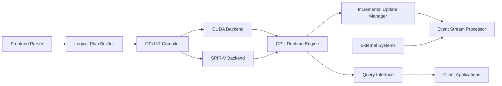
```mermaid
flowchart LR
    A["Frontend Parser"]
    B["Logical Plan Builder"]
    C["GPU IR Compiler"]
    D["CUDA Backend"]
    E["SPIR-V Backend"]
    F["GPU Runtime Engine"]
    G["Incremental Update Manager"]
    H["Event Stream Processor"]
    I["Query Interface"]
    J["External Systems"]
    K["Client Applications"]
    A --> B
    B --> C
    C --> D
    C --> E
    D --> F
    E --> F
    F --> G
    G --> H
    F --> I
    J --> H
    I --> K
```

#### Core Technical Approach

Telephone employs a **three-layer architecture**:

1. **Compilation Layer**: DDlog-compatible parser generating
    GPU-optimized intermediate representation
2. **Execution Layer**: Massively parallel GPU kernels implementing
    relational algebra operations
3. **Incremental Layer**: Differential dataflow semantics enabling
    real-time updates with minimal recomputation

The system leverages DBSP as a simplified version of differential dataflow,
representing time as consecutive rather than partially ordered, where each
state requires a unique predecessor, providing a cleaner implementation model
while maintaining incremental computation capabilities.

#### Success Criteria

#### Measurable Objectives

| Metric                       | Target                                   | Measurement Method              |
| ---------------------------- | ---------------------------------------- | ------------------------------- |
| Batch Processing Speedup     | 5-10x vs Soufflé on standard benchmarks  | Comparative performance testing |
| Incremental Update Latency   | \<100ms for typical rule sets            | End-to-end timing measurements  |
| Memory Efficiency            | 50% reduction vs naive GPU approaches    | Memory profiling and analysis   |
| Cross-Platform Compatibility | Support for 4+ GPU vendors               | Hardware compatibility testing  |

#### Critical Success Factors

- **Performance Parity**: Achieving competitive performance with
  specialized GPU Datalog engines while adding incremental capabilities
- **Semantic Correctness**: Maintaining DDlog-compatible incremental
  semantics across all operations
- **Developer Experience**: Providing intuitive APIs and debugging tools
  for neurosymbolic application development
- **Scalability**: Demonstrating linear performance scaling with GPU
  resources and data size

#### Key Performance Indicators (KPIs)

- **Throughput**: Facts processed per second in batch mode
- **Latency**: Time from event ingestion to derived fact availability
- **Resource Utilization**: GPU memory bandwidth and compute utilization
  percentages
- **Correctness**: Semantic equivalence with reference DDlog
  implementations

#### Scope

#### In-scope

#### Core Features and Functionalities

| Feature Category         | Included Capabilities                                                       |
| ------------------------ | --------------------------------------------------------------------------- |
| Datalog Language Support | DDlog-compatible syntax, stratified negation, recursive rules, aggregation  |
| GPU Acceleration         | CUDA and SPIR-V backends, parallel join/project/filter operations           |
| Incremental Processing   | Delta propagation, semi-naïve evaluation, reference counting for deletions  |
| Event Processing         | Time-stamped facts, temporal queries, streaming ingestion APIs              |

#### Primary User Workflows

- **Rule Development**: Write and test Datalog programs using familiar
  DDlog syntax
- **Batch Processing**: Load large datasets and compute initial derived
  facts
- **Incremental Updates**: Stream new events and receive updated
  conclusions in real-time
- **Query Processing**: Execute ad-hoc queries against materialized
  relations
- **System Integration**: Connect with LLMs and other AI components via
  APIs

#### Essential Integrations

- **Neural Network Frameworks**: PyTorch and TensorFlow integration for
  neurosymbolic workflows
- **Event Streaming**: Kafka, Pulsar, and other message queue systems
- **Data Storage**: Integration with columnar stores and time-series
  databases
- **Monitoring**: Metrics export for performance monitoring and
  debugging

#### Key Technical Requirements

- **Multi-GPU Support**: Efficient utilization of multiple GPUs within a
  single node
- **Memory Management**: Automatic GPU memory allocation and garbage
  collection
- **Fault Tolerance**: Graceful handling of GPU memory exhaustion and
  hardware failures
- **Provenance Tracking**: Optional maintenance of derivation chains for
  explainability

#### Implementation Boundaries

#### System Boundaries

The system operates within the following technical boundaries:

- **Single-Node Deployment**: Initial implementation targets
  single-machine, multi-GPU configurations
- **Structured Data**: Focus on relational data with well-defined
  schemas
- **Deterministic Semantics**: Standard Datalog semantics without
  probabilistic extensions in Phase 1
- **Memory-Resident Processing**: Primary data structures maintained in
  GPU memory
- **Headless Operation**: Interaction occurs via CLI and
  programmatic APIs; no graphical UI is planned

#### User Groups Covered

| User Group            | Access Level             | Primary Use Cases                                          |
| --------------------- | ------------------------ | ---------------------------------------------------------- |
| AI Researchers        | Full API access          | Neurosymbolic system development, performance benchmarking |
| Enterprise Developers | Managed service APIs     | Event-driven knowledge graphs, real-time analytics         |
| System Integrators    | Configuration interfaces | Deployment, monitoring, and maintenance                    |

#### Geographic/Market Coverage

- **Initial Release**: English-language documentation and support
- **Hardware Support**: NVIDIA, AMD, Intel, and Apple GPU architectures
- **Cloud Platforms**: AWS, GCP, Azure, and on-premises deployment
  options

#### Data Domains Included

- **Event-Centric Knowledge Graphs**: Communications, incidents,
  temporal relationships
- **Program Analysis**: Static analysis facts, call graphs, dependency
  relationships
- **Business Rules**: Policy evaluation, compliance checking, decision
  support
- **Scientific Computing**: Logical constraints, symbolic mathematics,
  theorem proving

#### Out-of-scope

#### Explicitly Excluded Features/Capabilities

- **Distributed Computing**: Multi-node clusters and distributed
  consensus mechanisms
- **Probabilistic Reasoning**: Uncertainty quantification and
  probabilistic inference (reserved for Phase 2)
- **Natural Language Processing**: Text parsing, entity extraction, and
  linguistic analysis
- **Machine Learning Training**: Neural network training and
  gradient-based optimization
- **Database Management**: ACID transactions, persistent storage, and
  backup/recovery
- **User Interface**: Graphical interfaces and interactive development
  environments

#### Future Phase Considerations

- **Phase 2**: Probabilistic semiring support, distributed execution,
  advanced provenance
- **Phase 3**: Integration with neural architecture search, automated
  rule discovery
- **Phase 4**: Cloud-native deployment, managed service offerings,
  enterprise features

#### Integration Points Not Covered

- **Legacy Database Systems**: Direct integration with SQL databases and
  data warehouses
- **Workflow Orchestration**: Integration with Apache Airflow,
  Kubernetes operators
- **Security Frameworks**: Authentication, authorization, and encryption
  (delegated to deployment layer)

#### Unsupported Use Cases

- **Transactional Workloads**: OLTP applications requiring immediate
  consistency guarantees
- **Unstructured Data Processing**: Image, audio, and video analysis
  workflows
- **Interactive Analytics**: Ad-hoc SQL queries and business
  intelligence dashboards
- **Real-Time Control Systems**: Hard real-time constraints and
  deterministic scheduling

## 2. Product Requirements

## 2.1 Feature Catalogue

### F-001 – GPU-accelerated Datalog Compiler

- **Overview:** Transforms DDlog-compatible programs into GPU-optimised kernels,
  delivering 5–45x speedups over CPU engines such as Soufflé.
- **Business Value:** Removes the CPU bottleneck that has limited
  neurosymbolic adoption in production settings.
- **User Benefit:** Lets researchers and enterprise teams execute large rulesets
  unchanged while gaining GPU acceleration.
- **Technical Context:** Implements iterated relational algebra kernels and a
  range-indexed data layout tuned for parallel evaluation.

#### F-001 Dependencies

| Dependency Type              | Details                                   |
| ---------------------------- | ----------------------------------------- |
| **Prerequisite Features**    | None (foundational feature)               |
| **System Dependencies**      | CUDA toolkit, Rust compiler, GPU hardware |
| **External Dependencies**    | DDlog parser, NVPTX Rust backend          |
| **Integration Requirements** | Multi-backend GPU support (CUDA/SPIR-V)   |

### F-002 – Incremental Update Engine

- **Overview:** Maintains incremental outputs in response to fact changes,
  achieving millisecond-scale propagation without full recomputation.
- **Business Value:** Supports real-time analytics and compliance workloads that
  demand up-to-the-moment derived knowledge.
- **User Benefit:** Exposes declarative delta semantics so teams avoid bespoke
  change detection.
- **Technical Context:** Builds on differential dataflow to reconcile delta
  batches with materialised relations.
- **Semantics:** Groups updates into monotone `epoch` transactions, applies
  delta joins until fixpoint, and honours parser `Delay -<N>` and diff-mark
  adornments exactly as specified in ADR-001.

#### F-002 Dependencies

| Dependency Type              | Details                                            |
| ---------------------------- | -------------------------------------------------- |
| **Prerequisite Features**    | F-001                                              |
| **System Dependencies**      | DDlog runtime, reference counting mechanisms       |
| **External Dependencies**    | Event ingestion adapters, differential dataflow    |
| **Integration Requirements** | Shared memory manager, incremental propagation API |

### F-003 – Multi-backend GPU Support

- **Overview:** Provides a unified runtime across CUDA, HIP/ROCm, SPIR-V, and
  Metal targets with feature-parity guarantees.
- **Business Value:** Avoids vendor lock-in and keeps procurement and cloud
  options open.
- **User Benefit:** Automatically maps kernels to the chosen hardware with
  capability detection and graceful fallbacks.
- **Technical Context:** Normalises kernel launches, memory transfers, and
  synchronisation primitives across GPU backends.

#### F-003 Dependencies

| Dependency Type              | Details                                         |
| ---------------------------- | ----------------------------------------------- |
| **Prerequisite Features**    | F-001                                           |
| **System Dependencies**      | CUDA toolkit, HIP/ROCm, Vulkan SDK              |
| **External Dependencies**    | Vendor-specific runtime drivers                 |
| **Integration Requirements** | Hardware abstraction layer, capability registry |

### F-004 – Event-centric Knowledge Graph Engine

- **Overview:** Maintains time-stamped facts and temporal joins for
  provenance-rich reasoning over event streams.
- **Business Value:** Supplies audit-ready knowledge graphs for regulated
  domains and high-stakes decisioning.
- **User Benefit:** Exposes declarative APIs for sliding windows, causal
  queries, and change data capture.
- **Technical Context:** Uses differential arrangements keyed by event time to
  minimise storage while retaining provenance links.

#### F-004 Dependencies

| Dependency Type              | Details                                        |
| ---------------------------- | ---------------------------------------------- |
| **Prerequisite Features**    | F-001, F-002                                   |
| **System Dependencies**      | Event ingestion connectors (Kafka, Pulsar)     |
| **External Dependencies**    | Time-series storage adapters                   |
| **Integration Requirements** | Stream processing API, temporal query language |

### F-005 – DDlog-compatible Parser

- **Overview:** Implements the DDlog grammar with stratified negation and
  aggregation, including incremental recompilation support.
- **Business Value:** Preserves investment in existing DDlog rulebases and
  reduces migration friction.
- **User Benefit:** Produces precise error diagnostics and integrates with
  developer tooling for rapid iteration.
- **Technical Context:** Extends the upstream grammar with modular AST
  generation and incremental parsing.

#### F-005 Dependencies

| Dependency Type              | Details                                        |
| ---------------------------- | ---------------------------------------------- |
| **Prerequisite Features**    | None                                           |
| **System Dependencies**      | Rust parser libraries, DDlog grammar           |
| **External Dependencies**    | Domain-specific rule repositories              |
| **Integration Requirements** | Logical plan builder, type inference subsystem |

### F-006 – GPU Memory Management System

- **Overview:** Provides deterministic allocation, compaction, and spillover
  strategies tailored to Telephone's relational workloads.
- **Business Value:** Keeps GPU-resident datasets within tight memory limits
  while sustaining latency guarantees.
- **User Benefit:** Offers predictable eviction behaviour and telemetry signals
  for capacity planning.
- **Technical Context:** Bridges CUDA and SPIR-V memory models with reference
  counting and device-side metrics.

#### F-006 Dependencies

| Dependency Type              | Details                                        |
| ---------------------------- | ---------------------------------------------- |
| **Prerequisite Features**    | F-001                                          |
| **System Dependencies**      | CUDA memory APIs, GPU device management        |
| **External Dependencies**    | Vendor debugging/profiling tooling             |
| **Integration Requirements** | Memory pressure signals, garbage collector API |

## 2.2 Functional Requirements Snapshot

| Feature | Requirement ID | Summary                                   | Verification  |
| ------- | -------------- | ----------------------------------------- | ------------- |
| F-001   | F-001-RQ-001   | Parse DDlog programs into AST             | Unit tests    |
| F-001   | F-001-RQ-003   | Compile kernels for CUDA and SPIR-V       | Integration   |
| F-002   | F-002-RQ-002   | Maintain delta propagation under 100ms    | Performance   |
| F-003   | F-003-RQ-001   | Execute on NVIDIA GPUs with parity        | Compatibility |
| F-004   | F-004-RQ-003   | Support temporal queries over event flows | Functional    |
| F-006   | F-006-RQ-004   | Enforce graceful memory pressure handling | Reliability   |

## 2.3 Feature Relationships

### Feature Dependencies Map

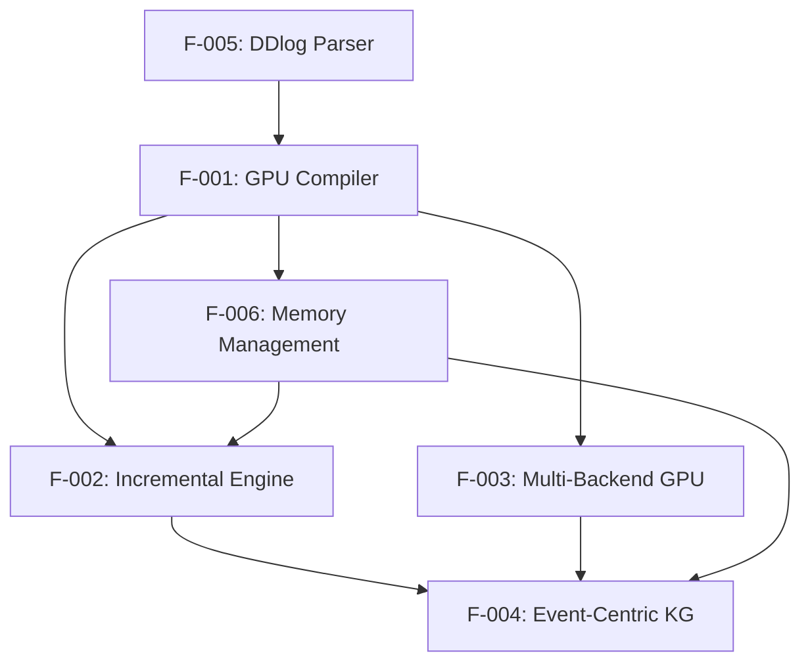
```mermaid
flowchart TD
    F005["F-005: DDlog Parser"]
    F001["F-001: GPU Compiler"]
    F002["F-002: Incremental Engine"]
    F003["F-003: Multi-Backend GPU"]
    F006["F-006: Memory Management"]
    F004["F-004: Event-Centric KG"]
    F005 --> F001
    F001 --> F002
    F001 --> F003
    F001 --> F006
    F002 --> F004
    F003 --> F004
    F006 --> F002
    F006 --> F004
```

#### Integration Points

| Integration                    | Description                   | Shared Components                     |
| ------------------------------ | ----------------------------- | ------------------------------------- |
| **Parser → Compiler**          | AST transformation to GPU IR  | Type system, semantic validation      |
| **Compiler → Incremental**     | Delta propagation scheduling  | Dependency graphs, execution plans    |
| **Compiler → Multi-Backend**   | Kernel generation abstraction | GPU facade, portable algorithms       |
| **Memory → All Engines**       | Resource management           | Buffer allocation, garbage collection |

#### Common Services

| Service                      | Used By                    | Purpose                                  |
| ---------------------------- | -------------------------- | ---------------------------------------- |
| **GPU Context Management**   | F-001, F-002, F-003, F-006 | Device initialization, resource tracking |
| **Type System**              | F-001, F-005               | Schema validation, type inference        |
| **Monitoring & Metrics**     | All features               | Performance tracking, debugging          |
| **Configuration Management** | All features               | Runtime parameters, optimization flags   |

## 2.4 Implementation Considerations

### F-001 Compiler Considerations

- GPU kernels must balance occupancy with memory bandwidth; profiling guides
  tiling strategies per backend.
- Intermediate relations are stored in columnar buffers with lock-free
  compaction to suit massively parallel updates.
- Generated code enforces bounds checks and borrow rules that mirror Rust's
  safety guarantees.

### F-002 Incremental Engine Considerations

- Logical time indexes must stay memory-bounded for long-running streams;
  checkpoints prune stale deltas.
- Update batches target sub-100ms latency, so GPU kernels favour warp-uniform
  control flow and pre-allocated staging buffers.
- Transactional integrity relies on idempotent apply/rollback hooks that mirror
  differential dataflow semantics.

### F-003 Multi-backend Runtime Considerations

- Backend adapters share a capability registry that selects kernel variants at
  runtime.
- HIP, CUDA, and SPIR-V toolchains diverge on memory fences; the abstraction
  layer harmonises launch parameters and synchronisation semantics.
- Continuous integration covers vendor drivers to catch regressions triggered by
  toolkit updates.

### F-004 Event Engine Considerations

- Temporal windows rely on watermark tracking; late-arriving events are handled
  by configurable grace periods.
- Provenance retention is tunable to balance auditability against GPU memory
  pressure.
- External sources stream via Kafka/Pulsar connectors that map onto the engine's
  delta ingestion API.

### F-005 Parser Considerations

- Grammar extensions remain backwards compatible with DDlog; incompatibilities
  are surfaced as lints rather than hard failures.
- Incremental parsing caches AST fragments to keep feedback loops fast.
- Diagnostics include rule-level provenance pointing back to source spans.

### F-006 Memory Manager Considerations

- Allocation arenas are carved per relation family to avoid fragmentation.
- Spillover to host memory is governed by policy thresholds that emit telemetry
  events.
- Recovery routines rebuild device state from checkpoints without blocking the
  incremental scheduler.

## 2.5 Traceability Matrix

| Requirement  | Business Driver       | Technical Specification | Test Category    |
| ------------ | --------------------- | ----------------------- | ---------------- |
| F-001-RQ-001 | DDlog compatibility   | Parser specification    | Unit/Integration |
| F-001-RQ-002 | GPU acceleration      | IR generation           | Performance      |
| F-002-RQ-001 | Real-time updates     | Delta propagation       | Functional       |
| F-002-RQ-004 | Low latency           | \<100ms response        | Performance      |
| F-003-RQ-001 | Hardware independence | CUDA support            | Compatibility    |
| F-004-RQ-001 | Event processing      | Temporal reasoning      | Functional       |

This comprehensive product requirements specification provides the foundation
for implementing Telephone's core capabilities while ensuring traceability from
business needs to technical implementation details.

## 3. Technology Stack

## 3.1 Programming Languages

### 3.1.1 Core System Language

| Component                      | Language | Version              | Justification                                                                                                                                                                                                                   |
| ------------------------------ | -------- | -------------------- | ------------------------------------------------------------------------------------------------------------------------------------------------------------------------------------------------------------------------------- |
| **Datalog Compiler**           | Rust     | 1.85+ (2024 Edition) | Rust CUDA Project provides tools for compiling Rust to extremely fast PTX code as well as libraries for using existing CUDA libraries. Memory safety without garbage collection overhead is critical for GPU memory management. |
| **GPU Runtime Engine**         | Rust     | 1.85+ (2024 Edition) | The ownership model is central to Rust's memory management, defining how memory is allocated and deallocated, ensuring that resources are managed without the overhead of a garbage collector.                                  |
| **Incremental Update Manager** | Rust     | 1.85+ (2024 Edition) | DDlog is based on Frank McSherry's excellent differential dataflow library, which is implemented in Rust and provides the foundation for incremental computation.                                                               |

### 3.1.2 Gpu Kernel Languages

| Target Platform         | Language/IR     | Toolchain                    | Justification                                                                                                                                        |
| ----------------------- | --------------- | ---------------------------- | ---------------------------------------------------------------------------------------------------------------------------------------------------- |
| **NVIDIA GPUs**         | Rust → PTX      | rust-cuda/rustc_codegen_nvvm | rustc_codegen_nvvm generates highly optimized PTX code which can be loaded by the CUDA Driver API to execute on the GPU.                             |
| **Cross-Platform GPUs** | Rust → SPIR-V   | rust-gpu/rustc_codegen_spirv | Rust GPU compiles Rust code to SPIR-V, the binary format used by Vulkan and other modern GPU APIs, allowing GPU code to be written entirely in Rust. |

### 3.1.3 Frontend Parser

| Component        | Language | Version              | Justification                                                                                                                                                                                                                              |
| ---------------- | -------- | -------------------- | ------------------------------------------------------------------------------------------------------------------------------------------------------------------------------------------------------------------------------------------ |
| **DDlog Parser** | Rust     | 1.85+ (2024 Edition) | The DDlog compiler is written in Haskell and generates Rust code (as text files); the Rust code is compiled and linked with the open-source Rust version of the DD library. We will implement a native Rust parser for better integration. |

### 3.1.4 Selection Criteria

#### Language Selection – Memory Safety

Memory safety is a core principle, ensuring that programs do not access invalid
memory. Rust's memory management is designed to prevent common bugs such as
null pointer dereferencing and buffer overflows. The language uses a
compile-time system to enforce memory safety.

#### GPU Programming Capability

Rust has become a powerful language for high-performance computing,
particularly in GPU and parallel processing. GPU Access with CUDA provides
direct hardware interaction for NVIDIA graphics cards.

#### Performance Requirements

The language's zero-cost abstractions and safety guarantees make it ideal for
high-performance computing. Memory safety remains crucial when working with
parallel processing. Rust's ownership system prevents data races and ensures
thread safety.

## 3.2 Frameworks & Libraries

### 3.2.1 Core Gpu Computing Frameworks

| Framework     | Version | Purpose                       | Compatibility                                                                                                                                                                                                                       |
| ------------- | ------- | ----------------------------- | ----------------------------------------------------------------------------------------------------------------------------------------------------------------------------------------------------------------------------------- |
| **rust-cuda** | 0.3+    | NVIDIA GPU acceleration       | The Rust CUDA Project provides tools for compiling Rust to extremely fast PTX code as well as libraries for using existing CUDA libraries                                                                                           |
| **rust-gpu**  | 0.9+    | Cross-platform GPU via SPIR-V | Currently only SPIR-V support is planned, Vulkan's open compiler target. Our SPIR-🇹 shader IR framework started with the goal of allowing us to work with GPU shaders beyond the limitations                                        |
| **wgpu**      | 0.20+   | WebGPU abstraction layer      | WebGPU is a modern graphics and compute API that provides high-performance GPU access. Performance: WebGPU enables direct access to GPU resources. Cross-Platform: Build once and run on Windows, macOS, Linux, and modern browsers |

### 3.2.2 Differential Dataflow Foundation

| Library                   | Version | Purpose                        | Integration                                                                                                                                                     |
| ------------------------- | ------- | ------------------------------ | --------------------------------------------------------------------------------------------------------------------------------------------------------------- |
| **differential-dataflow** | 0.12+   | Incremental computation engine | DDlog is based on Frank McSherry's excellent differential dataflow library. The DDlog compiler translates DDlog programs to Differential Dataflow (DD) programs |
| **timely-dataflow**       | 0.12+   | Distributed dataflow runtime   | Differential Dataflow offers a computational model that effectively addresses this, ensuring consistent performance for both data additions and deletions       |

### 3.2.3 Gpu-specific Libraries

| Library       | Version | Platform | Purpose                                                                                                                                                                                                                                         |
| ------------- | ------- | -------- | ----------------------------------------------------------------------------------------------------------------------------------------------------------------------------------------------------------------------------------------------- |
| **cust**      | 0.3+    | CUDA     | cust for CPU-side CUDA features such as launching GPU kernels, GPU memory allocation, device queries, etc. High level with features such as RAII and Rust Results. A high level wrapper for the CUDA Driver API                                 |
| **cuda_std**  | 0.3+    | CUDA     | cuda_std for GPU-side functions and utilities, such as thread index queries, memory allocation, warp intrinsics, etc. Closely tied to rustc_codegen_nvvm                                                                                        |
| **spirv-std** | 0.9+    | SPIR-V   | rust-gpu introduces a number of SPIR-V related attributes to express behavior specific to SPIR-V not exposed in the base rust language. Before you'll able to use these attributes, make sure you import the attribute from the spirv-std crate |

### 3.2.4 Memory Management & Performance

| Library   | Version | Purpose                 | Justification                                                                                                                                                                             |
| --------- | ------- | ----------------------- | ----------------------------------------------------------------------------------------------------------------------------------------------------------------------------------------- |
| **glam**  | 0.29+   | SIMD vector mathematics | PR#9 relaxed glam version requirements (\>=0.22, \<=0.29) for consistent memory layout across GPU backends                                                                                |
| **rayon** | 1.10+   | CPU parallelism         | The parallel processing capabilities of Rust extend beyond just GPU computation. The language's zero-cost abstractions and safety guarantees make it ideal for high-performance computing |

### 3.2.5 Compatibility Requirements

#### Rust Toolchain

The examples and lints work on rust 2021, but a beta or nightly compiler will
be needed if you actually want to try the 2024 edition before the 1.85
toolchain is released on February 20, 2025.

#### GPU Backend Compatibility

Rust GPU and Rust CUDA evolved independently and diverged in their APIs. For
example, accessing thread indices is done through a function call in Rust CUDA
(thread::thread_idx_x()), while in Rust GPU it requires annotating entrypoint
arguments. Even the standard library names differ (cuda_std vs spirv_std).

## 3.3 Open Source Dependencies

### 3.3.1 Core Rust Ecosystem

| Crate       | Version | Registry  | Purpose                            |
| ----------- | ------- | --------- | ---------------------------------- |
| **serde**   | 1.0+    | crates.io | Serialization for DDlog AST and IR |
| **tokio**   | 1.40+   | crates.io | Async runtime for event processing |
| **clap**    | 4.5+    | crates.io | Command-line interface             |
| **tracing** | 0.1+    | crates.io | Structured logging and diagnostics |
| **anyhow**  | 1.0+    | crates.io | Error handling                     |

### 3.3.2 Gpu Computing Dependencies

| Crate                  | Version | Registry  | Purpose                                                                                                                                             |
| ---------------------- | ------- | --------- | --------------------------------------------------------------------------------------------------------------------------------------------------- |
| **rustc_codegen_nvvm** | 0.3+    | crates.io | rustc_codegen_nvvm which is a rustc backend that targets NVVM IR (a subset of LLVM IR) for the libnvvm library. Generates highly optimized PTX code |
| **spirv-builder**      | 0.9+    | crates.io | Helper crates like spirv_builder and cuda_builder hide some complexity but it's still more involved than using standard Rust                        |
| **cuda-builder**       | 0.3+    | crates.io | Build system integration for CUDA kernels                                                                                                           |

### 3.3.3 Differential Dataflow Stack

| Crate                     | Version | Registry  | Purpose                                                                                                           |
| ------------------------- | ------- | --------- | ----------------------------------------------------------------------------------------------------------------- |
| **differential-dataflow** | 0.12+   | crates.io | Differential Dataflow Implementation Github Repository. <https://github.com/TimelyDataflow/differential-dataflow> |
| **timely**                | 0.12+   | crates.io | Distributed dataflow coordination                                                                                 |
| **abomonation**           | 0.7+    | crates.io | Fast serialization for dataflow                                                                                   |

### 3.3.4 Parser And Language Processing

| Crate     | Version | Registry  | Purpose                             |
| --------- | ------- | --------- | ----------------------------------- |
| **nom**   | 7.1+    | crates.io | Parser combinators for DDlog syntax |
| **pest**  | 2.7+    | crates.io | Alternative PEG parser generator    |
| **logos** | 0.14+   | crates.io | Fast lexical analysis               |

### 3.3.5 Version Management Strategy

#### Semantic Versioning

All dependencies follow semantic versioning with minimum version requirements
to ensure compatibility while allowing patch updates.

#### Toolchain Pinning

Furthermore, a very specific version of nightly Rust is necessary for
everything to work. We will use `rust-toolchain.toml` to pin the exact nightly
version required for GPU compilation.

#### Dependency Auditing

Regular security audits using `cargo audit` and `cargo deny` to ensure supply
chain security.

## 3.5 Databases & Storage

### 3.5.1 Primary Data Storage

| Component               | Technology                    | Purpose                | Justification                                                                                                                                               |
| ----------------------- | ----------------------------- | ---------------------- | ----------------------------------------------------------------------------------------------------------------------------------------------------------- |
| **In-Memory Relations** | GPU VRAM                      | Active working set     | In-memory: DDlog stores and processes data in memory. At the moment, DDlog can only operate on databases that completely fit the memory of a single machine |
| **Columnar Storage**    | Custom GPU buffers            | Relational data layout | Structure-of-Arrays format optimized for GPU coalesced memory access                                                                                        |
| **Arrangements**        | GPU hash tables/sorted arrays | Indexed access         | GPU-resident indices for efficient joins and lookups                                                                                                        |

### 3.5.2 Persistent Storage Strategy

| Layer         | Technology               | Purpose                   | Retention                       |
| ------------- | ------------------------ | ------------------------- | ------------------------------- |
| **Event Log** | Apache Kafka / Pulsar    | Durable event sourcing    | Configurable (days to years)    |
| **Snapshots** | Compressed binary format | Checkpoint recovery       | Latest N snapshots              |
| **Archives**  | Object storage (S3/GCS)  | Long-term historical data | Compressed, partitioned by time |

### 3.5.3 Caching Solutions

| Cache Type             | Implementation   | Purpose              | Eviction Policy        |
| ---------------------- | ---------------- | -------------------- | ---------------------- |
| **Compilation Cache**  | File system      | Compiled GPU kernels | Content-addressed, LRU |
| **Arrangement Cache**  | GPU memory pools | Pre-built indices    | Reference counting     |
| **Query Result Cache** | Host memory      | Materialized views   | TTL-based expiration   |

### 3.5.4 Data Persistence Patterns

#### Event Sourcing

At runtime DDlog programs receive streams of changes to the input relations
(insertions or deletions) and produce streams of corresponding changes to
derived relations. All state changes are captured as immutable events.

#### Incremental Snapshots

In order to compute incremental results the DD runtime has to maintain temporal
indexes (indexed by logical time), containing previous versions of relations.
Periodic snapshots enable fast recovery without full replay.

#### Memory-First Architecture

At the moment, DDlog can only operate on databases that completely fit the
memory of a single machine. We are working on a distributed version of DDlog
that will be able to partition its state and computation across multiple
machines.

## 3.6 Development & Deployment

### 3.6.1 Development Tools

| Tool              | Version | Purpose                                                                                                                                                                                                                        | Configuration                                        |
| ----------------- | ------- | ------------------------------------------------------------------------------------------------------------------------------------------------------------------------------------------------------------------------------ | ---------------------------------------------------- |
| **rustup**        | 1.27+   | Rustup is the official tool used to manage Rust tooling. Not only can it be used to install Rust and keep it updated, it also allows you to seamlessly switch between the stable, beta, and nightly Rust compilers and tooling | Nightly toolchain pinned via \`rust-toolchain.toml\` |
| **cargo**         | 1.85+   | Package management and build system                                                                                                                                                                                            | Custom build scripts for GPU kernel compilation      |
| **rust-analyzer** | Latest  | IDE language server                                                                                                                                                                                                            | GPU-aware syntax highlighting and completion         |

### 3.6.2 Build System Architecture

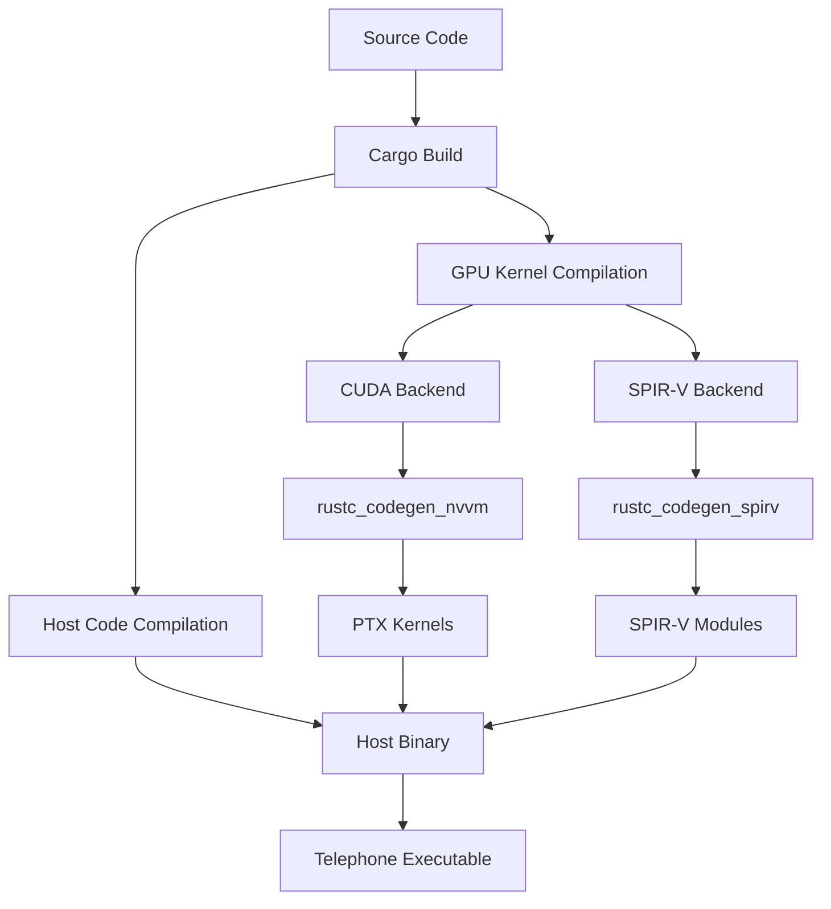
```mermaid
flowchart TD
    A["Source Code"]
    B["Cargo Build"]
    C["Host Code Compilation"]
    D["GPU Kernel Compilation"]
    E["CUDA Backend"]
    F["SPIR-V Backend"]
    G["rustc_codegen_nvvm"]
    H["rustc_codegen_spirv"]
    I["PTX Kernels"]
    J["SPIR-V Modules"]
    K["Host Binary"]
    L["Telephone Executable"]
    A --> B
    B --> C
    B --> D
    D --> E
    D --> F
    E --> G
    F --> H
    G --> I
    H --> J
    C --> K
    I --> K
    J --> K
    K --> L
```

### 3.6.3 Containerization Strategy

| Component       | Base Image               | Purpose                       | GPU Support                                                                                                                                                                                                           |
| --------------- | ------------------------ | ----------------------------- | --------------------------------------------------------------------------------------------------------------------------------------------------------------------------------------------------------------------- |
| **Development** | \`rust:1.85-slim\`       | Local development environment | NVIDIA Container Toolkit                                                                                                                                                                                              |
| **Production**  | \`debian:bookworm-slim\` | Minimal runtime               | CUDA runtime libraries                                                                                                                                                                                                |
| **CI/CD**       | \`rust:1.85\`            | Automated testing             | One can even test the Vulkan kernel code using a software driver like SwiftShader or lavapipe and get some signal that the bulk of CUDA logic is correct. This has the potential to save on expensive NVIDIA GPU time |

### 3.6.4 Ci/cd Pipeline Requirements

| Stage                 | Tools               | GPU Requirements       | Validation                                                                                                                                                                                          |
| --------------------- | ------------------- | ---------------------- | --------------------------------------------------------------------------------------------------------------------------------------------------------------------------------------------------- |
| **Lint & Format**     | clippy, rustfmt     | None                   | Code quality checks                                                                                                                                                                                 |
| **Unit Tests**        | cargo test          | None                   | Furthermore, because the kernel code is standard Rust, no GPU hardware is needed in CI to test the logic. This is important for open source projects as the GitHub Actions runners do not have GPUs |
| **Integration Tests** | Custom test harness | Software GPU emulation | One can even test the Vulkan kernel code using a software driver like SwiftShader or lavapipe                                                                                                       |
| **Performance Tests** | Self-hosted runners | NVIDIA GPUs            | Benchmark regression detection                                                                                                                                                                      |

### 3.6.5 Deployment Considerations

#### GPU Driver Dependencies

CUDA is exclusively an NVIDIA-only toolkit. Many tools have been proposed for
cross-platform GPU computing such as OpenCL, Vulkan Computing, and HIP.
However, CUDA remains the most used toolkit for such tasks by far. This is why
it is imperative to make Rust a viable option for use with the CUDA toolkit.

#### Memory Requirements

Rust uses a large amount of system memory, both RAM and VRAM (for graphics).
Having insufficient RAM can lead to stuttering and poor performance. A minimum
of 16 GB of RAM is recommended for smooth gameplay, while 8 GB of VRAM is ideal.

#### Cross-Platform Compatibility

We can finally write GPU code in Rust and run it on all major platforms across
all major GPUs. The next step is to improve the experience. We need to add
support for more Rust language constructs and APIs. Everything needs to be made
more ergonomic, more consistent, and fully integrated into the Rust ecosystem.

### 3.6.6 Security And Compliance

#### Security – Memory Safety

Rust Safety: Rust's memory safety ensures fewer bugs and better resource
management provides compile-time guarantees against common security
vulnerabilities.

#### Supply Chain Security

Regular dependency auditing and pinned versions ensure reproducible builds and
prevent supply chain attacks.

#### GPU Security

Isolation between different GPU contexts and proper resource cleanup to prevent
information leakage between workloads.

## 4. Process Flowchart

## 4.1 Core Business Processes

### 4.1.1 End-to-end User Journeys

#### Neurosymbolic Ai Development Workflow

Modern Datalog engines owe their algorithmic benefits to incremental evaluation
techniques such as semi-naïve evaluation, differential/timely dataflow, and
DBSP. Following Soufflé, GPUlog uses semi-naïve evaluation, which builds a
frontier of freshly-discovered facts, avoiding the inevitable re-discovery of a
fact at every subsequent iteration.

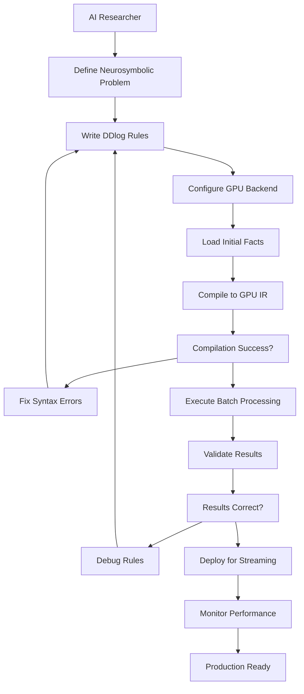
```mermaid
flowchart TD
    A["AI Researcher"]
    B["Define Neurosymbolic Problem"]
    C["Write DDlog Rules"]
    D["Configure GPU Backend"]
    E["Load Initial Facts"]
    F["Compile to GPU IR"]
    G["Compilation Success?"]
    H["Fix Syntax Errors"]
    I["Execute Batch Processing"]
    J["Validate Results"]
    K["Results Correct?"]
    L["Debug Rules"]
    M["Deploy for Streaming"]
    N["Monitor Performance"]
    O["Production Ready"]
    A --> B
    B --> C
    C --> D
    D --> E
    E --> F
    F --> G
    G --> H
    H --> C
    G --> I
    I --> J
    J --> K
    K --> L
    L --> C
    K --> M
    M --> N
    N --> O
```

#### Event-centric Knowledge Graph Maintenance

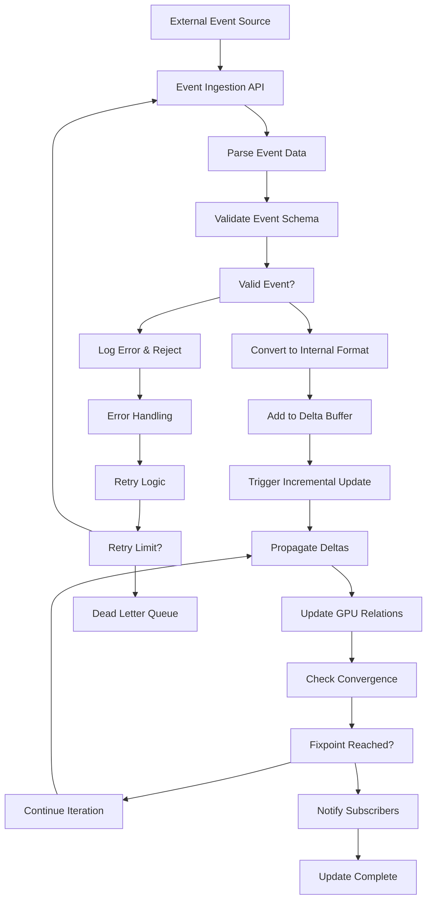
```mermaid
flowchart TD
    A["External Event Source"]
    B["Event Ingestion API"]
    C["Parse Event Data"]
    D["Validate Event Schema"]
    E["Valid Event?"]
    F["Log Error & Reject"]
    G["Convert to Internal Format"]
    H["Add to Delta Buffer"]
    I["Trigger Incremental Update"]
    J["Propagate Deltas"]
    K["Update GPU Relations"]
    L["Check Convergence"]
    M["Fixpoint Reached?"]
    N["Continue Iteration"]
    O["Notify Subscribers"]
    P["Update Complete"]
    Q["Error Handling"]
    R["Retry Logic"]
    S["Retry Limit?"]
    T["Dead Letter Queue"]
    A --> B
    B --> C
    C --> D
    D --> E
    E --> F
    E --> G
    G --> H
    H --> I
    I --> J
    J --> K
    K --> L
    L --> M
    M --> N
    N --> J
    M --> O
    O --> P
    F --> Q
    Q --> R
    R --> S
    S --> B
    S --> T
```

### 4.1.2 System Interactions

#### Multi-backend Gpu Execution Flow

Mermaid introduces 30 new shapes to enhance the flexibility and precision of
flowchart creation. These new shapes provide more options to represent
processes, decisions, events, data storage visually, and other elements within
your flowcharts, improving clarity and semantic meaning.


```mermaid
flowchart LR
    A["DDlog Parser"]
    B["AST Generation"]
    C["Semantic Analysis"]
    D["Logical Plan Builder"]
    E["GPU IR Generator"]
    F["Target Backend?"]
    G["NVPTX Compiler"]
    H["Vulkan Compiler"]
    I["PTX Kernels"]
    J["SPIR-V Modules"]
    K["CUDA Runtime"]
    L["Vulkan Runtime"]
    M["GPU Memory Manager"]
    N["Execution Engine"]
    O["GPU Relations"]
    P["Arrangements/Indices"]
    Q["Delta Buffers"]
    A --> B
    B --> C
    C --> D
    D --> E
    E --> F
    F --> G
    F --> H
    G --> I
    H --> J
    I --> K
    J --> L
    K --> M
    L --> M
    M --> N
    N --> O
    O --> P
    P --> Q
```

#### Integration With External Systems

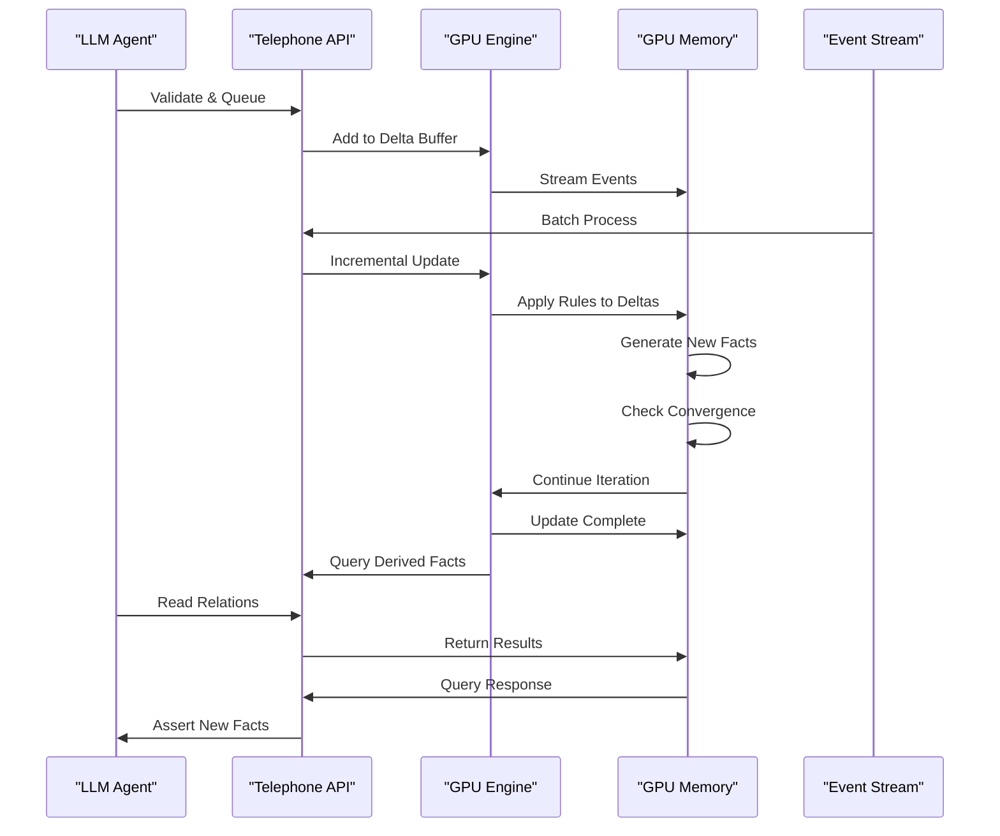
```mermaid
sequenceDiagram
    participant LLM_Agent as "LLM Agent"
    participant Telephone_API as "Telephone API"
    participant GPU_Engine as "GPU Engine"
    participant GPU_Memory as "GPU Memory"
    participant Event_Stream as "Event Stream"
    LLM_Agent ->> Telephone_API : Validate & Queue
    Telephone_API ->> GPU_Engine : Add to Delta Buffer
    GPU_Engine ->> GPU_Memory : Stream Events
    Event_Stream ->> Telephone_API : Batch Process
    Telephone_API ->> GPU_Engine : Incremental Update
    GPU_Engine ->> GPU_Memory : Apply Rules to Deltas
    GPU_Memory ->> GPU_Memory : Generate New Facts
    GPU_Memory ->> GPU_Memory : Check Convergence
    GPU_Memory ->> GPU_Engine : Continue Iteration
    GPU_Engine ->> GPU_Memory : Update Complete
    GPU_Engine ->> Telephone_API : Query Derived Facts
    LLM_Agent ->> Telephone_API : Read Relations
    Telephone_API ->> GPU_Memory : Return Results
    GPU_Memory ->> Telephone_API : Query Response
    Telephone_API ->> LLM_Agent : Assert New Facts
```

### 4.1.3 Decision Points And Business Rules

#### Rule Compilation Decision Matrix

Compilation decisions consider recursion depth, kernel occupancy, and whether
intermediate relations must remain GPU-resident. These heuristics replace the
previous flowchart and keep the narrative focussed on the criteria that
actually drive compiler behaviour.

#### Incremental Update Decision Flow

To ensure maintain the invariant that delta and full are disjoint, a
deduplication process is implemented both within the delta and against the full
set as the new tuples are allocated. After completing the second iteration, the
Datalog engine proceeds with the third iteration. The previous iteration's SG
delta is used as the input for the join operations in the current iteration.
The join results in new tuples SG new; however, all of these tuples are already
present in SG delta. This indicates that the query has reached its fixpoint.

### 4.1.4 Error Handling Paths

#### Gpu Memory Management Error Flow

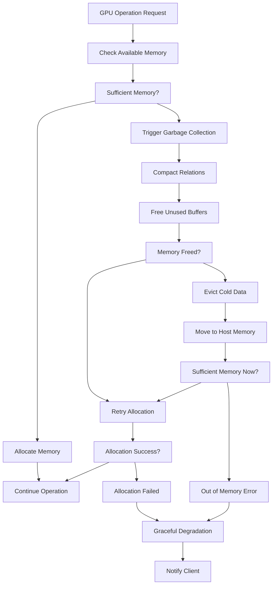
```mermaid
flowchart TD
    A["GPU Operation Request"]
    B["Check Available Memory"]
    C["Sufficient Memory?"]
    D["Allocate Memory"]
    E["Trigger Garbage Collection"]
    F["Compact Relations"]
    G["Free Unused Buffers"]
    H["Memory Freed?"]
    I["Retry Allocation"]
    J["Evict Cold Data"]
    K["Move to Host Memory"]
    L["Sufficient Memory Now?"]
    M["Out of Memory Error"]
    N["Allocation Success?"]
    O["Continue Operation"]
    P["Allocation Failed"]
    Q["Graceful Degradation"]
    R["Notify Client"]
    A --> B
    B --> C
    C --> D
    C --> E
    E --> F
    F --> G
    G --> H
    H --> I
    H --> J
    J --> K
    K --> L
    L --> I
    L --> M
    I --> N
    N --> O
    N --> P
    D --> O
    M --> Q
    P --> Q
    Q --> R
```

#### Compilation Error Recovery

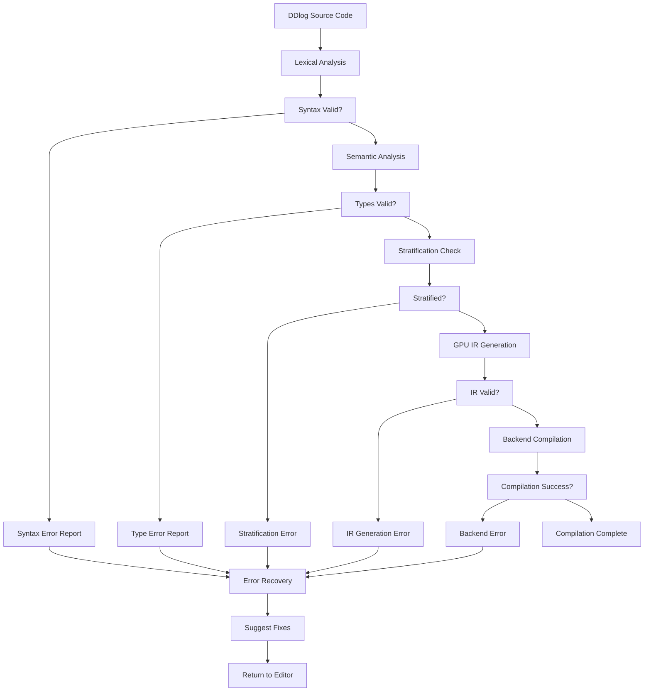
```mermaid
flowchart TD
    A["DDlog Source Code"]
    B["Lexical Analysis"]
    C["Syntax Valid?"]
    D["Syntax Error Report"]
    E["Semantic Analysis"]
    F["Types Valid?"]
    G["Type Error Report"]
    H["Stratification Check"]
    I["Stratified?"]
    J["Stratification Error"]
    K["GPU IR Generation"]
    L["IR Valid?"]
    M["IR Generation Error"]
    N["Backend Compilation"]
    O["Compilation Success?"]
    P["Backend Error"]
    Q["Compilation Complete"]
    R["Error Recovery"]
    S["Suggest Fixes"]
    T["Return to Editor"]
    A --> B
    B --> C
    C --> D
    C --> E
    E --> F
    F --> G
    F --> H
    H --> I
    I --> J
    I --> K
    K --> L
    L --> M
    L --> N
    N --> O
    O --> P
    O --> Q
    D --> R
    G --> R
    J --> R
    M --> R
    P --> R
    R --> S
    S --> T
```

## 4.2 Integration Workflows

### 4.2.1 Data Flow Between Systems

#### Event Stream Processing Pipeline

Our implementation combines MPI for inter-node communication with CUDA for GPU
parallelization, enabling the processing of massive datasets in real time. Our
implementation combines MPI for inter-node communication with CUDA for GPU
parallelization, enabling the processing of massive datasets in real time. We
have created novel data-parallel implementations of core relational algebra
operations (join), while also optimizing deduplication and tuple
materialization.

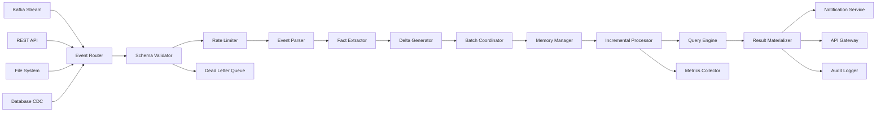
```mermaid
flowchart LR
    A["Kafka Stream"]
    B["REST API"]
    C["File System"]
    D["Database CDC"]
    E["Event Router"]
    F["Schema Validator"]
    G["Rate Limiter"]
    H["Dead Letter Queue"]
    I["Event Parser"]
    J["Fact Extractor"]
    K["Delta Generator"]
    L["Batch Coordinator"]
    M["Memory Manager"]
    N["Incremental Processor"]
    O["Query Engine"]
    P["Result Materializer"]
    Q["Notification Service"]
    R["API Gateway"]
    S["Metrics Collector"]
    T["Audit Logger"]
    A --> E
    B --> E
    C --> E
    D --> E
    E --> F
    F --> G
    G --> I
    F --> H
    I --> J
    J --> K
    K --> L
    L --> M
    M --> N
    N --> O
    O --> P
    P --> Q
    P --> R
    N --> S
    P --> T
```

### 4.2.2 Api Interactions

#### Llm Integration Sequence

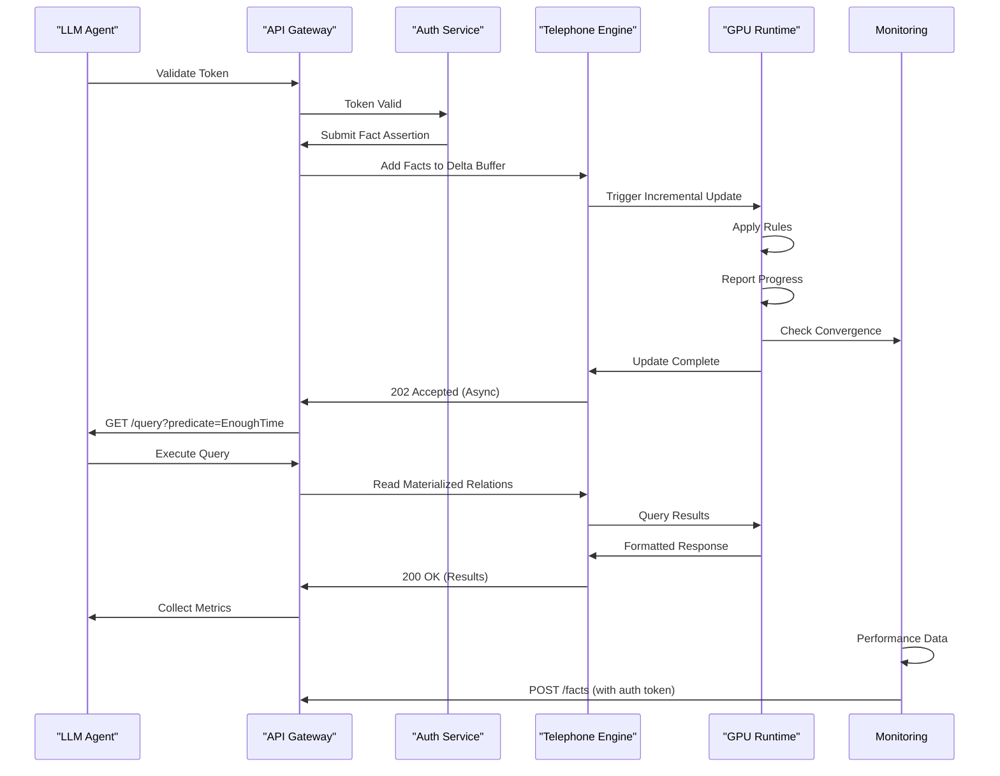
```mermaid
sequenceDiagram
    participant LLM_Agent as "LLM Agent"
    participant API_Gateway as "API Gateway"
    participant Auth_Service as "Auth Service"
    participant Telephone_Engine as "Telephone Engine"
    participant GPU_Runtime as "GPU Runtime"
    participant Monitoring
    LLM_Agent ->> API_Gateway : Validate Token
    API_Gateway ->> Auth_Service : Token Valid
    Auth_Service ->> API_Gateway : Submit Fact Assertion
    API_Gateway ->> Telephone_Engine : Add Facts to Delta Buffer
    Telephone_Engine ->> GPU_Runtime : Trigger Incremental Update
    GPU_Runtime ->> GPU_Runtime : Apply Rules
    GPU_Runtime ->> GPU_Runtime : Report Progress
    GPU_Runtime ->> Monitoring : Check Convergence
    GPU_Runtime ->> Telephone_Engine : Update Complete
    Telephone_Engine ->> API_Gateway : 202 Accepted (Async)
    API_Gateway ->> LLM_Agent : GET /query?predicate=EnoughTime
    LLM_Agent ->> API_Gateway : Execute Query
    API_Gateway ->> Telephone_Engine : Read Materialized Relations
    Telephone_Engine ->> GPU_Runtime : Query Results
    GPU_Runtime ->> Telephone_Engine : Formatted Response
    Telephone_Engine ->> API_Gateway : 200 OK (Results)
    API_Gateway ->> LLM_Agent : Collect Metrics
    Monitoring ->> Monitoring : Performance Data
    Monitoring ->> API_Gateway : POST /facts (with auth token)
```

### 4.2.3 Event Processing Flows

#### Real-time Event Processing State Machine

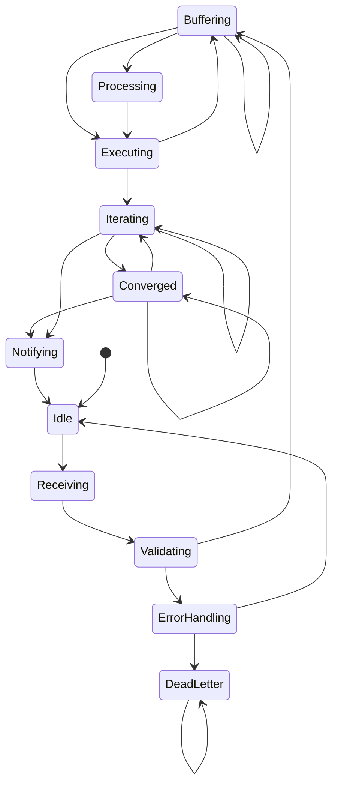
```mermaid
stateDiagram-v2
    Buffering --> Buffering
    Buffering --> Executing
    Buffering --> Processing
    Converged --> Converged
    Converged --> Iterating
    Converged --> Notifying
    DeadLetter --> DeadLetter
    ErrorHandling --> DeadLetter
    ErrorHandling --> Idle
    Executing --> Buffering
    Executing --> Iterating
    Idle --> Receiving
    Iterating --> Converged
    Iterating --> Iterating
    Iterating --> Notifying
    Notifying --> Idle
    Processing --> Executing
    Receiving --> Validating
    Validating --> Buffering
    Validating --> ErrorHandling
    [*] --> Idle
```

### 4.2.4 Batch Processing Sequences

#### Large Dataset Initial Load

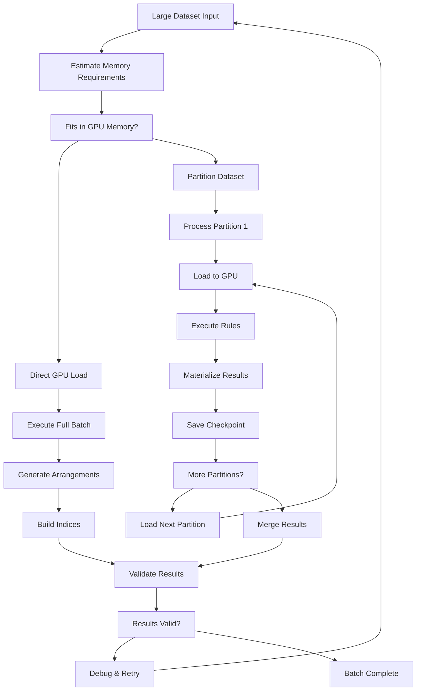
```mermaid
flowchart TD
    A["Large Dataset Input"]
    B["Estimate Memory Requirements"]
    C["Fits in GPU Memory?"]
    D["Direct GPU Load"]
    E["Partition Dataset"]
    F["Process Partition 1"]
    G["Load to GPU"]
    H["Execute Rules"]
    I["Materialize Results"]
    J["Save Checkpoint"]
    K["More Partitions?"]
    L["Load Next Partition"]
    M["Merge Results"]
    N["Execute Full Batch"]
    O["Generate Arrangements"]
    P["Build Indices"]
    Q["Validate Results"]
    R["Results Valid?"]
    S["Debug & Retry"]
    T["Batch Complete"]
    A --> B
    B --> C
    C --> D
    C --> E
    E --> F
    F --> G
    G --> H
    H --> I
    I --> J
    J --> K
    K --> L
    K --> M
    L --> G
    D --> N
    N --> O
    O --> P
    P --> Q
    M --> Q
    Q --> R
    R --> S
    R --> T
    S --> A
```

## 4.3 State Management

### 4.3.1 State Transitions

#### Gpu Memory State Lifecycle

In GDlog we can take advantage of GPU operation over our data structure's
internal compact array to parallelize this process. Efficient parallelization
is achieved by employing a strategy that entails the coarse yet swift
partitioning of both the sorted array of full and delta relations into several
small, sorted tiles, each of which can fit neatly into a GPU's execution wraps.
This transformation of the merging process effectively converts it into a
divide-and-conquer problem and, as a result, makes it amenable to seamless
acceleration by SIMD hardware.

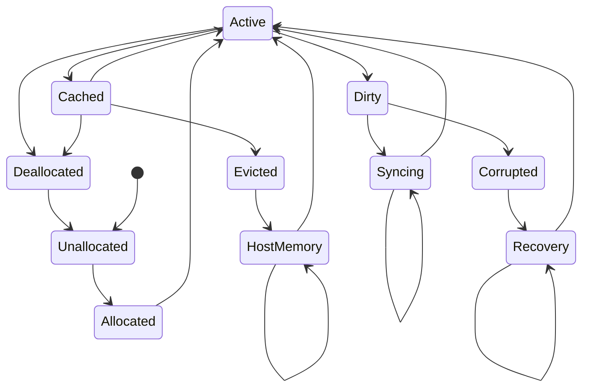
```mermaid
stateDiagram-v2
    Active --> Cached
    Active --> Deallocated
    Active --> Dirty
    Allocated --> Active
    Cached --> Active
    Cached --> Deallocated
    Cached --> Evicted
    Corrupted --> Recovery
    Deallocated --> Unallocated
    Dirty --> Corrupted
    Dirty --> Syncing
    Evicted --> HostMemory
    HostMemory --> Active
    HostMemory --> HostMemory
    Recovery --> Active
    Recovery --> Recovery
    Syncing --> Active
    Syncing --> Syncing
    Unallocated --> Allocated
    [*] --> Unallocated
```

### 4.3.2 Data Persistence Points

#### Checkpoint And Recovery Flow

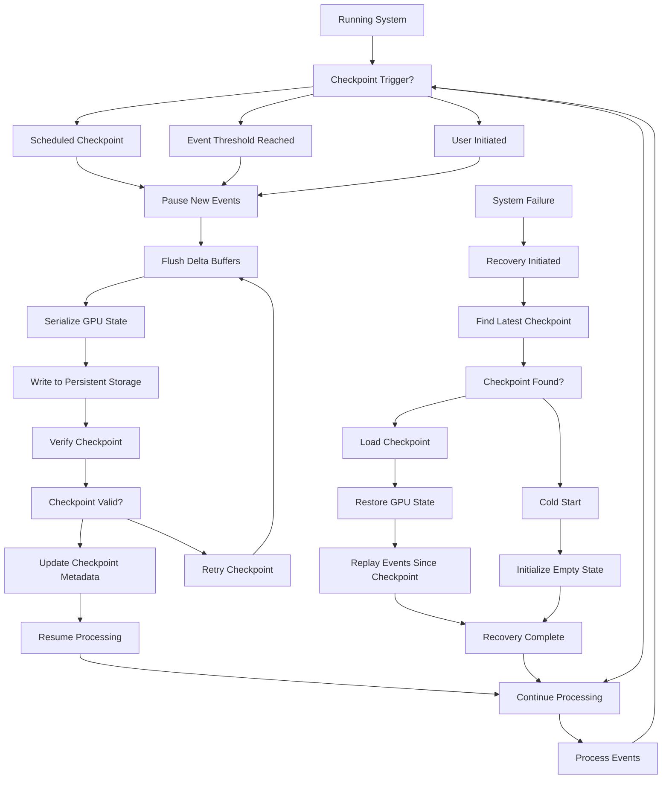
```mermaid
flowchart TD
    A["Running System"]
    B["Checkpoint Trigger?"]
    C["Scheduled Checkpoint"]
    D["Event Threshold Reached"]
    E["User Initiated"]
    F["Continue Processing"]
    G["Pause New Events"]
    H["Flush Delta Buffers"]
    I["Serialize GPU State"]
    J["Write to Persistent Storage"]
    K["Verify Checkpoint"]
    L["Checkpoint Valid?"]
    M["Update Checkpoint Metadata"]
    N["Retry Checkpoint"]
    O["Resume Processing"]
    P["Process Events"]
    Q["System Failure"]
    R["Recovery Initiated"]
    S["Find Latest Checkpoint"]
    T["Checkpoint Found?"]
    U["Load Checkpoint"]
    V["Cold Start"]
    W["Restore GPU State"]
    X["Replay Events Since Checkpoint"]
    Y["Recovery Complete"]
    Z["Initialize Empty State"]
    A --> B
    B --> C
    B --> D
    B --> E
    B --> F
    C --> G
    D --> G
    E --> G
    G --> H
    H --> I
    I --> J
    J --> K
    K --> L
    L --> M
    L --> N
    N --> H
    M --> O
    O --> F
    F --> P
    P --> B
    Q --> R
    R --> S
    S --> T
    T --> U
    T --> V
    U --> W
    W --> X
    X --> Y
    V --> Z
    Z --> Y
    Y --> F
```

### 4.3.3 Transaction Boundaries

#### Incremental Update Transaction Flow

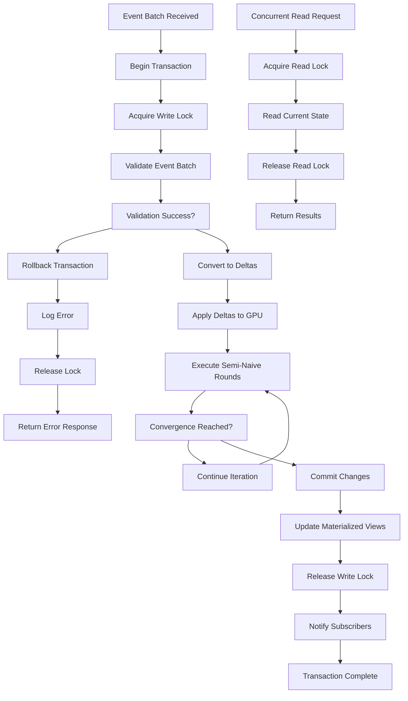
```mermaid
flowchart TD
    A["Event Batch Received"]
    B["Begin Transaction"]
    C["Acquire Write Lock"]
    D["Validate Event Batch"]
    E["Validation Success?"]
    F["Rollback Transaction"]
    G["Convert to Deltas"]
    H["Apply Deltas to GPU"]
    I["Execute Semi-Naive Rounds"]
    J["Convergence Reached?"]
    K["Continue Iteration"]
    L["Commit Changes"]
    M["Update Materialized Views"]
    N["Release Write Lock"]
    O["Notify Subscribers"]
    P["Transaction Complete"]
    Q["Log Error"]
    R["Release Lock"]
    S["Return Error Response"]
    T["Concurrent Read Request"]
    U["Acquire Read Lock"]
    V["Read Current State"]
    W["Release Read Lock"]
    X["Return Results"]
    A --> B
    B --> C
    C --> D
    D --> E
    E --> F
    E --> G
    G --> H
    H --> I
    I --> J
    J --> K
    J --> L
    K --> I
    L --> M
    M --> N
    N --> O
    O --> P
    F --> Q
    Q --> R
    R --> S
    T --> U
    U --> V
    V --> W
    W --> X
```

## 4.4 Error Handling And Recovery

### 4.4.1 Retry Mechanisms

#### Exponential Backoff Strategy

Retry windows grow geometrically with jitter once transient faults are detected.

### 4.4.2 Fallback Processes

#### Gpu To Cpu Fallback Decision Tree

When retries cannot recover a GPU operation, queues downgrade to the CPU
implementation. This path is guarded by configuration flags and emits a
telemetry event so operators can monitor degraded performance explicitly.

### 4.4.3 Recovery Procedures

#### System Recovery Workflow

State recovery replays the most recent checkpoints into GPU memory and re-runs
pending delta batches until fixpoint equilibrium is restored.

## 4.5 Performance And Monitoring

### 4.5.1 Performance Monitoring Flow

#### Real-time Performance Tracking

### 4.5.2 Sla Monitoring And Compliance

#### Service Level Agreement Tracking

This comprehensive Process Flowchart section provides detailed workflows for
all major system operations, from user interactions to error recovery, ensuring
that implementers have clear guidance on system behavior and decision points
throughout the Telephone GPU-accelerated Datalog engine lifecycle.

## 5. System Architecture

## 5.1 High-level Architecture

### 5.1.1 System Overview

Telephone employs a **layered GPU-accelerated dataflow architecture** that
unifies high-throughput batch processing with real-time incremental updates for
Datalog programs. The system follows a **compiler-runtime separation pattern**
where a sophisticated frontend transforms DDlog programs into GPU-optimized
intermediate representation, while a multi-backend runtime engine executes
these programs across diverse GPU architectures.

The architecture is built on three foundational principles:

#### GPU-First Design

The system implements iterated relational algebra kernels over novel
range-indexed data structures, achieving significant (up to 45x) gains compared
to CPU-based engines like Soufflé. GPUlog implements iterated relational
algebra kernels over a novel range-indexed data structure called the
hash-indexed sorted array (HISA). All core operations are designed for
massively parallel execution with careful attention to memory coalescing and
thread divergence avoidance.

#### Differential Semantics

The system updates outputs based on changes in inputs rather than recomputing
everything from scratch. Incremental computation ensures efficient processing
and quick response times, which are crucial for real-time applications. This
enables millisecond-scale response to data changes while maintaining full
logical consistency.

#### Cross-Platform Portability

The system can write GPU code in Rust and run it on all major platforms across
all major GPUs. The next step is to improve the experience through a unified
compilation pipeline that targets both CUDA and SPIR-V backends without
sacrificing performance.

The system boundaries encompass DDlog program compilation, GPU memory
management, incremental update processing, and external system integration
through well-defined APIs. Major interfaces include the DDlog parser frontend,
GPU backend abstraction layer, event ingestion APIs, and query processing
endpoints.

### 5.1.2 Core Components Table

| Component Name                | Primary Responsibility                   | Key Dependencies                     | Integration Points                  | Critical Considerations                                     |
| ----------------------------- | ---------------------------------------- | ------------------------------------ | ----------------------------------- | ----------------------------------------------------------- |
| **DDlog Frontend Parser**     | Parse DDlog syntax into validated AST    | Rust parser libraries, DDlog grammar | Logical Plan Builder, Type System   | Must handle multi-head rules, delay markers, diff semantics |
| **GPU IR Compiler**           | Transform logical plans to GPU kernels   | CUDA/SPIR-V toolchains, Rust-GPU     | Frontend Parser, Backend Runtimes   | Cross-platform code generation, kernel optimization         |
| **Incremental Update Engine** | Process deltas and maintain consistency  | Differential dataflow library        | GPU Memory Manager, Event Processor | Reference counting, fixpoint detection, delta propagation   |
| **Multi-Backend GPU Runtime** | Execute kernels across GPU architectures | CUDA toolkit, Vulkan SDK             | Memory Manager, Execution Scheduler | Hardware abstraction, performance parity across backends    |

### 5.1.3 Data Flow Description

The primary data flow follows a **staged pipeline architecture** with three
distinct phases:

#### Compilation Phase

DDlog source programs enter through the frontend parser, which validates syntax
and constructs an abstract syntax tree. The logical plan builder transforms
this AST into a dependency graph of relational operations, performing
optimizations like join reordering and predicate pushdown. The GPU IR compiler
then generates platform-specific kernels, with Rust GPU and Rust CUDA evolved
independently and diverged in their APIs. For example, accessing thread indices
is done through a function call in Rust CUDA, while in Rust GPU it requires
annotating entrypoint arguments. Even the standard library names differ
(cuda_std vs spirv_std).

#### Execution Phase

The multi-backend runtime loads compiled kernels and initializes GPU memory
structures. Base relations are loaded into columnar GPU buffers using
structure-of-arrays layout for optimal memory coalescing. SoA is considered the
best practice for GPUs due to improved memory coalescing and cache performance.
The execution scheduler orchestrates kernel launches according to rule
dependencies, implementing semi-naïve evaluation for recursive rules.

#### Incremental Phase

When new events arrive, the delta processor converts them to internal format
and triggers incremental evaluation. Incremental computation stands at the core
of differential dataflow. This principle involves updating outputs based on
changes in inputs rather than recomputing everything from scratch. Only
affected rules execute, with results propagated through the dependency graph
until fixpoint convergence.

Key data transformation points include string interning for symbolic values,
delta format conversion for incremental updates, and result materialization for
query responses. The system maintains both full relations and delta buffers in
GPU memory, with automatic garbage collection and memory compaction.

### 5.1.4 External Integration Points

| System Name               | Integration Type   | Data Exchange Pattern    | Protocol/Format          | SLA Requirements         |
| ------------------------- | ------------------ | ------------------------ | ------------------------ | ------------------------ |
| **LLM Agents**            | Bidirectional API  | Fact assertion and query | REST/gRPC with JSON      | \<100ms query response   |
| **Event Streams**         | Ingestion pipeline | Continuous event flow    | Kafka/Pulsar protocols   | \<10ms ingestion latency |
| **Time-Series Databases** | Storage backend    | Archival and retrieval   | Native connectors        | 99.9% availability       |
| **Monitoring Systems**    | Telemetry export   | Metrics and traces       | Prometheus/OpenTelemetry | Real-time visibility     |

## 5.2 Component Details

### 5.2.1 Ddlog Frontend Parser

#### Ddlog Frontend Parser – Purpose and Responsibilities

The frontend parser serves as the primary entry point for DDlog programs,
responsible for lexical analysis, syntax validation, semantic checking, and AST
construction. It handles the complete DDlog syntax including multi-head rules,
temporal constructs, and differential markers.

#### Ddlog Frontend Parser – Technologies and Frameworks

Built using Rust with nom parser combinators for robust error handling and
recovery. Leverages the existing DDlog grammar specification while extending
support for GPU-specific optimizations and cross-platform compilation hints.

#### Ddlog Frontend Parser – Key Interfaces and APIs

- `parse_program(source: &str) -> Result<DatalogProgram, ParseError>`
- `validate_semantics(ast: &DatalogProgram) -> Result<(), SemanticError>`
- `extract_dependencies(program: &DatalogProgram) -> DependencyGraph`

#### Ddlog Frontend Parser – Data Persistence Requirements

Parser maintains no persistent state but caches compiled ASTs using
content-addressable storage for incremental recompilation during development.

#### Ddlog Frontend Parser – Scaling Considerations

Parser performance scales linearly with program size. Large programs benefit
from parallel parsing of independent modules and incremental parsing for
development workflows.

### 5.2.2 Gpu Ir Compiler

#### Gpu Ir Compiler – Purpose and Responsibilities

Transforms validated DDlog programs into GPU-optimized intermediate
representation and generates executable kernels for multiple backend targets.
Implements advanced optimizations including join reordering, memory layout
optimization, and kernel fusion.

#### Gpu Ir Compiler – Technologies and Frameworks

Rust CUDA enables you to write and run CUDA kernels in Rust, executing directly
on NVIDIA GPUs using NVVM IR. Rust CUDA includes a compiler backend that
compiles regular Rust code into NVVM IR. For cross-platform support, uses
rust-gpu for SPIR-V generation targeting Vulkan-compatible GPUs.

#### Gpu Ir Compiler – Key Interfaces and APIs

- `compile_to_cuda(ir: &LogicalPlan) -> Result<CudaKernels, CompileError>`
- `compile_to_spirv(ir: &LogicalPlan) -> Result<SpirvModules, CompileError>`
- `optimize_memory_layout(relations: &[Relation]) -> MemoryLayout`

#### Gpu Ir Compiler – Data Persistence Requirements

Compiled kernels are cached using content-addressable storage with automatic
invalidation based on source changes and target architecture updates.

#### Gpu Ir Compiler – Scaling Considerations

Compilation time scales with program complexity and number of target
architectures. Parallel compilation across backends and aggressive caching
minimize development iteration time.

### 5.2.3 Incremental Update Engine

#### Incremental Update Engine – Purpose and Responsibilities

Implements differential dataflow semantics for real-time incremental
computation. Manages delta propagation, reference counting for deletions, and
fixpoint detection while maintaining logical consistency across all derived
relations.

#### Incremental Update Engine – Technologies and Frameworks

Differential dataflow arose from work at Microsoft Research, where we aimed to
build a high-level framework that could both compute and incrementally maintain
non-trivial algorithms. In this book we will work through the motivation and
technical details behind differential dataflow, a computational framework build
on top of timely dataflow intended for efficiently performing computations on
large amounts of data and maintaining the computations as the data change.

#### Incremental Update Engine – Key Interfaces and APIs

- `process_delta_batch(deltas: &[Delta]) -> Result<UpdateResult, UpdateError>`
- `check_convergence(iteration: u32) -> ConvergenceStatus`
- `maintain_reference_counts(relation: &str, deltas: &[Delta])`

#### Incremental Update Engine – Data Persistence Requirements

Maintains epoch-indexed delta history for debugging and rollback capabilities.
Implements automatic compaction based on configurable retention policies.

#### Incremental Update Engine – Scaling Considerations

The importance of differential dataflow lies in its ability to provide
high-throughput and low-latency performance, making it ideal for real-time
analytics and streaming applications. Performance scales with delta size rather
than total data size, enabling efficient processing of high-frequency update
streams.

### 5.2.4 Multi-backend Gpu Runtime

#### Multi-backend Gpu Runtime – Purpose and Responsibilities

Provides hardware abstraction for GPU execution across NVIDIA, AMD, Intel, and
Apple architectures. Manages GPU memory allocation, kernel scheduling, and
performance optimization while maintaining consistent semantics across
platforms.

#### Multi-backend Gpu Runtime – Technologies and Frameworks

To increase the performance portability of GDlog, we translated it to a
Heterogeneous-Compute Interface for Portability (HIP) based engine with
identical function signature. Thus, we have the ability to run the analytical
programs in both NVIDIA and AMD GPUs seamlessly.

#### Multi-backend Gpu Runtime – Key Interfaces and APIs

- `initialize_gpu_context(preferred_backend: GpuBackend) -> Result<GpuContext, InitError>`
- `allocate_gpu_memory(size: usize, layout: MemoryLayout) -> Result<GpuBuffer, MemoryError>`
- `launch_kernel(kernel: &CompiledKernel, params: &KernelParams) -> Result<(), ExecutionError>`

#### Multi-backend Gpu Runtime – Data Persistence Requirements

No persistent storage required, but maintains GPU memory pools and kernel
caches across program executions for performance optimization.

#### Multi-backend Gpu Runtime – Scaling Considerations

Supports multi-GPU configurations within single nodes. Our implementation
combines MPI for inter-node communication with CUDA for GPU parallelization,
enabling the processing of massive datasets in real time. We have created novel
data-parallel implementations of core relational algebra operations (join),
while also optimizing deduplication and tuple materialization.

### 5.2.5 Canonical Planning And IR Layer

#### Canonical Planning And IR Layer – Purpose and Responsibilities

Bridges the DDlog parser and GPU code generator with a structured, MLIR-style
intermediate representation. Encodes rules, delta semantics, and provenance as
typed ops, enables rewrite-driven optimisation, and produces deterministic plan
hashes that power compile- and run-time caches.

#### Canonical Planning And IR Layer – Technologies and Frameworks

- **pliron `tel` dialect:** Provides typed ops, regions, and verifiers for
  relations, rules, delta views, and fixpoint regions while retaining parser
  adornments (`Delay`, diff marks, references) as attributes.
- **egg / egglog:** Hosts rewrite sets for join associativity/commutativity,
  predicate pushdown, and delta distribution; saturation is budgeted to keep
  compilation predictable.
- **melior exporter (optional):** Future compatibility layer to emit an MLIR
  dialect without making MLIR a runtime dependency.

#### Canonical Planning And IR Layer – Key Interfaces and APIs

- `lower_to_tel(ast: &DatalogProgram) -> Result<TelModule, TelError>`
- `canonicalise(module: &TelModule) -> Result<CanonicalPlan, CanonicaliseError>`
- `plan_hash(plan: &CanonicalPlan, target: &TargetProfile) -> PlanHash`
- `lower_to_backend(plan: &CanonicalPlan, target: &TargetProfile) -> BackendPlan`

#### Canonical Planning And IR Layer – Data Persistence Requirements

Maintains a three-tier cache keyed by `PlanHash`: logical plan DAG, compiled
kernel bundle, and optional result shard metadata. Cache entries are salted
with target ABI and statistics fingerprints to avoid cross-environment clashes.

#### Canonical Planning And IR Layer – Scaling Considerations

Equality saturation can grow quickly; the planner enforces node/iteration caps
and uses cost-guided extraction to keep compilations bounded. Deterministic
plan hashes ensure that rule changes invalidate only the affected sub-DAGs,
enabling fast redeployments for streaming knowledge-graph workloads.

## 5.3 Technical Decisions

### 5.3.1 Architecture Style Decisions And Tradeoffs

#### Layered Architecture with GPU-First Design

The decision to adopt a layered architecture with GPU-first design principles
represents a fundamental departure from traditional CPU-bound Datalog engines.
This choice prioritizes massive parallelism and memory bandwidth over
single-threaded optimization.

| Decision Factor      | Chosen Approach           | Alternative Considered | Rationale                                                                                                                                                                                                                                                                                                                                                                              |
| -------------------- | ------------------------- | ---------------------- | -------------------------------------------------------------------------------------------------------------------------------------------------------------------------------------------------------------------------------------------------------------------------------------------------------------------------------------------------------------------------------------- |
| **Execution Model**  | GPU-accelerated parallel  | CPU multi-threaded     | GPUs offer an attractive implementation candidate for Datalog backends due to their excellent performance in data-parallel, memory-intensive applications. Their programming model supports highly parallelized loops (with 10,000+ FP32 cores on modern GPUs). Crucially, GPUs provide extremely high throughput: the recent AMD MI300 can transfer 8192 bits in a single clock cycle |
| **Memory Layout**    | Columnar (SoA)            | Row-oriented (AoS)     | SoA is considered the best practice for GPUs due to improved memory coalescing and cache performance                                                                                                                                                                                                                                                                                   |
| **Backend Strategy** | Multi-backend abstraction | Single vendor lock-in  | Ensures portability across GPU vendors while maintaining performance                                                                                                                                                                                                                                                                                                                   |
| **Update Semantics** | Differential/incremental  | Batch recomputation    | This principle involves updating outputs based on changes in inputs rather than recomputing everything from scratch. Incremental computation ensures efficient processing and quick response times                                                                                                                                                                                     |

#### Compiler-Runtime Separation

The clear separation between compilation and runtime phases enables aggressive
optimization while maintaining flexibility for dynamic rule changes and
development workflows.

### 5.3.2 Communication Pattern Choices

#### Event-Driven Delta Propagation

The system employs an event-driven communication pattern for incremental
updates, where changes trigger cascading updates through the dependency graph
rather than periodic batch processing.

| Pattern               | Implementation                  | Benefits                 | Tradeoffs              |
| --------------------- | ------------------------------- | ------------------------ | ---------------------- |
| **Delta Propagation** | Asynchronous event queues       | Sub-millisecond latency  | Complexity in ordering |
| **GPU-Host Sync**     | CUDA events/Vulkan fences       | Minimal CPU-GPU overhead | Platform-specific code |
| **Inter-Component**   | Rust channels with backpressure | Type safety, performance | Memory overhead        |
| **External APIs**     | gRPC with streaming             | Language agnostic        | Network latency        |

### 5.3.3 Data Storage Solution Rationale

#### GPU-Resident Memory-First Architecture

The decision to maintain primary data structures in GPU memory represents a
significant architectural choice that prioritizes performance over traditional
database persistence patterns.

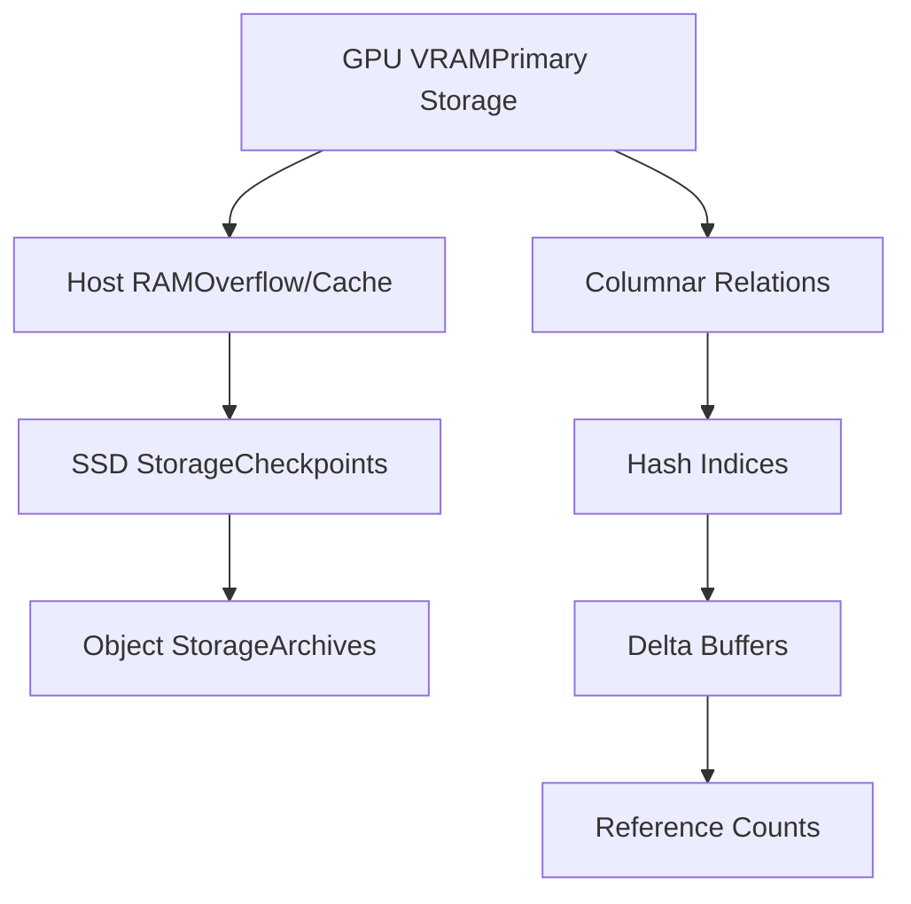
```mermaid
flowchart TD
    A["GPU VRAMPrimary Storage"]
    B["Host RAMOverflow/Cache"]
    C["SSD StorageCheckpoints"]
    D["Object StorageArchives"]
    E["Columnar Relations"]
    F["Hash Indices"]
    G["Delta Buffers"]
    H["Reference Counts"]
    A --> B
    B --> C
    C --> D
    E --> F
    F --> G
    G --> H
    A --> E
```

#### Storage Layer Justification

- **GPU VRAM**: We need a GPU-based representation of relations (sets of
  tuples), which are typically implemented via linked data structures on the
  CPU. Second, the massive number of parallel threads dictates that lock
  freedom and communication avoidance be particularly relevant concerns
- **Columnar Layout**: Optimizes memory coalescing and enables efficient
  parallel operations on individual attributes
- **Delta Buffers**: Enable incremental processing without full relation
  reconstruction
- **Reference Counting**: Supports correct deletion semantics in
  differential dataflow

### 5.3.4 Caching Strategy Justification

#### Multi-Level Caching with Content-Addressable Storage

The caching strategy employs content-addressable storage at multiple levels to
optimize both compilation and runtime performance.

| Cache Level            | Content                   | Eviction Policy       | Performance Impact             |
| ---------------------- | ------------------------- | --------------------- | ------------------------------ |
| **Compilation Cache**  | GPU kernels, IR           | Content-addressed LRU | 10-100x faster recompilation   |
| **Arrangement Cache**  | Sorted relations, indices | Reference counting    | 2-5x faster joins              |
| **Query Result Cache** | Materialized views        | TTL-based             | Sub-millisecond query response |
| **Memory Pool Cache**  | GPU buffer allocations    | Size-based LRU        | Reduced allocation overhead    |

### 5.3.5 Security Mechanism Selection

#### Memory Safety Through Rust's Type System

The choice of Rust as the implementation language provides memory safety
guarantees that are particularly critical in GPU programming environments where
debugging is challenging.

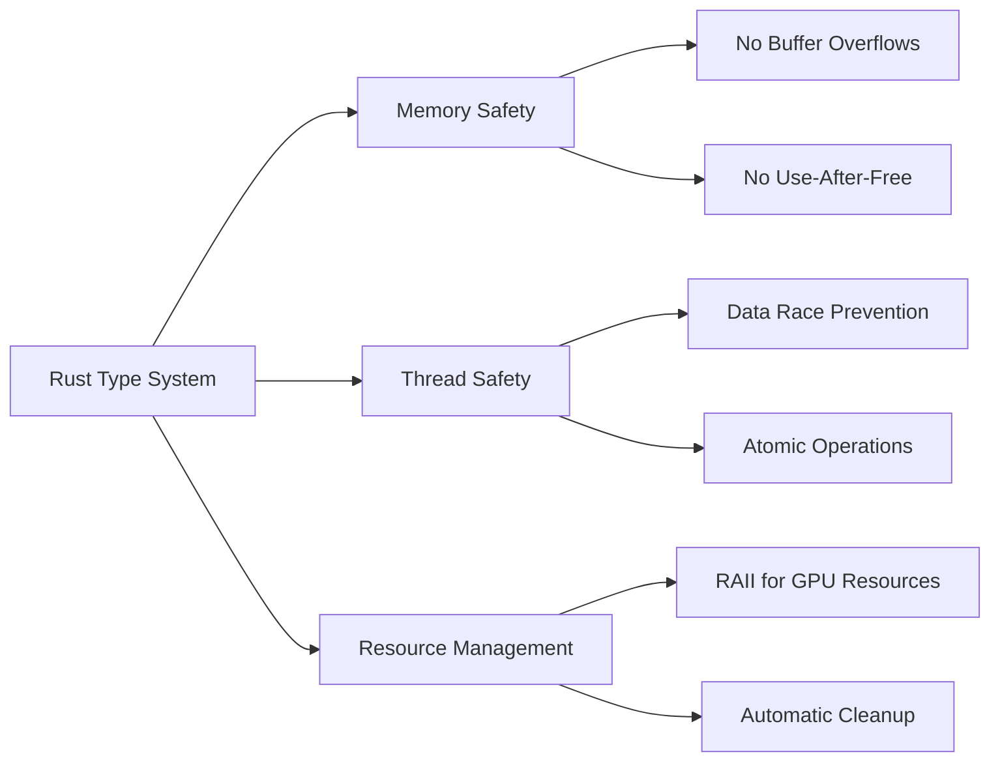
```mermaid
flowchart LR
    A["Rust Type System"]
    B["Memory Safety"]
    C["Thread Safety"]
    D["Resource Management"]
    E["No Buffer Overflows"]
    F["No Use-After-Free"]
    G["Data Race Prevention"]
    H["Atomic Operations"]
    I["RAII for GPU Resources"]
    J["Automatic Cleanup"]
    A --> B
    A --> C
    A --> D
    B --> E
    B --> F
    C --> G
    C --> H
    D --> I
    D --> J
```

#### Security Considerations

- **GPU Memory Isolation**: Each program execution uses isolated GPU
  contexts
- **Input Validation**: All external data undergoes strict schema
  validation
- **Resource Limits**: Configurable limits on GPU memory usage and
  execution time
- **Audit Logging**: Complete provenance tracking for compliance
  requirements

## 5.4 Cross-cutting Concerns

### 5.4.1 Monitoring And Observability Approach

#### Comprehensive Telemetry with GPU-Aware Metrics

The monitoring strategy provides visibility into both host-side operations and
GPU execution characteristics, enabling performance optimization and
operational troubleshooting.

#### Key Metrics Categories

- **Performance Metrics**: GPU utilization, memory bandwidth, kernel
  execution time, throughput (facts/second)
- **Correctness Metrics**: Fixpoint convergence time, delta propagation
  latency, reference count consistency
- **Resource Metrics**: GPU memory usage, host memory usage, compilation
  cache hit rates
- **Business Metrics**: Query response time, event ingestion rate,
  system availability

#### Implementation Approach

- **Prometheus Integration**: Custom metrics exported via standard
  Prometheus endpoints
- **Distributed Tracing**: OpenTelemetry spans for request tracing
  across components
- **GPU Profiling**: NVIDIA Nsight and AMD ROCProfiler integration for
  kernel analysis
- **Real-time Dashboards**: Grafana dashboards with GPU-specific
  visualizations

### 5.4.2 Logging And Tracing Strategy

#### Structured Logging with Correlation IDs

The logging strategy employs structured logging with correlation IDs to trace
operations across the distributed system components and GPU execution
boundaries.

| Log Level | Content                            | Destination        | Retention |
| --------- | ---------------------------------- | ------------------ | --------- |
| **ERROR** | System failures, GPU errors        | Persistent storage | 90 days   |
| **WARN**  | Performance degradation, fallbacks | Persistent storage | 30 days   |
| **INFO**  | State changes, major operations    | Persistent storage | 7 days    |
| **DEBUG** | Detailed execution traces          | Memory buffer      | 24 hours  |

#### Tracing Implementation

- **Span Hierarchy**: Request → Compilation → Execution → GPU Kernels
- **GPU Correlation**: CUDA/Vulkan event correlation with host-side
  spans
- **Performance Annotations**: Kernel launch parameters, memory transfer
  sizes
- **Error Context**: Full stack traces with GPU error codes and memory
  states

### 5.4.3 Error Handling Patterns

#### Hierarchical Error Recovery with GPU Fallbacks

The error handling strategy implements multiple levels of recovery, from
individual kernel failures to complete GPU backend fallbacks.

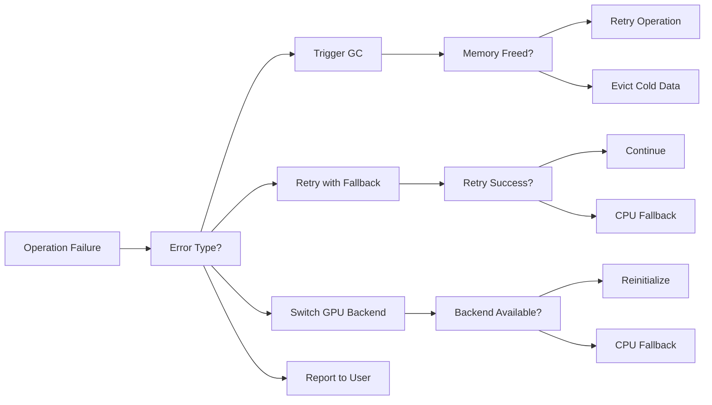
```mermaid
flowchart LR
    A["Operation Failure"]
    B["Error Type?"]
    C["Trigger GC"]
    D["Retry with Fallback"]
    E["Switch GPU Backend"]
    F["Report to User"]
    G["Memory Freed?"]
    H["Retry Operation"]
    I["Evict Cold Data"]
    J["Retry Success?"]
    K["Continue"]
    L["CPU Fallback"]
    M["Backend Available?"]
    N["Reinitialize"]
    O["CPU Fallback"]
    A --> B
    B --> C
    B --> D
    B --> E
    B --> F
    C --> G
    G --> H
    G --> I
    D --> J
    J --> K
    J --> L
    E --> M
    M --> N
    M --> O
```

#### Error Recovery Strategies

- **Memory Errors**: Automatic garbage collection, data eviction, memory
  compaction
- **Compilation Errors**: Detailed diagnostics with source location
  mapping
- **Runtime Errors**: Graceful degradation to CPU execution when
  possible
- **Network Errors**: Exponential backoff with circuit breaker patterns

### 5.4.4 Authentication And Authorization Framework

#### API-First Security with Role-Based Access Control

The security framework implements authentication and authorization at the API
gateway level, with fine-grained permissions for different system operations.

#### Security Architecture

- **Authentication**: JWT tokens with configurable expiration and
  refresh
- **Authorization**: Role-based access control (RBAC) with
  operation-level permissions
- **API Security**: Rate limiting, request validation, and audit logging
- **Data Security**: Encryption at rest for persistent data, TLS for all
  network communication

#### Permission Model

- **Admin**: Full system access, configuration changes, user management
- **Developer**: Program compilation, debugging, performance monitoring
- **Analyst**: Query execution, result retrieval, limited monitoring
- **Service**: Automated fact assertion, event ingestion, health checks

### 5.4.5 Performance Requirements And Slas

#### Tiered Performance Guarantees

The system provides differentiated performance guarantees based on operation
type and data characteristics.

| Operation Type          | Latency Target | Throughput Target | Availability |
| ----------------------- | -------------- | ----------------- | ------------ |
| **Query Processing**    | \<100ms (p95)  | 1000 queries/sec  | 99.9%        |
| **Event Ingestion**     | \<10ms (p99)   | 100K events/sec   | 99.95%       |
| **Incremental Updates** | \<1s (p95)     | 10K updates/sec   | 99.9%        |
| **Batch Compilation**   | \<30s (p95)    | 100 programs/hour | 99%          |

#### Performance Monitoring

- **Real-time Metrics**: Sub-second granularity for critical operations
- **SLA Alerting**: Automated alerts when performance degrades below
  thresholds
- **Capacity Planning**: Predictive scaling based on historical usage
  patterns
- **Performance Regression Detection**: Automated benchmarking in CI/CD
  pipeline

### 5.4.6 Disaster Recovery Procedures

#### Multi-Level Backup and Recovery Strategy

The disaster recovery strategy addresses both data loss and system availability
concerns through automated backup and rapid recovery procedures.

#### Recovery Time Objectives (RTO)

- **Service Restart**: \<5 minutes for application-level failures
- **Data Recovery**: \<30 minutes for GPU memory reconstruction
- **Full System Recovery**: \<2 hours for complete infrastructure
  failure
- **Cross-Region Failover**: \<1 hour for regional disasters

#### Recovery Point Objectives (RPO)

- **In-Memory Data**: \<1 minute through continuous checkpointing
- **Event Stream**: \<10 seconds through message queue persistence
- **Configuration**: \<5 minutes through version-controlled
  infrastructure

#### Backup Strategy

- **Continuous Checkpointing**: GPU memory snapshots every 60 seconds
- **Event Log Retention**: 30-day retention of all input events for
  replay
- **Configuration Backup**: Version-controlled infrastructure as code
- **Cross-Region Replication**: Asynchronous replication to secondary
  regions

### 5.4.7 Error Handling Flow Diagrams

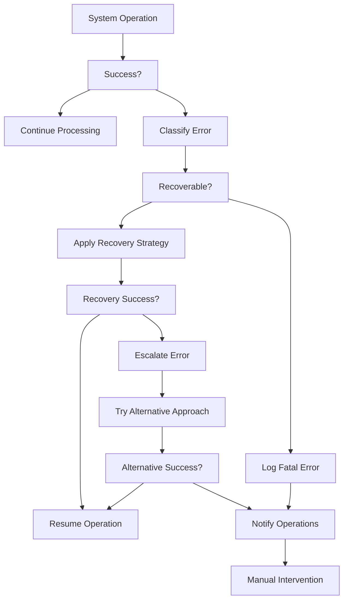
```mermaid
flowchart TD
    A["System Operation"]
    B["Success?"]
    C["Continue Processing"]
    D["Classify Error"]
    E["Recoverable?"]
    F["Apply Recovery Strategy"]
    G["Log Fatal Error"]
    H["Recovery Success?"]
    I["Resume Operation"]
    J["Escalate Error"]
    K["Notify Operations"]
    L["Try Alternative Approach"]
    M["Alternative Success?"]
    N["Manual Intervention"]
    A --> B
    B --> C
    B --> D
    D --> E
    E --> F
    E --> G
    F --> H
    H --> I
    H --> J
    G --> K
    J --> L
    L --> M
    M --> I
    M --> K
    K --> N
```

This comprehensive system architecture provides the foundation for implementing
Telephone's GPU-accelerated Datalog engine with differential semantics. The
architecture balances performance, scalability, and maintainability while
addressing the unique challenges of GPU programming and incremental computation
in a production environment.

## 6. System Components Design

## 6.1 Gpu Memory Management System

### 6.1.1 Memory Architecture Overview

The GPU Memory Management System serves as the foundation for all data
operations in Telephone, implementing a sophisticated multi-tier memory
hierarchy optimized for differential dataflow semantics. The system manages GPU
VRAM as the primary storage tier, with intelligent overflow handling to host
memory and persistent storage layers.

#### Core Memory Hierarchy

| Memory Tier        | Technology                                                                                                                                                                                                                                                                                                                                                     | Purpose                | Capacity   | Bandwidth   | Latency    |
| ------------------ | -------------------------------------------------------------------------------------------------------------------------------------------------------------------------------------------------------------------------------------------------------------------------------------------------------------------------------------------------------------- | ---------------------- | ---------- | ----------- | ---------- |
| **GPU VRAM**       | Modern GPUs offer memory bandwidths exceeding 1 TB/s, dwarfing CPU‑only systems                                                                                                                                                                                                                                                                                | Primary working set    | 8-80 GB    | 1-8 TB/s    | \<1 μs     |
| **Host RAM**       | System memory                                                                                                                                                                                                                                                                                                                                                  | Overflow cache         | 64-1024 GB | 50-200 GB/s | 1-10 μs    |
| **NVMe Storage**   | GPUDirect Storage enables a direct data path between local or remote storage and GPU memory, avoiding extra copies through a bounce buffer in the CPU's memory and enabling a DMA engine near the storage to move data directly into or out of GPU memory. The technology provides 2x-8x higher bandwidth with data transfers directly between storage and GPU | Persistent checkpoints | 1-100 TB   | 3-14 GB/s   | 10-100 μs  |
| **Object Storage** | S3/GCS/Azure                                                                                                                                                                                                                                                                                                                                                   | Long-term archives     | Unlimited  | 1-10 GB/s   | 10-100 ms  |

#### Memory Layout Strategy

The system implements a **Structure-of-Arrays (SoA) columnar layout** for
optimal GPU memory coalescing. Late materialization delays row assembly until
after filtering, while GPU offloading computes aggregations on specialized
hardware, achieving 12× speedups for complex analytical workloads. Each
relation is decomposed into separate column buffers, enabling efficient
parallel operations on individual attributes.

```mermaid
flowchart LR
    I["Free Block List"]
    J["Size Class 1: 4KB"]
    K["Size Class 2: 64KB"]
    L["Size Class 3: 1MB"]
    M["Size Class 4: 16MB"]
    A["Relation R"]
    B["Column A Buffer"]
    C["Column B Buffer"]
    D["Column C Buffer"]
    E["Data Array"]
    F["Validity Bitmap"]
    G["Data Array"]
    H["Validity Bitmap"]
    I --> J
    I --> K
    I --> L
    I --> M
    A --> B
    A --> C
    A --> D
    B --> E
    B --> F
    C --> G
    C --> H
```

### 6.1.2 Buffer Allocation Strategies

#### Size-Class Based Allocation

The memory allocator implements a **buddy system** with power-of-two size
classes to minimize fragmentation while providing fast allocation. Allocation
schemes that result in a high degree of memory fragmentation are unsuitable, as
this will result in a lot of precious GPU memory becoming unusable. There are
often soft-realtime constraints. If a rendering operation of some kind needs
memory right now, and there's a deadline of 16ms of rendering time in order to
meet a 60hz frame rate, an allocation algorithm that takes a second or two to
find free memory is unusable.

| Size Class | Block Size | Use Case                      | Allocation Strategy                                                                                                                                                                             |
| ---------- | ---------- | ----------------------------- | ----------------------------------------------------------------------------------------------------------------------------------------------------------------------------------------------- |
| **Micro**  | 4KB - 64KB | Small relations, metadata     | Free list with coalescing                                                                                                                                                                       |
| **Small**  | 64KB - 1MB | Medium relations, indices     | Buddy allocator                                                                                                                                                                                 |
| **Medium** | 1MB - 16MB | Large relations, arrangements | Best-fit with splitting                                                                                                                                                                         |
| **Large**  | 16MB+      | Massive datasets, batch loads | Consider creating them as dedicated allocations using VMA_ALLOCATION_CREATE_DEDICATED_MEMORY_BIT, especially if they are large or if you plan to destroy and recreate them with different sizes |

#### Memory Pool Architecture

As a result, your GPU might seem to be running out of memory while it isn't.
When memory pressure is high, the pool will automatically free cached objects.
It should never be required to manually reclaim memory before performing any
high-level GPU array operation: Functionality that allocates should itself call
into the memory pool and free any cached memory if necessary.

```mermaid
flowchart TD
    A["Memory Request"]
    B["Size Class?"]
    C["Micro Pool"]
    D["Small Pool"]
    E["Medium Pool"]
    F["Large Pool"]
    G["Free List Lookup"]
    H["Buddy Allocation"]
    I["Best Fit Search"]
    J["Dedicated Allocation"]
    K["Available?"]
    L["Direct GPU Malloc"]
    M["Return Buffer"]
    N["Trigger GC"]
    O["Retry Allocation"]
    P["Success?"]
    Q["Evict Cold Data"]
    R["Host Memory Fallback"]
    A --> B
    B --> C
    B --> D
    B --> E
    B --> F
    C --> G
    D --> H
    E --> I
    F --> J
    G --> K
    H --> K
    I --> K
    J --> L
    K --> M
    K --> N
    N --> O
    O --> P
    P --> M
    P --> Q
    Q --> R
```

### 6.1.3 Garbage Collection And Compaction

#### Reference Counting with Epoch Management

The system implements a **generational garbage collector** that leverages
DDlog's reference counting semantics for precise memory reclamation. Each tuple
maintains a reference count indicating the number of active derivations
supporting it.

#### Compaction Strategies

| Trigger Condition       | Compaction Type        | Target                  | Performance Impact |
| ----------------------- | ---------------------- | ----------------------- | ------------------ |
| **Memory Pressure**     | Emergency compaction   | Free 20-30% VRAM        | High (100-500ms)   |
| **Fragmentation \>40%** | Defragmentation        | Consolidate free blocks | Medium (50-100ms)  |
| **Epoch Boundary**      | Incremental compaction | 5-10% of relations      | Low (10-20ms)      |
| **Idle Period**         | Background compaction  | All eligible relations  | Minimal            |

#### Compaction Algorithm

```mermaid
sequenceDiagram
    participant Garbage_Collector as "Garbage Collector"
    participant Memory_Pool as "Memory Pool"
    participant GPU_Memory as "GPU Memory"
    participant Host_Memory as "Host Memory"
    Garbage_Collector ->> Memory_Pool : 45% fragmented
    Memory_Pool ->> Garbage_Collector : Pause new allocations
    Garbage_Collector ->> GPU_Memory : Mark live objects
    Garbage_Collector ->> GPU_Memory : Calculate new layout
    Garbage_Collector ->> GPU_Memory : Copy to temporary buffer
    Garbage_Collector ->> GPU_Memory : Update pointers
    Garbage_Collector ->> GPU_Memory : Free old blocks
    Garbage_Collector ->> Memory_Pool : Merge free blocks
    Garbage_Collector ->> Memory_Pool : Resume allocations
    Garbage_Collector ->> GPU_Memory : Update metadata
    Garbage_Collector ->> Host_Memory : Check fragmentation level
```

### 6.1.4 Cross-platform Memory Management

#### CUDA Memory Management

API for memory management (cudaMalloc, cudaMemcpy) Thread indexing macros
(threadIdx.x, blockIdx.x). Asynchronous Transfers: Overlap cudaMemcpyAsync with
compute. Pinned Host Memory: Eliminates copies through page‑locking.

#### SPIR-V Memory Management

With SPIR-🇹 as an intermediate stage between rust-gpu and SPIR-V, however, we
can take a new approach: we can extend SPIR-V with our own untyped pointers,
and introduce passes for lowering to such pointers (erasing redundant type
information), and for lifting from them back to SPIR-V (regenerating the
minimal amount of type information) - everything in between can remain faithful
to the untyped memory paradigm Rust prefers.

#### Unified Memory Interface

| Operation    | CUDA Implementation         | SPIR-V Implementation  | Abstraction Layer            |
| ------------ | --------------------------- | ---------------------- | ---------------------------- |
| **Allocate** | \`cudaMalloc()\`            | \`vkAllocateMemory()\` | \`gpu_alloc(size, usage)\`   |
| **Transfer** | \`cudaMemcpy()\`            | \`vkCmdCopyBuffer()\`  | \`gpu_copy(src, dst, size)\` |
| **Map**      | \`cudaHostAlloc()\`         | \`vkMapMemory()\`      | \`gpu_map(buffer, access)\`  |
| **Sync**     | \`cudaDeviceSynchronize()\` | \`vkQueueWaitIdle()\`  | \`gpu_sync()\`               |

### 6.1.5 Memory Pressure Handling

#### Eviction Policies

The system implements a **multi-level LRU eviction policy** with different
strategies for different data types:

1. **Arrangements (Indices)**: Least Recently Used with rebuild cost
    consideration
2. **Delta Buffers**: FIFO with epoch-based retention
3. **Materialized Views**: Access frequency weighted LRU
4. **Temporary Buffers**: Immediate reclamation after use

#### Overflow Management

One key aspect of UM programming is that the shared memory region is kept
coherent in an implicit and transparent manner by migrating data towards the
processing units as they are modified (when a page fault happens) by either one
of the them (this is called "On-Demand Paging"). In this scheme, when a shared
page is modified by either the CPU or the GPU, that page (and not the whole
memory region) is copied to the other processing unit memory space, hence
reducing the copies when not a lot of shared data is modified.

```mermaid
flowchart TD
    A["GPU Memory Full"]
    B["Identify Eviction Candidates"]
    C["Data Type?"]
    D["Check Rebuild Cost"]
    E["Check Epoch Age"]
    F["Check Access Pattern"]
    G["Immediate Eviction"]
    H["Cost > Threshold?"]
    I["Age > Retention?"]
    J["LRU Score Low?"]
    K["Keep in GPU"]
    L["Evict to Host"]
    M["Archive to Storage"]
    N["Update Memory Map"]
    O["Compress and Store"]
    P["Mark as Protected"]
    A --> B
    B --> C
    C --> D
    C --> E
    C --> F
    C --> G
    D --> H
    E --> I
    F --> J
    H --> K
    H --> L
    I --> M
    I --> L
    J --> L
    J --> K
    G --> L
    L --> N
    M --> O
    K --> P
```

## 6.2 Incremental Update Processor

### 6.2.1 Delta Propagation Engine

The Incremental Update Processor implements **differential dataflow semantics**
for real-time maintenance of derived relations. The system processes streams of
insertions and deletions, propagating changes through the rule dependency graph
with minimal recomputation.

#### Delta Representation

Each delta carries both positive and negative changes with reference counting
for correct deletion semantics:

| Field               | Type            | Purpose                  | Size     |
| ------------------- | --------------- | ------------------------ | -------- |
| **Tuple Data**      | Columnar arrays | Actual fact content      | Variable |
| **Delta Sign**      | i8              | +1 (insert), -1 (delete) | 1 byte   |
| **Reference Count** | u32             | Supporting derivations   | 4 bytes  |
| **Epoch**           | u64             | Logical timestamp        | 8 bytes  |
| **Source Rule**     | u32             | Originating rule ID      | 4 bytes  |

#### Semi-Naïve Evaluation

The processor implements **semi-naïve evaluation** to avoid redundant
recomputation during fixpoint iteration:

```mermaid
flowchart TD
    A["New Delta Batch"]
    B["Parse and Validate"]
    C["Group by Target Relation"]
    D["Apply to Base Relations"]
    E["Trigger Affected Rules"]
    F["Semi-Naïve Round"]
    G["Join Deltas with Full Relations"]
    H["Generate New Deltas"]
    I["Deduplicate Results"]
    J["New Facts Generated?"]
    K["Update Reference Counts"]
    L["Fixpoint Reached"]
    M["Propagate to Dependent Rules"]
    N["Commit Changes"]
    O["Notify Subscribers"]
    A --> B
    B --> C
    C --> D
    D --> E
    E --> F
    F --> G
    G --> H
    H --> I
    I --> J
    J --> K
    J --> L
    K --> M
    M --> F
    L --> N
    N --> O
```

### 6.2.2 Rule Dependency Management

#### Dependency Graph Construction

The system maintains a **directed acyclic graph (DAG)** of rule dependencies to
optimize evaluation order and minimize cascading updates:

```mermaid
flowchart TD
    G["Stratum 0: Base Facts"]
    H["Stratum 1: AwarenessEvent"]
    I["Stratum 2: EarliestAwareness"]
    J["Stratum 3: EnoughTime"]
    A["Delivered"]
    B["MentionsIncident"]
    C["ReadReceipt"]
    D["AwarenessEvent"]
    E["EarliestAwareness"]
    F["EnoughTime"]
    A --> D
    B --> D
    C --> D
    D --> E
    E --> F
```

#### Stratification and Scheduling

| Stratum | Relations                | Evaluation Strategy   | Parallelization           |
| ------- | ------------------------ | --------------------- | ------------------------- |
| **0**   | Base relations (EDB)     | Direct insertion      | Full parallel             |
| **1**   | First-order derivations  | Semi-naïve iteration  | Rule-level parallel       |
| **2**   | Second-order derivations | Dependency-ordered    | Sequential within stratum |
| **3+**  | Higher-order derivations | Topological sort      | Limited parallelism       |

### 6.2.3 Reference Counting System

#### Precise Deletion Semantics

The system implements **reference counting** to handle deletions correctly in
the presence of multiple derivation paths:

```mermaid
sequenceDiagram
    participant Delta_Processor as "Delta Processor"
    participant Reference_Counter as "Reference Counter"
    participant Target_Relation as "Target Relation"
    participant Dependent_Rules as "Dependent Rules"
    Delta_Processor ->> Reference_Counter : Decrement count
    Reference_Counter ->> Reference_Counter : Check if count == 0
    Reference_Counter ->> Reference_Counter : Remove tuple
    Reference_Counter ->> Target_Relation : Propagate negative delta
    Reference_Counter ->> Dependent_Rules : Keep tuple (other derivations exist)
    Reference_Counter ->> Reference_Counter : Process deletion (-1, tuple_id)
```

#### Reference Count Storage

| Storage Strategy       | Use Case               | Memory Overhead       | Lookup Performance |
| ---------------------- | ---------------------- | --------------------- | ------------------ |
| **Dense Array**        | Small, dense relations | 4 bytes per tuple     | O(1)               |
| **Hash Table**         | Sparse relations       | 12-16 bytes per tuple | O(1) average       |
| **Compressed Bitmap**  | Boolean relations      | 1 bit per tuple       | O(1)               |
| **Run-Length Encoded** | Sorted relations       | Variable              | O(log n)           |

### 6.2.4 Batch Processing And Streaming

#### Adaptive Batching

The processor implements **adaptive batching** to balance latency and
throughput based on incoming event patterns:

| Batch Trigger        | Condition             | Target Latency | Throughput Impact |
| -------------------- | --------------------- | -------------- | ----------------- |
| **Size-based**       | 1K-10K events         | 10-100ms       | High throughput   |
| **Time-based**       | 50-500ms timeout      | Low latency    | Medium throughput |
| **Pressure-based**   | Memory \>80% full     | Variable       | Prevents OOM      |
| **Dependency-based** | Critical path updates | \<10ms         | Low throughput    |

#### Event Stream Integration

Delta Lake enables ACID transactions atop columnar storage via transaction logs
that track Parquet file versions for rollbacks and time travel capabilities.
These systems support both batch ingestion and real-time streaming while
maintaining analytical efficiency through automated OPTIMIZE operations that
reorganize data post-ingestion without locking tables.

```mermaid
flowchart LR
    A["Kafka Stream"]
    B["REST API"]
    C["File Watcher"]
    D["Database CDC"]
    E["Event Router"]
    F["Schema Validator"]
    G["Rate Limiter"]
    H["Size Monitor"]
    I["Timer Service"]
    J["Pressure Monitor"]
    K["Batch Builder"]
    L["Parse Events"]
    M["Generate Deltas"]
    N["Apply Updates"]
    A --> E
    B --> E
    C --> E
    D --> E
    E --> F
    F --> G
    G --> H
    G --> I
    G --> J
    H --> K
    I --> K
    J --> K
    K --> L
    L --> M
    M --> N
```

### 6.2.5 Epoch Scheduling And Provenance Semantics

The incremental processor realises ADR-001’s model for time and provenance:

- **Epoch transactions:** Ingest pipelines tag each batch with a monotonically
  increasing `epoch: u64`. Producers call `begin_epoch(t)`, stream tuple/weight
  pairs, and complete with `seal_epoch(t)`. Late tuples (`epoch < watermark`)
  are rejected in v0.1 and surfaced via telemetry for replay.
- **Delta iteration:** Once sealed, the scheduler performs semi-naïve
  delta products—`ΔA_t × B_{≤t}` etc.—until `ΔR_t` is empty, then folds the
  derived deltas into the compacted base with cancellation.
- **Parser adornments:** `Delay -<N>` shifts contributions to `t+N`, diff marks
  expose the current delta buffers, and multi-head rules expand into multiple
  heads that share the same body evaluation.
- **Provenance weights:** Every tuple carries an integer weight (`Δ ∈ ℤ`).
  Unions add weights, joins multiply them (default Z-set semantics), and
  compaction drops tuples whose accumulated weight is zero. Optional
  user-defined tags propagate alongside the default semiring without changing
  convergence.
- **GPU residency:** Each relation maintains device buffers for `base`,
  `delta_in`, and `delta_out`. Hot epochs remain on device; compacted shards
  spill to host memory and rehydrate transparently when joins or provenance
  queries reference them.

The result is a deterministic, testable mapping from Telephone’s DDlog syntax
to GPU execution that supports cancellations, scheduled delays, and provenance
inspection without surprising the incremental runtime.

## 6.3 Query Processing Engine

### 6.3.1 Query Execution Architecture

The Query Processing Engine provides **real-time access** to materialized
relations and supports both **point queries** and **analytical queries** over
the continuously updated knowledge graph.

#### Query Types and Optimization

| Query Type       | Example                              | Optimization Strategy | Expected Latency |
| ---------------- | ------------------------------------ | --------------------- | ---------------- |
| **Point Lookup** | \`EnoughTime(Cameron, INC-8427)?\`   | Hash index lookup     | \<1ms            |
| **Range Query**  | \`AwarenessEvent(\*, INC-8427, \*)\` | Sorted index scan     | 1-10ms           |
| **Aggregation**  | \`COUNT(EnoughTime(\*, INC-8427))\`  | Parallel reduction    | 10-100ms         |
| **Join Query**   | Complex multi-relation queries       | GPU hash join         | 100-1000ms       |

#### Materialized View Management

The system maintains **materialized views** of frequently accessed query
patterns to provide sub-millisecond response times:

```mermaid
flowchart LR
    J["Incident Awareness Index"]
    K["Person Timeline Index"]
    L["Time-based Partitions"]
    M["Aggregation Summaries"]
    A["Query Request"]
    B["Parse & Validate"]
    C["Query Planner"]
    D["Materialized View?"]
    E["Direct Lookup"]
    F["Generate Execution Plan"]
    G["GPU Kernel Execution"]
    H["Result Assembly"]
    I["Return Results"]
    A --> B
    B --> C
    C --> D
    D --> E
    D --> F
    F --> G
    G --> H
    E --> I
    H --> I
```

### 6.3.2 Index Management System

#### Multi-Level Indexing

The system implements **GPU-resident indices** optimized for parallel access
patterns:

| Index Type        | Structure                                                                                                                                                                                                  | Use Case          | Memory Overhead | Build Time |
| ----------------- | ---------------------------------------------------------------------------------------------------------------------------------------------------------------------------------------------------------- | ----------------- | --------------- | ---------- |
| **Hash Index**    | Storage buffers (SSBO) are fully generic read-write buffers with very high size. Spec minimum size is 128 megabytes, and the modern PC gpus we are targetting with this tutorial all have it at 4 gigabits | Point lookups     | 150-200%        | Fast       |
| **Sorted Index**  | GPU-parallel merge sort                                                                                                                                                                                    | Range queries     | 100-120%        | Medium     |
| **Bitmap Index**  | Compressed bitmaps                                                                                                                                                                                         | Boolean filters   | 10-50%          | Fast       |
| **Spatial Index** | R-tree on GPU                                                                                                                                                                                              | Geometric queries | 200-300%        | Slow       |

#### Index Maintenance Strategy

```mermaid
sequenceDiagram
    participant Update_Processor as "Update Processor"
    participant Index_Manager as "Index Manager"
    participant GPU_Memory as "GPU Memory"
    participant Query_Engine as "Query Engine"
    Update_Processor ->> Index_Manager : Check affected indices
    Index_Manager ->> Index_Manager : Incremental update
    Index_Manager ->> GPU_Memory : Updated index
    GPU_Memory ->> Index_Manager : Mark for rebuild
    Index_Manager ->> GPU_Memory : Schedule background rebuild
    Index_Manager ->> Index_Manager : Query request
    Query_Engine ->> Index_Manager : Access index
    Index_Manager ->> GPU_Memory : Results
    GPU_Memory ->> Query_Engine : Delta notification
```

### 6.3.3 Provenance Tracking

#### Semiring Model

Telephone adopts Z-set semantics for existence weights: every tuple carries an
integer `Δ` that unions add and joins multiply. This default semiring powers
incremental cancellation while remaining open to user-defined tags (e.g.,
probabilistic weights) that propagate in parallel without influencing
convergence. Aggregations fold weights via the declared monoid, and provenance
metadata records which weights contributed to each derived fact.

#### Derivation Chain Maintenance

The system provides **optional provenance tracking** for explainability and
debugging, maintaining derivation chains without impacting core performance:

| Provenance Level | Information Tracked              | Storage Overhead      | Query Impact |
| ---------------- | -------------------------------- | --------------------- | ------------ |
| **None**         | No provenance                    | 0%                    | None         |
| **Rule-level**   | Which rule derived each fact     | 4 bytes per tuple     | \<5%         |
| **Tuple-level**  | Input tuples for each derivation | 16-32 bytes per tuple | 10-20%       |
| **Full Chain**   | Complete derivation tree         | 64+ bytes per tuple   | 50-100%      |

#### Witness Hash Implementation

For efficient provenance without full derivation trees, the system implements

#### witness hashing

```rust
// Pseudo-code for witness hash computation
fn compute_witness_hash(rule_id: u32, input_tuples: &[TupleId]) -> u64 {
    let mut hasher = FxHasher::default();
    hasher.write_u32(rule_id);
    for tuple_id in input_tuples {
        hasher.write_u64(*tuple_id);
    }
    hasher.finish()
}
```

### 6.3.4 Result Caching And Invalidation

#### Query Result Caching

The system implements **semantic caching** that understands query equivalence
and can reuse results across similar queries:

```mermaid
flowchart TD
    A["Query Request"]
    B["Normalize Query"]
    C["Compute Cache Key"]
    D["Cache Hit?"]
    E["Check Freshness"]
    F["Execute Query"]
    G["Still Valid?"]
    H["Return Cached Result"]
    I["Store in Cache"]
    J["Return Result"]
    K["Delta Update"]
    L["Invalidate Affected Queries"]
    M["Update Cache Metadata"]
    A --> B
    B --> C
    C --> D
    D --> E
    D --> F
    E --> G
    G --> H
    G --> F
    F --> I
    I --> J
    K --> L
    L --> M
```

#### Cache Invalidation Strategy

| Invalidation Trigger   | Scope                      | Granularity    | Performance Impact |
| ---------------------- | -------------------------- | -------------- | ------------------ |
| **Relation Update**    | All queries on relation    | Coarse-grained | Low                |
| **Tuple-level Change** | Queries matching predicate | Fine-grained   | Medium             |
| **Time-based Expiry**  | All cached results         | Time-bounded   | Low                |
| **Memory Pressure**    | LRU eviction               | Size-based     | Variable           |

## 6.4 Multi-backend Gpu Runtime

### 6.4.1 Hardware Abstraction Layer

The Multi-Backend GPU Runtime provides a **unified interface** across different
GPU architectures while maintaining optimal performance for each platform.

#### Backend Architecture

Rust GPU: This project is similar to Rust CUDA but targets SPIR-V for Vulkan
GPUs. Our long-term vision for the two projects includes merging
developer-facing APIs to provide a unified experience for GPU programming in
Rust.

```mermaid
flowchart LR
    A["Telephone Core Engine"]
    B["GPU Trait Interface"]
    C["Memory Manager Trait"]
    D["Kernel Launcher Trait"]
    E["Synchronization Trait"]
    F["CUDA Backend"]
    G["SPIR-V Backend"]
    H["Metal Backend"]
    I["OpenCL Backend"]
    J["NVIDIA GPUs"]
    K["AMD GPUs"]
    L["Intel GPUs"]
    M["Apple GPUs"]
    A --> B
    A --> C
    A --> D
    A --> E
    B --> F
    B --> G
    B --> H
    B --> I
    F --> J
    G --> K
    G --> L
    H --> M
    I --> K
    I --> L
```

#### Unified GPU Interface

| Operation             | CUDA Implementation                                | SPIR-V Implementation               | Abstraction           |
| --------------------- | -------------------------------------------------- | ----------------------------------- | --------------------- |
| **Device Query**      | \`cudaGetDeviceProperties()\`                      | \`vkGetPhysicalDeviceProperties()\` | \`get_device_info()\` |
| **Context Creation**  | \`cudaSetDevice()\`                                | \`vkCreateDevice()\`                | \`create_context()\`  |
| **Memory Allocation** | API for memory management (cudaMalloc, cudaMemcpy) | \`vkAllocateMemory()\`              | \`allocate_buffer()\` |
| **Kernel Launch**     | \`kernel\<\<\>\>()\`                               | \`vkCmdDispatch()\`                 | \`launch_kernel()\`   |

### 6.4.2 Performance Optimization Strategies

#### Memory Coalescing Optimization

Coalesced Access: Align threads so that consecutive threads access consecutive
addresses. The runtime automatically optimizes memory access patterns for each
GPU architecture:

| GPU Architecture     | Memory Pattern   | Optimization Strategy    | Performance Gain |
| -------------------- | ---------------- | ------------------------ | ---------------- |
| **NVIDIA (CUDA)**    | 128-byte aligned | Warp-level coalescing    | 2-4x             |
| **AMD (RDNA)**       | 64-byte aligned  | Wavefront optimization   | 1.5-3x           |
| **Intel (Xe)**       | 64-byte aligned  | SIMD lane optimization   | 1.5-2.5x         |
| **Apple (M-series)** | 128-byte aligned | Tile memory optimization | 2-3x             |

#### Occupancy Optimization

Warp Scheduling: SM issues one instruction to all threads in a warp. Occupancy:
Ratio of active warps to maximum warps per SM.

```mermaid
flowchart TD
    A["Kernel Launch Request"]
    B["Analyze Resource Requirements"]
    C["Calculate Optimal Block Size"]
    D["GPU Architecture?"]
    E["Optimize for Warps (32 threads)"]
    F["Optimize for Wavefronts (64 threads)"]
    G["Optimize for SIMD (8-32 threads)"]
    H["Optimize for Threadgroups (32 threads)"]
    I["Launch with Optimal Configuration"]
    J["Monitor Performance Counters"]
    K["Adjust for Next Launch"]
    A --> B
    B --> C
    C --> D
    D --> E
    D --> F
    D --> G
    D --> H
    E --> I
    F --> I
    G --> I
    H --> I
    I --> J
    J --> K
```

### 6.4.3 Cross-platform Kernel Compilation

#### Compilation Pipeline

Rust CUDA is a collection of crates, one of which is rustc_codegen_nvvm. This
crate plugs directly into the Rust compiler to generate NVVM IR, which NVIDIA's
tools then compile down to GPU-executable code. It's the magic that makes
Rust-on-GPU happen and allows your Rust code to call existing CUDA libraries
(anything compiled into PTX).

```mermaid
flowchart LR
    A["Rust GPU Kernels"]
    B["CUDA Path"]
    C["SPIR-V Path"]
    D["NVVM IR"]
    E["SPIR-V Bytecode"]
    F["PTX Code"]
    G["Vulkan Shaders"]
    H["Metal Shaders"]
    I["OpenCL Kernels"]
    A --> B
    A --> C
    B --> D
    C --> E
    D --> F
    E --> G
    E --> H
    E --> I
```

#### Kernel Portability Layer

The system implements a **portable kernel core** with platform-specific facades:

| Abstraction           | CUDA Implementation                        | SPIR-V Implementation       | Purpose                         |
| --------------------- | ------------------------------------------ | --------------------------- | ------------------------------- |
| **Thread Index**      | \`threadIdx.x + blockIdx.x \* blockDim.x\` | \`gl_GlobalInvocationID.x\` | Thread identification           |
| **Shared Memory**     | \`\_\_shared\_\_\`                         | \`workgroup\` storage class | Fast inter-thread communication |
| **Atomic Operations** | \`atomicAdd()\`                            | \`atomicAdd()\`             | Thread-safe updates             |
| **Barriers**          | \`\_\_syncthreads()\`                      | \`barrier()\`               | Thread synchronization          |

### 6.4.4 Runtime Performance Monitoring

#### GPU Metrics Collection

The runtime continuously monitors GPU performance metrics to optimize resource
utilization:

| Metric Category        | CUDA Source          | SPIR-V Source                     | Update Frequency |
| ---------------------- | -------------------- | --------------------------------- | ---------------- |
| **Utilization**        | NVML API             | Vulkan queries                    | 100ms            |
| **Memory Usage**       | \`cudaMemGetInfo()\` | \`vkGetDeviceMemoryProperties()\` | 1s               |
| **Kernel Performance** | CUDA Events          | Vulkan timestamps                 | Per kernel       |
| **Power Consumption**  | NVML power readings  | Platform-specific APIs            | 1s               |

#### Adaptive Performance Tuning

```mermaid
sequenceDiagram
    participant Performance_Monitor as "Performance Monitor"
    participant Auto_Tuner as "Auto-Tuner"
    participant GPU_Runtime as "GPU Runtime"
    participant Kernel_Executor as "Kernel Executor"
    Performance_Monitor ->> Performance_Monitor : Report performance data
    Performance_Monitor ->> Auto_Tuner : Analyze patterns
    Auto_Tuner ->> Auto_Tuner : Adjust block sizes
    Auto_Tuner ->> GPU_Runtime : Modify memory layout
    Auto_Tuner ->> GPU_Runtime : Update launch parameters
    Auto_Tuner ->> Kernel_Executor : Continue monitoring
    Auto_Tuner ->> Auto_Tuner : Execute with new settings
    GPU_Runtime ->> Performance_Monitor : Measure impact
    Performance_Monitor ->> Performance_Monitor : Collect metrics
```

## 6.5 Event Stream Processor

### 6.5.1 Stream Ingestion Architecture

The Event Stream Processor handles **high-throughput event ingestion** from
multiple sources while maintaining **exactly-once semantics** and **low-latency
processing**.

#### Multi-Source Event Ingestion

| Event Source      | Protocol        | Throughput       | Latency    | Reliability   |
| ----------------- | --------------- | ---------------- | ---------- | ------------- |
| **Apache Kafka**  | Kafka protocol  | 1M+ events/sec   | 1-5ms      | Exactly-once  |
| **Apache Pulsar** | Pulsar protocol | 500K+ events/sec | 2-10ms     | Exactly-once  |
| **REST API**      | HTTP/gRPC       | 100K+ events/sec | 10-50ms    | At-least-once |
| **File System**   | File watching   | 10K+ events/sec  | 100-1000ms | At-least-once |
| **Database CDC**  | Change streams  | 50K+ events/sec  | 10-100ms   | Exactly-once  |

#### Event Processing Pipeline

```mermaid
flowchart TD
    A["Event Sources"]
    B["Protocol Adapters"]
    C["Schema Validation"]
    D["Rate Limiting"]
    E["Deduplication"]
    F["Event Buffer"]
    G["Batch Coordinator"]
    H["Compression"]
    I["Event Parser"]
    J["Fact Extraction"]
    K["Delta Generation"]
    L["GPU Transfer"]
    M["Dead Letter Queue"]
    N["Retry Logic"]
    O["Circuit Breaker"]
    A --> B
    B --> C
    C --> D
    D --> E
    E --> F
    F --> G
    G --> H
    H --> I
    I --> J
    J --> K
    K --> L
    C --> M
    D --> N
    L --> O
```

### 6.5.2 Event Schema Management

#### Dynamic Schema Evolution

The system supports **schema evolution** without requiring system restarts or
data migration:

| Schema Change    | Handling Strategy        | Backward Compatibility | Performance Impact |
| ---------------- | ------------------------ | ---------------------- | ------------------ |
| **Add Field**    | Default value assignment | Full compatibility     | Minimal            |
| **Remove Field** | Ignore during parsing    | Full compatibility     | None               |
| **Rename Field** | Field mapping rules      | Configurable           | Low                |
| **Type Change**  | Conversion functions     | Version-dependent      | Medium             |

#### Schema Registry Integration

```mermaid
sequenceDiagram
    participant Event_Source as "Event Source"
    participant Schema_Registry as "Schema Registry"
    participant Stream_Processor as "Stream Processor"
    participant Schema_Validator as "Schema Validator"
    Event_Source ->> Schema_Registry : Schema ID assigned
    Schema_Registry ->> Event_Source : Send event with schema ID
    Event_Source ->> Stream_Processor : Lookup schema by ID
    Stream_Processor ->> Schema_Registry : Return schema definition
    Schema_Registry ->> Stream_Processor : Validate event against schema
    Stream_Processor ->> Schema_Validator : Validation result
    Schema_Validator ->> Stream_Processor : Process event
    Stream_Processor ->> Stream_Processor : Send to dead letter queue
    Stream_Processor ->> Stream_Processor : Register new schema version
```

### 6.5.3 Backpressure And Flow Control

#### Adaptive Backpressure

The system implements **multi-level backpressure** to prevent memory exhaustion
and maintain system stability:

| Pressure Level | Trigger Condition      | Response Strategy   | Recovery Time |
| -------------- | ---------------------- | ------------------- | ------------- |
| **Green**      | \<70% buffer capacity  | Normal processing   | N/A           |
| **Yellow**     | 70-85% buffer capacity | Increase batch size | 1-5 seconds   |
| **Orange**     | 85-95% buffer capacity | Apply rate limiting | 5-30 seconds  |
| **Red**        | \>95% buffer capacity  | Reject new events   | 30+ seconds   |

#### Flow Control Mechanisms

```mermaid
flowchart TD
    A["Incoming Events"]
    B["Buffer Monitor"]
    C["Buffer Level?"]
    D["Normal Processing"]
    E["Increase Batch Size"]
    F["Apply Rate Limiting"]
    G["Reject Events"]
    H["Process Events"]
    I["Larger Batches"]
    J["Throttle Input"]
    K["Send 503 Response"]
    L["Log Rejection"]
    M["Update Buffer Level"]
    A --> B
    B --> C
    C --> D
    C --> E
    C --> F
    C --> G
    D --> H
    E --> I
    F --> J
    G --> K
    I --> H
    J --> H
    K --> L
    H --> M
    M --> B
```

### 6.5.4 Event Ordering And Consistency

#### Temporal Ordering Guarantees

The system provides **configurable ordering guarantees** based on application
requirements:

| Ordering Level | Guarantee                   | Implementation             | Latency Impact |
| -------------- | --------------------------- | -------------------------- | -------------- |
| **None**       | No ordering                 | Direct processing          | Minimal        |
| **Per-Key**    | Events for same key ordered | Key-based partitioning     | Low            |
| **Per-Source** | Events from source ordered  | Source-based queuing       | Medium         |
| **Global**     | All events ordered          | Single-threaded processing | High           |

#### Out-of-Order Event Handling

```mermaid
sequenceDiagram
    participant Event_Stream as "Event Stream"
    participant Reorder_Buffer as "Reorder Buffer"
    participant Event_Processor as "Event Processor"
    participant Watermark_Timer as "Watermark Timer"
    Event_Stream ->> Reorder_Buffer : Event with timestamp T3
    Event_Stream ->> Reorder_Buffer : Event with timestamp T2
    Event_Stream ->> Reorder_Buffer : Sort by timestamp
    Reorder_Buffer ->> Reorder_Buffer : Watermark advance to T2
    Watermark_Timer ->> Reorder_Buffer : Release events T1, T2
    Reorder_Buffer ->> Event_Processor : Hold T3 (future event)
    Reorder_Buffer ->> Reorder_Buffer : Watermark advance to T4
    Watermark_Timer ->> Reorder_Buffer : Release event T3
    Reorder_Buffer ->> Event_Processor : Event with timestamp T1
```

### 6.5.5 Fault Tolerance And Recovery

#### Checkpoint-Based Recovery

The system implements **distributed checkpointing** for fault tolerance:

| Checkpoint Type           | Frequency         | Storage Location    | Recovery Time |
| ------------------------- | ----------------- | ------------------- | ------------- |
| **Memory Snapshot**       | Every 1000 events | Local SSD           | \<1 second    |
| **Persistent Checkpoint** | Every 60 seconds  | Distributed storage | 5-30 seconds  |
| **Full System Backup**    | Every 24 hours    | Object storage      | 5-60 minutes  |

#### Failure Detection and Recovery

```mermaid
stateDiagram-v2
    Degraded --> Failed
    Degraded --> Healthy
    Failed --> Recovering
    Healthy --> Degraded
    Healthy --> Failed
    Recovering --> Failed
    Recovering --> Healthy
    Recovering --> Recovering
    [*] --> Healthy
```

This comprehensive System Components Design provides detailed specifications
for implementing Telephone's core GPU-accelerated infrastructure. Each
component is designed to work together seamlessly while maintaining high
performance, reliability, and cross-platform compatibility. The design
leverages the latest GPU computing technologies and best practices to deliver
the performance requirements outlined in the technical specifications.

## 6.6 Operational Guardrails

Telephone exposes only command-line tooling and a lean embedding API.
Authentication, rate limiting, and gateway policy remain responsibilities for
the host application. Within the engine we focus on memory safety, provenance
validation, and explicit GPU resource quotas to prevent starvation.

## 6.7 Observability Touchpoints

The engine exports counters and timers via a Prometheus-compatible endpoint and
emits structured logs for ingestion by deployment tooling. Detailed dashboards,
alerting, and tracing pipelines sit outside this design scope.

## 6.8 Testing Strategy

### 6.8.1 Guiding Principles

- Exercise core logic through fast, deterministic unit tests.
- Use property-based tests to probe edge cases in rule evaluation and
  data transformations.
- Mirror incremental semantics with differential tests that compare
  batch and incremental outputs.
- Run GPU kernels on both physical hardware and emulation layers to
  surface backend-specific regressions early.

### 6.8.2 Unit Testing

We rely on `rstest` for fixture management and parameterised cases. Unit tests
cover rule parsing, logical plan construction, delta propagation, and kernel
scheduling. Each test must fail fast with clear context, avoid global state,
and assert on observable behaviour rather than implementation details.

### 6.8.3 Property-based And Differential Testing

`proptest` drives randomised input generation for relation updates, ensuring
invariants such as idempotent fact retractions, stable stratified negation, and
monotonic arrangements. Differential tests feed identical workloads through the
batch and incremental paths and assert on equality, providing a guardrail
against accidental semantic drift.

### 6.8.4 Gpu Execution Testing

GPU-specific tests run under two modes:

- Emulation via `wgpu` or CUDA device emulators for deterministic CI
  coverage without vendor lock-in.
- Targeted smoke suites on real hardware to validate memory management,
  kernel launch parameters, and performance envelopes.

All GPU tests record kernel timings and memory footprints so regressions
surface as part of routine CI signals.

### 6.8.5 Regression Safety Nets

CI executes the full test matrix on pull requests and nightly builds. Coverage
thresholds focus on critical planning and execution modules rather than chasing
100% line coverage. Fuzzers and long-running stress jobs execute out of band;
failures file actionable issues instead of blocking day-to-day workflows.

## 8. Infrastructure

## 8.1 Infrastructure Architecture Overview

**Telephone is designed as a single-node, GPU-accelerated computational engine
that does not require complex distributed infrastructure or cloud-native
deployment patterns.** The system operates as a high-performance backend
service optimized for single-machine, multi-GPU configurations, similar to
other specialized computational engines like database systems or scientific
computing applications.

The infrastructure requirements are fundamentally different from typical web
applications or microservices architectures. Single-server deployments suit
smaller teams or pilot projects, while multi-node clusters leverage
technologies like NVIDIA Multi-Process Service (MPS) to coordinate parallel
workloads. This can mean training or inferencing on a single server, using the
entire system, or partitioning the GPU to run multiple applications all within
the same node. There may be options to upgrade resources by adding additional
GPU, CPU, or memory within that server, but these solutions typically do not
scale to the cluster level. Single node deployments typically do not require
high-speed networking to connect multiple nodes for your AI workload but may
require it for connecting to other applications.

### 8.1.1 Infrastructure Philosophy

| Design Principle                  | Implementation                                   | Justification                                                                                                                                                                            |
| --------------------------------- | ------------------------------------------------ | ---------------------------------------------------------------------------------------------------------------------------------------------------------------------------------------- |
| **Single-Node Focus**             | Vertical scaling within individual machines      | Single Node work. This can mean training or inferencing on a single server, using the entire system, or partitioning the GPU to run multiple applications all within the same node.      |
| **GPU-Centric Architecture**      | Infrastructure optimized for GPU workloads       | High-density GPU systems may exceed 30kW per rack, so organizations need specialized data center designs. Without robust infrastructure, even the most expensive GPUs will underperform. |
| **Minimal External Dependencies** | Self-contained deployment model                  | Reduces operational complexity and external failure points                                                                                                                               |
| **Development-First Approach**    | Optimized for research and development workflows | Supports rapid iteration and experimentation                                                                                                                                             |

### 8.1.2 Target Deployment Environments

#### Primary Deployment Scenarios

| Environment Type          | Use Case                              | Infrastructure Requirements              | Scaling Approach      |
| ------------------------- | ------------------------------------- | ---------------------------------------- | --------------------- |
| **Research Workstations** | AI research, algorithm development    | Single GPU node, development tools       | Vertical scaling      |
| **Enterprise Servers**    | Production neurosymbolic applications | Multi-GPU servers, enterprise networking | Resource partitioning |
| **Cloud Instances**       | Scalable compute, experimentation     | GPU-enabled cloud VMs                    | Instance scaling      |
| **Edge Deployment**       | Real-time inference, local processing | Compact GPU systems                      | Specialized hardware  |

## 8.2 Hardware Requirements

### 8.2.1 Gpu Hardware Specifications

#### Minimum GPU Requirements

The minimum requirement is a GPU with a compute capability of 3.0 or higher.
CUDA supports a range of Nvidia GPU architectures. The minimum requirement is a
GPU with a compute capability of 3.0 or higher.

| GPU Architecture     | Compute Capability | Memory Requirement | Performance Tier      |
| -------------------- | ------------------ | ------------------ | --------------------- |
| **Kepler (Minimum)** | 3.0+               | 4GB VRAM           | Basic functionality   |
| **Maxwell**          | 5.0+               | 8GB VRAM           | Good performance      |
| **Pascal**           | 6.0+               | 8-16GB VRAM        | High performance      |
| **Volta/Turing**     | 7.0+               | 16-32GB VRAM       | Excellent performance |
| **Ampere/Ada**       | 8.0+               | 24-80GB VRAM       | Maximum performance   |

#### Recommended GPU Configurations

| Deployment Type | GPU Model     | Memory  | Justification                                                                                                                                    |
| --------------- | ------------- | ------- | ------------------------------------------------------------------------------------------------------------------------------------------------ |
| **Development** | RTX 4080/4090 | 16-24GB | A powerful GPU is crucial for running models efficiently. Depending on your needs, you might opt for high-end GPUs like the NVIDIA A100 or H100. |
| **Production**  | A100/H100     | 40-80GB | Enterprise-grade reliability and performance                                                                                                     |
| **Research**    | RTX 6000 Ada  | 48GB    | Large memory for complex knowledge graphs                                                                                                        |
| **Edge**        | RTX 4060/4070 | 8-12GB  | Compact form factor with adequate performance                                                                                                    |

### 8.2.2 System Requirements

#### Host System Specifications

| Component   | Minimum         | Recommended      | Optimal                                                                                                                                                                                                        |
| ----------- | --------------- | ---------------- | -------------------------------------------------------------------------------------------------------------------------------------------------------------------------------------------------------------- |
| **CPU**     | 8 cores, 3.0GHz | 16 cores, 3.5GHz | 32 cores, 4.0GHz                                                                                                                                                                                               |
| **RAM**     | 32GB            | 64GB             | 128GB+                                                                                                                                                                                                         |
| **Storage** | 500GB NVMe SSD  | 1TB NVMe SSD     | High-throughput parallel file systems exceeding 10GB/s read/write are ideal for large training datasets. Local NVMe storage is helpful for checkpoints and intermediate data requiring rapid reads and writes. |
| **Network** | 1Gbps Ethernet  | 10Gbps Ethernet  | 25Gbps+ for cluster connectivity                                                                                                                                                                               |

#### Power and Cooling Requirements

High-density GPU systems may exceed 30kW per rack, so organizations need
specialized data center designs.

| System Configuration       | Power Consumption | Cooling Requirements               | Infrastructure Impact                             |
| -------------------------- | ----------------- | ---------------------------------- | ------------------------------------------------- |
| **Single GPU Workstation** | 500-800W          | Standard air cooling               | Standard office environment                       |
| **Dual GPU Server**        | 1000-1500W        | Enhanced air/liquid cooling        | Dedicated cooling consideration                   |
| **Quad GPU Server**        | 2000-3000W        | Liquid cooling required            | Data center environment                           |
| **8-GPU Server**           | 4000-6000W        | Specialized cooling infrastructure | High-density GPU systems may exceed 30kW per rack |

### 8.2.3 Software Dependencies

#### Operating System Support

| Operating System           | Support Level    | CUDA Version                                                                                                                                                                                                                                                        | Rust Toolchain   |
| -------------------------- | ---------------- | ------------------------------------------------------------------------------------------------------------------------------------------------------------------------------------------------------------------------------------------------------------------- | ---------------- |
| **Ubuntu 20.04/22.04 LTS** | Primary          | The guide supports major Linux distributions including Ubuntu, Red Hat Enterprise Linux, SUSE, Debian, Fedora                                                                                                                                                       | Stable + Nightly |
| **RHEL/CentOS 8/9**        | Primary          | CUDA 12.0+                                                                                                                                                                                                                                                          | Stable + Nightly |
| **Windows 11**             | Secondary        | The CUDA Installation Guide for Microsoft Windows provides step-by-step instructions to help developers set up NVIDIA's CUDA Toolkit on Windows systems. It details essential system requirements, including a CUDA-capable GPU and a compatible version of Windows | Stable + Nightly |
| **macOS**                  | Development only | Metal backend                                                                                                                                                                                                                                                       | Rust-GPU only    |

#### Required Software Stack

| Component          | Version              | Purpose                                                                                                                                                                                                 | Installation Method                                                                                                                                                                                                                                                                                                                                                                 |
| ------------------ | -------------------- | ------------------------------------------------------------------------------------------------------------------------------------------------------------------------------------------------------- | ----------------------------------------------------------------------------------------------------------------------------------------------------------------------------------------------------------------------------------------------------------------------------------------------------------------------------------------------------------------------------------- |
| **CUDA Toolkit**   | 12.0+                | CUDA® is a parallel computing platform and programming model invented by NVIDIA. It enables dramatic increases in computing performance by harnessing the power of the graphics processing unit (GPU).  | Package manager/installer                                                                                                                                                                                                                                                                                                                                                           |
| **Rust Toolchain** | 1.85+ (2024 Edition) | Core development environment                                                                                                                                                                            | rustup                                                                                                                                                                                                                                                                                                                                                                              |
| **NVIDIA Drivers** | 525+                 | GPU hardware interface                                                                                                                                                                                  | To ensure your GPU functions correctly with CUDA, you may need to install the appropriate drivers. Identify Your GPU: Use the command nvidia-smi to check your GPU model and driver version. Download Drivers: Visit the Nvidia Driver Downloads page to find the latest drivers for your GPU. Install Drivers: Follow the installation instructions provided on the download page. |
| **Docker**         | 20.10+               | Containerized deployment                                                                                                                                                                                | Package manager                                                                                                                                                                                                                                                                                                                                                                     |

## 8.3 Deployment Architecture

### 8.3.1 Single-node Deployment Model

**Telephone follows a single-node deployment architecture optimized for
GPU-accelerated workloads.** This approach eliminates the complexity of
distributed systems while maximizing performance for the target use cases.

```mermaid
flowchart LR
    A["Multi-GPU Server"]
    B["High-Speed Storage"]
    C["Network Interface"]
    D["Linux/Windows OS"]
    E["CUDA Runtime"]
    F["GPU Drivers"]
    G["Telephone Engine"]
    H["Rust Runtime"]
    I["GPU Kernels"]
    J["REST/gRPC APIs"]
    K["Event Streams"]
    L["Monitoring"]
    M["LLM Agents"]
    N["Event Sources"]
    O["Monitoring Systems"]
    A --> D
    B --> D
    C --> D
    D --> E
    E --> F
    F --> G
    G --> H
    H --> I
    G --> J
    G --> K
    G --> L
    J --> M
    K --> N
    L --> O
```

### 8.3.2 Resource Allocation Strategy

#### GPU Resource Management

Without timeslicing each GPU workload will be allocated to one GPU, and the
node will only be able to schedule as many workloads as there are GPUs on the
node. You can enable timeslicing to enable multiple GPU workloads to schedule
per GPU, and set the number of slices to allow on each GPU. The number of
slices defines how many workloads can share GPU execution time per GPU on the
node. Each workload is guaranteed the same amount of GPU execution time, but
there is no guarantee on GPU memory allocation per workload.

| Resource Type     | Allocation Strategy                  | Management Approach                                                                                                                                                                                  | Performance Impact         |
| ----------------- | ------------------------------------ | ---------------------------------------------------------------------------------------------------------------------------------------------------------------------------------------------------- | -------------------------- |
| **GPU Memory**    | Exclusive allocation per instance    | Direct VRAM management                                                                                                                                                                               | Maximum performance        |
| **GPU Compute**   | Time-slicing for development         | The maximum number of containers that can share a single physical GPU is 48. You can enable time-sharing GPUs on GKE Standard clusters and node pools running GKE version 1.23.7-gke.1400 and later. | Reduced but shared         |
| **CPU Cores**     | Dedicated cores for GPU coordination | NUMA-aware allocation                                                                                                                                                                                | Optimized data transfer    |
| **System Memory** | Buffer pools and caching             | Automatic management                                                                                                                                                                                 | Reduced GPU-host transfers |

### 8.3.3 Network Architecture

#### Simplified Network Requirements

Single node deployments typically do not require high-speed networking to
connect multiple nodes for your AI workload but may require it for connecting
to other applications.

```mermaid
flowchart LR
    A["Internet/WAN"]
    B["Corporate Network"]
    C["Event Sources"]
    D["Network Interface"]
    E["Firewall/Security"]
    F["Load Balancer"]
    G["Telephone Engine"]
    H["GPU-CPU Bus"]
    I["Memory Bus"]
    J["Storage Bus"]
    A --> D
    B --> D
    C --> D
    D --> E
    E --> F
    F --> G
    G --> H
    G --> I
    G --> J
```

#### Network Requirements

| Connection Type  | Bandwidth    | Latency  | Purpose                             |
| ---------------- | ------------ | -------- | ----------------------------------- |
| **External API** | 1-10 Gbps    | \<10ms   | Client connections, event ingestion |
| **Management**   | 100 Mbps     | \<100ms  | Monitoring, administration          |
| **GPU-CPU**      | PCIe 4.0/5.0 | \<1μs    | Data transfer, kernel coordination  |
| **Storage**      | NVMe 4.0     | \<100μs  | Checkpoint I/O, data loading        |

## 8.4 Build And Distribution

### 8.4.1 Build Infrastructure Requirements

#### Development Environment Setup

Thanks to @adamcavendish, we now automatically build and publish Docker images
as part of CI. These images are based on NVIDIA's official CUDA containers and
come preconfigured to build and run Rust GPU kernels. Rust CUDA uses NVVM under
the hood, which is NVIDIA's LLVM-based CUDA frontend. NVVM is currently based
on LLVM 7 and getting it set up manually can be tedious and error-prone. These
images solve the setup issue.

| Component          | Requirement      | Installation Method                  | Purpose                                                                                                                         |
| ------------------ | ---------------- | ------------------------------------ | ------------------------------------------------------------------------------------------------------------------------------- |
| **Rust Toolchain** | Nightly 1.85+    | \`rustup toolchain install nightly\` | Core compilation                                                                                                                |
| **CUDA Toolkit**   | 12.0+            | NVIDIA installer                     | GPU kernel compilation                                                                                                          |
| **Docker**         | 20.10+           | Package manager                      | We now automatically build and publish Docker images as part of CI. These images are based on NVIDIA's official CUDA containers |
| **Build Tools**    | GCC/Clang, CMake | Package manager                      | Native dependencies                                                                                                             |

#### Containerized Build Environment

```dockerfile
# Example build container configuration
FROM nvidia/cuda:12.0-devel-ubuntu22.04

#### Install Rust toolchain
RUN curl --proto '=https' --tlsv1.2 -sSf https://sh.rustup.rs | sh -s -- -y
RUN rustup toolchain install nightly
RUN rustup default nightly

#### Install system dependencies
RUN apt-get update && apt-get install -y \
    build-essential \
    cmake \
    pkg-config \
    libssl-dev

#### Set up GPU compilation environment
ENV CUDA_HOME=/usr/local/cuda
ENV PATH=$CUDA_HOME/bin:$PATH
ENV LD_LIBRARY_PATH=$CUDA_HOME/lib64:$LD_LIBRARY_PATH
```

### 8.4.2 Continuous Integration Pipeline

#### GitHub Actions Workflow

The Rust CUDA project currently can't run GPU tests on GitHub Actions due to
the lack of NVIDIA GPUs. If you want to sponsor some CI machines, get in touch!
Even without GPU tests, CI now provides a critical safety net for future
development.

```mermaid
flowchart LR
    A["Code Push"]
    B["Lint & Format"]
    C["Unit Tests"]
    D["CPU-Only Integration Tests"]
    E["Build Artifacts"]
    F["Container Images"]
    G["GPU Tests Available?"]
    H["Skip GPU Tests"]
    I["GPU Integration Tests"]
    J["Publish Artifacts"]
    K["Deploy to Registry"]
    A --> B
    B --> C
    C --> D
    D --> E
    E --> F
    F --> G
    G --> H
    G --> I
    H --> J
    I --> J
    J --> K
```

#### CI/CD Pipeline Stages

| Stage                 | Duration      | Requirements            | Validation                                                                                           |
| --------------------- | ------------- | ----------------------- | ---------------------------------------------------------------------------------------------------- |
| **Linting**           | 2-5 minutes   | CPU-only runners        | Code quality, formatting                                                                             |
| **Unit Tests**        | 5-15 minutes  | CPU-only runners        | The Rust CUDA project currently can't run GPU tests on GitHub Actions due to the lack of NVIDIA GPUs |
| **Build**             | 10-30 minutes | CUDA toolkit            | Compilation success                                                                                  |
| **Integration Tests** | 15-45 minutes | Self-hosted GPU runners | End-to-end functionality                                                                             |

### 8.4.3 Distribution Strategy

#### Artifact Distribution

| Artifact Type        | Distribution Method | Target Audience | Update Frequency |
| -------------------- | ------------------- | --------------- | ---------------- |
| **Source Code**      | GitHub releases     | Developers      | Per release      |
| **Binary Releases**  | GitHub releases     | End users       | Monthly          |
| **Container Images** | Docker Hub/GHCR     | DevOps teams    | Per commit       |
| **Documentation**    | GitHub Pages        | All users       | Continuous       |

#### Installation Methods

```bash
# Method 1: Cargo installation
cargo install telephone-datalog

#### Method 2: Container deployment
docker run --gpus all telephone/engine:latest

#### Method 3: Binary download
wget https://github.com/telephone/releases/latest/telephone-linux-x64.tar.gz
tar -xzf telephone-linux-x64.tar.gz
./telephone --help
```

## 8.5 Operational Requirements

### 8.5.1 Monitoring And Observability

#### GPU-Aware Monitoring Stack

Monitor and scale with centralized tools to optimize performance. Popular tools
include Scale Computing Platform for centralized management, Kubernetes
(orchestration), Slurm (job scheduling), CUDA & ROCm (GPU programming),
TensorFlow, PyTorch, and JAX (AI/ML frameworks).

| Monitoring Layer        | Tools                     | Metrics                           | Collection Method           |
| ----------------------- | ------------------------- | --------------------------------- | --------------------------- |
| **GPU Hardware**        | nvidia-smi, DCGM          | Utilization, memory, temperature  | NVIDIA Management Library   |
| **System Resources**    | Prometheus, Node Exporter | CPU, memory, disk, network        | System APIs                 |
| **Application Metrics** | Custom exporters          | Query latency, throughput, errors | Application instrumentation |
| **Business Metrics**    | Grafana dashboards        | Fact processing rate, accuracy    | Custom metrics              |

#### Monitoring Architecture

```mermaid
flowchart TD
    A["Telephone Engine"]
    B["GPU Metrics Collector"]
    C["System Metrics Collector"]
    D["Application Metrics"]
    E["Prometheus"]
    F["Grafana"]
    G["AlertManager"]
    H["PagerDuty"]
    I["Slack"]
    J["Email"]
    A --> D
    B --> E
    C --> E
    D --> E
    E --> F
    E --> G
    G --> H
    G --> I
    G --> J
```

### 8.5.2 Backup And Recovery

#### Data Protection Strategy

| Data Type         | Backup Method      | Frequency        | Retention  | Recovery Time |
| ----------------- | ------------------ | ---------------- | ---------- | ------------- |
| **Configuration** | Git repository     | Continuous       | Indefinite | \<5 minutes   |
| **GPU State**     | Memory snapshots   | Every 15 minutes | 24 hours   | \<2 minutes   |
| **Event Logs**    | Incremental backup | Hourly           | 30 days    | \<10 minutes  |
| **Checkpoints**   | Full backup        | Daily            | 7 days     | \<30 minutes  |

#### Recovery Procedures

```mermaid
flowchart TD
    A["System Failure"]
    B["Assess Failure Type"]
    C["Failure Scope?"]
    D["Restart Service"]
    E["Reload GPU Drivers"]
    F["Full System Recovery"]
    G["Load Latest Checkpoint"]
    H["Reinitialize GPU Context"]
    I["Restore from Backup"]
    J["Validate State"]
    K["State Valid?"]
    L["Resume Operations"]
    M["Manual Intervention"]
    A --> B
    B --> C
    C --> D
    C --> E
    C --> F
    D --> G
    E --> H
    F --> I
    G --> J
    H --> J
    I --> J
    J --> K
    K --> L
    K --> M
```

### 8.5.3 Security Considerations

#### System Security Framework

| Security Layer           | Implementation                | Purpose          | Maintenance            |
| ------------------------ | ----------------------------- | ---------------- | ---------------------- |
| **Network Security**     | Firewall, VPN access          | Access control   | Monthly rule review    |
| **System Security**      | OS hardening, updates         | System integrity | Weekly patching        |
| **Application Security** | Authentication, authorization | API protection   | Continuous monitoring  |
| **Data Security**        | Encryption at rest/transit    | Data protection  | Key rotation quarterly |

### 8.5.4 Capacity Planning

#### Resource Scaling Guidelines

| Metric         | Threshold         | Action                             | Timeline  |
| -------------- | ----------------- | ---------------------------------- | --------- |
| **GPU Memory** | \>80% utilization | Add GPU or optimize memory usage   | 1-2 weeks |
| **CPU Usage**  | \>70% sustained   | Upgrade CPU or optimize workload   | 1 week    |
| **Storage**    | \>85% full        | Add storage or implement retention | 3-5 days  |
| **Network**    | \>60% bandwidth   | Upgrade network interface          | 2-4 weeks |

#### Cost Optimization Strategy

| Optimization Area        | Approach                         | Expected Savings | Implementation Effort |
| ------------------------ | -------------------------------- | ---------------- | --------------------- |
| **GPU Utilization**      | Workload scheduling optimization | 20-30%           | Medium                |
| **Power Management**     | Dynamic GPU scaling              | 15-25%           | Low                   |
| **Storage Tiering**      | Hot/cold data separation         | 30-40%           | High                  |
| **Network Optimization** | Traffic shaping, compression     | 10-20%           | Medium                |

## 8.8 Conclusion

**Telephone's infrastructure architecture is specifically designed for
single-node, GPU-accelerated deployments that prioritize performance and
simplicity over distributed complexity.** The system's infrastructure
requirements reflect its role as a specialized computational engine rather than
a traditional distributed application.

Key infrastructure characteristics:

1. **Simplified Deployment Model**: Single-node architecture eliminates
    distributed systems complexity
2. **GPU-Centric Design**: Infrastructure optimized for GPU workloads
    and memory management
3. **Minimal External Dependencies**: Self-contained deployment reduces
    operational overhead
4. **Development-Friendly**: Easy setup and iteration for research and
    development workflows
5. **Cost-Effective Scaling**: Vertical scaling approach provides
    predictable cost structure

This infrastructure approach enables Telephone to deliver maximum performance
for neurosymbolic AI applications while maintaining operational simplicity and
cost effectiveness. The single-node focus allows organizations to deploy
high-performance logical reasoning capabilities without the complexity and
overhead of distributed infrastructure management.

## Appendix A — Data Acquisition & Preparation

This appendix makes the test plan **turn‑key**. It specifies exactly how to
obtain, subset, convert, and verify the datasets used in Phase 1 (Batch) and
Phase 2 (Incremental).

______________________________________________________________________

### A1. Scope & outputs

**Goal.** Produce reproducible, version‑pinned corpora for CI and for local
performance runs.

**Artifacts.**

- Raw downloads in `data/<source>/raw/`
- Converted RDF/RDF★ in `data/<source>/rdf/`
- Small CI fixtures in `tests/data/<source>/`
- A manifest `DATASET_MANIFEST.md` with URLs, versions, and SHA256s

**Make targets.**

- `make data` — fetch + convert everything
- `make validate-data` — checksums, RDF lint, counts, dry‑load

______________________________________________________________________

### A2. Directory layout

```text
repo/
  data/
    eventkg/{raw,rdf}
    gdelt/{raw,rdf}
    icews/{raw,rdf}
  mapping/
    gdelt.yaml
    icews.yaml
  scripts/
    gdelt_to_rdf.py
    icews_to_rdf.py
    synth/
      make_synth_graph.py
  tests/
    data/{eventkg,gdelt,icews,synth}
  DATASET_MANIFEST.md
```

______________________________________________________________________

### A3. EventKG (RDF dumps)

#### A3.1. Obtain

1. Locate the latest EventKG release (Zenodo). Record DOI + release date in
   `DATASET_MANIFEST.md`.
2. Download and verify:

   ```bash
   mkdir -p data/eventkg/raw && cd data/eventkg/raw
   curl -L -o eventkg.tar.gz "<EVENTKG_RELEASE_URL>"
   shasum -a 256 eventkg.tar.gz | tee -a ../../../DATASET_MANIFEST.md
   tar -xzf eventkg.tar.gz
   ```

#### A3.2. Prepare

- Normalize to N‑Triples for streaming parsers (optional):

  ```bash
  mkdir -p ../rdf
  for f in *.ttl *.nt *.nq; do
    rdfpipe "$f" --output-format nt > ../rdf/"${f%.*}.nt"
  done
  ```

#### A3.3. Sample (CI fixture)

- Create a small subset (e.g., events for one month) via SPARQL CONSTRUCT; save
  to `tests/data/eventkg/eventkg_ci.nt`.

______________________________________________________________________

### A4. GDELT (modeled as RDF)

#### A4.1. Obtain

1. Choose a bounded window (e.g., one week of v2 Events + GKG).
2. Download CSVs:

   ```bash
   mkdir -p data/gdelt/raw && cd data/gdelt/raw
   # Example: 2024-06-01 day files (adjust pattern/range)
   wget -e robots=off -r -np -nd \
     -A "20240601.export.CSV.zip,20240601.gkg.csv.zip" \
     "https://data.gdeltproject.org/gdeltv2/"
   ```

3. Record filenames and SHA256 hashes in `DATASET_MANIFEST.md`.

#### A4.2. Convert → RDF

- Define mapping once in `mapping/gdelt.yaml` (columns → IRIs; time/geo
  normalization; optional RDF★ for provenance):

  ```yaml
  prefixes:
    ex: "http://example.org/"
    time: "http://www.w3.org/2006/time#"
  event:
    subject: "ex:event/{GLOBALEVENTID}"
    predicates:
      ex:actor1: "Actor1Name"
      ex:actor2: "Actor2Name"
      ex:eventCode: "EventCode"
      time:inXSDDateTime: "SQLDATE" # normalized to xsd:dateTime
  ```

- Run converter:

  ```bash
  cd repo
  python3 scripts/gdelt_to_rdf.py \
    --mapping mapping/gdelt.yaml \
    --in data/gdelt/raw \
    --out data/gdelt/rdf/gdelt_week.nt
  ```

#### A4.3. CI fixture

- Sample 1–5% of events (random by `GLOBALEVENTID` hash) to
  `tests/data/gdelt/gdelt_ci.nt`.

______________________________________________________________________

### A5. ICEWS (modeled as RDF)

#### A5.1. Obtain

1. Download TSVs from Harvard Dataverse (document snapshot date).
2. Verify checksums; store in `data/icews/raw/` and record in
   `DATASET_MANIFEST.md`.

#### A5.2. Convert → RDF

- Mapping in `mapping/icews.yaml` (CAMEO codes to IRIs; actors; geos; dates).
- Convert with:

  ```bash
  python3 scripts/icews_to_rdf.py \
    --mapping mapping/icews.yaml \
    --in data/icews/raw \
    --out data/icews/rdf/icews_month.nt
  ```

#### A5.3. CI fixture

- Subset a single week/day to `tests/data/icews/icews_ci.nt`.

______________________________________________________________________

### A6. RDF★ handling

- If annotating relationships (e.g., provenance):

  - Use embedded triples: `<< s p o >> prov:wasDerivedFrom ex:source123 .`
  - Confirm your import path accepts RDF★; otherwise, flatten via reification
    during import.

______________________________________________________________________

### A7. Synthetic datasets

#### A7.1. Generators

- Place deterministic generators in `scripts/synth/` (fixed seeds):

  ```bash
  python3 scripts/synth/make_synth_graph.py \
    --seed 42 \
    --n-entities 500 \
    --out tests/data/synth/synth_graph.nt \
    --gold tests/data/synth/synth_gold.json
  ```

#### A7.2. Golden outputs

- For each synthetic rule suite, precompute expected IDB (JSON/CSV) and
  version‑control it under `tests/data/synth/`.

______________________________________________________________________

### A8. Version pinning & manifests

- `DATASET_MANIFEST.md` should list for each asset:

  - **Source URL/DOI**
  - **Release/date range**
  - **Local path**
  - **SHA256** of the file
  - **Sampling query/seed** (if applicable)

Example entry:

```yaml
- name: eventkg-2024-03
  url: https://zenodo.org/record/<id>
  sha256: <hex>
  files:
    - data/eventkg/raw/eventkg.tar.gz
    - data/eventkg/rdf/eventkg.nt
  sample:
    query: sparql/ekg_month_construct.rq
```

______________________________________________________________________

### A9. Smoke checks (`make validate-data`)

The target should:

1. **Verify checksums:** compare against `DATASET_MANIFEST.md`
2. **RDF lint:** parse with `rapper`/`riot` and fail on syntax errors
3. **Counts:** print triple counts per file and per graph
4. **Dry‑load:** run a one‑rule load into the engine to catch format regressions

Example snippet:

```bash
riot --validate data/eventkg/rdf/eventkg.nt
python3 scripts/dry_load.py --in data/eventkg/rdf/eventkg.nt --rule tests/rules/ping.dl
```

______________________________________________________________________

### A10. Repro tips

- **Freeze windows:** always test with fixed date ranges (documented in the
  manifest).
- **Pin tooling:** record versions of `rdfpipe/rapper/riot` and Python packages
  used by converters.
- **Don’t mutate raw:** treat `data/*/raw` as read‑only; write conversions to
  `data/*/rdf`.
- **Small first:** use CI fixtures locally before switching to large runs to
  validate pipeline health.
